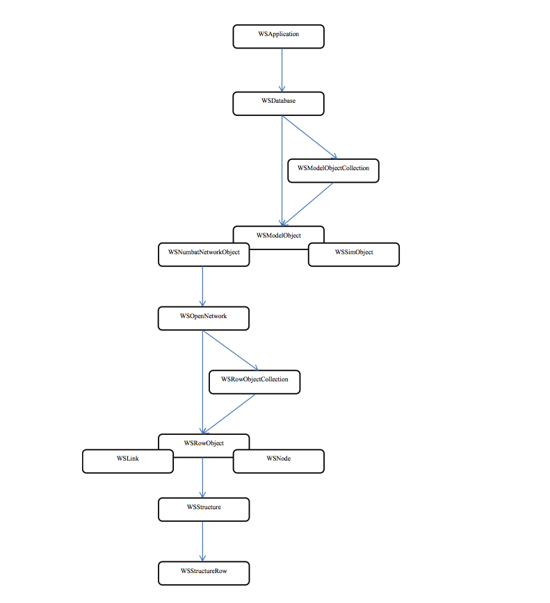
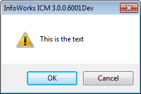
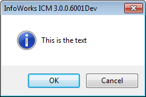
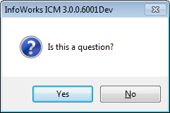
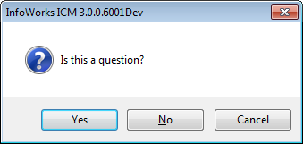
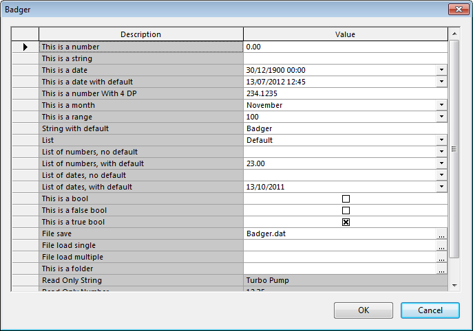
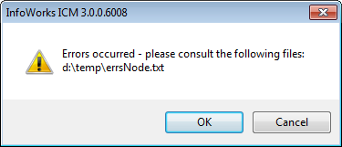

# The InfoWorks ICM / InfoNet Ruby Scripting Interface

## Disclaimer

<span style='color="red"'>*We do not guarantee the information in this document. The presence of a
class or method in this document does not guarantee it will exist and/or
work as described.*</span>

## Sancarn's notes

This document is still Work-In-Progress

This file has been transpiled from documentation provided by Innovyze. Afterwards
it has been edited further to improve the documentation and remove transpilation glitches. However
some glitches due to the transpiling may still occur. For example, occasionally single lines
have been occasionally split into multiple lines with little reason. These glitches can also occur
in the middle of source code examples.

**PLEASE REPORT CODE SAMPLES WHICH DO NOT WORK AS ISSUES**, similarly if code samples,
or descriptions could be articulated in a different more meaningful way, please
raise these as issues or make a push request to alter the documentation. I will gladly
accept push requests which add meaningful detail to the document.

There are also numerous undocumented methods, classes and structures provided by
the Ruby APIs. These will be documented as much as possible in this document, however,
of course, we are very limited as to how much we can know without information directly
provided by Innovyze. **If you have any information or any lost documentation please
contribute it!**

Finally if you have any information regarding the InfoWorksCS API, please send this over
to me also, as I am also building a document regarding InfoWorks CS APIs, as the interop
between InfoWorks CS and InfoWorks ICM is important to all.

I hope his documentation helps you as much as it helps me on a daily basis.
~Sancarn

Index
------------

## [InfoWorks ICM API guidance documents](#infoworks-icm-api-guidance-documents)
1. [Introduction](#introduction)
    a. [UI and Exchange](#ui-and-exchange)
2. [The Exchange Object Model](#the-exchange-object-model)
3. [WSNumbatNetworkObject vs WSOpenNetwork](#wsnumbatnetworkobject-vs-wsopennetwork)
4. [Methods](#methods)
5. [Dates and Times](dates-and-times)
6. [Handling objects at the master database level](#handling-objects-at-the-master-database-level)
7. [Scripting paths](#scripting-paths)
8. [Handling objects within a network](#handling-objects-within-a-network)
9. [Getting and setting values in ‘row objects’.](#getting-and-setting-values-in-row-objects)
10. [Navigating between objects](#navigating-between-objects)
    a. [Specific to nodes and links](#specific-to-nodes-and-links)
    b. [General navigation](#general-navigation)

## [InfoWorks ICM API Reference](#infoworks-icm-api-reference-1)
1. [WSApplication](#wsapplication)
2. [WSDatabase](#wsdatabase)
3. [WSModelObjectCollection](#wsmodelobjectcollection)
4. [WSModelObject](#wsmodelobject)
5. [WSNumbatNetworkObject](#wsnumbatnetworkobject)
6. [WSSimObject](#wssimobject)
7. [WSOpenNetwork](#wsopennetwork)
8. [WSRowObject](#wsrowobject)
9. [WSNode](#wsnode)
10. [WSLink](#wslink)
11. [WSRiskAnalysisRunObject](#wsriskanalysisrunobject)
12. [WSRowObjectCollection](#wsrowobjectcollection)
13. [WSTableInfo](#wstableinfo)
14. [WSFieldInfo](#wsfieldinfo)
15. [WSCommit](#wscommit)
16. [WSCommits](#wscommits)
17. [WSStructure](#wsstructure)
18. [WSStructureRow](#wsstructurerow)
19. [WSValidations](#wsvalidations)
20. [WSValidation](#wsvalidation)

## [Appendix](#appendix)
1. [Pollutograph codes](#appendix-1--pollutograph-codes)
2. [Run Parameters](#appendix-2--run-parameters)
3. [Running scripts from the user interface](#appendix-3--running-scripts-from-the-user-interface)
4. [Open Data Import / Export Centre UI Customisation](#appendix-4---open-data-import--export-centre-ui-customisation)
5. [Character encoding](#appendix-5--character-encoding)


<br/>
<br/>
<br/>
<br/>
<br/>
<br/>
<br/>
<br/>
<br/>
<br/>
<br/>
<br/>
<br/>
<br/>
<br/>
<br/>
<br/>
<br/>
<br/>
<br/>
<br/>
<br/>
<br/>
<br/>

InfoWorks ICM API guidance documents
------------

This document describes the Ruby interface for InfoWorks ICM and
InfoNet. It assumes a degree of familiarity with Ruby and with the
terminology of object oriented programming e.g. ‘class’,’method’.

### UI and Exchange

Scripts may be run both from

1.  the user interface of InfoWorks ICM and InfoNet,

2.  the separately licensed InfoWorks ICM Exchange and InfoNet Exchange
    products, which run from the command line without displayed a
    graphical user interface.

Whilst there is a great degree of overlap between the functionality
available when running scripts from the user interface and that
available within the Exchange products, some functionality is only
available with one or the other. The distinction between the two is
broadly speaking as follows:

1.  Within the user interface, scripts are run when a GeoPlan is open
    displaying a network, possibly with a guest network loaded. The
    scripts may manipulate the data in the network, perform imports and
    exports using the Open Data Import and Export centres, commit and
    revert changes, and display some simple user interface features. The
    scripts may not manipulate tree objects except selection lists, and
    may not open and close databases, set up and run simulations etc.

2.  From the Exchange applications, users may in addition manipulate
    tree objects, create databases, set up and run simulations etc.,
    however the user interface items available from the ICM / InfoNet
    user interfaces will not be available.

*Important note – users must note that the flexible nature of the Ruby
scripting language means that the language is almost infinitely
flexible, the embedding of the language within the InfoWorks ICM /
InfoNet applications is intended primarily for the manipulation of data
via the product’s APIs, and it may not be possible to get other Ruby
libraries etc. working within InfoWorks without problems and it will not
be possible to provide support for such attempts. If you aspire to use
Ruby within the Innovyze products for tasks not centred around the
products’ APIs you should consult with Innovyze to get advice as to the
feasibility of what you are intending to attempt.*

# The Exchange Object Model
-------------------------



The above diagram uses arrows to represent a containment hierarchy
rather than an inheritance hierarchy i.e. it shows that a number of
items of class WSDatabase may be returned from the WSApplication class,
not that the WSDatabase class is derived from the WSApplication class.

Inheritance is represented by overlapping boxes e.g. WSNode and WSLink
are derived from the WSRowObject class.

For clarity only the most important classes provided by the applications
are represented in the diagram.

The classes shown in the diagram above are as follows:

**WSApplication**

The WSApplication class represents the top-level of the application. It
consists purely of class methods. These methods fall into three
categories:

1.  Ones that get and set settings global to the application

2.  Ones that create and open databases represented by the WSDatabase
    class

3.  Running simulations – these methods allow access to advanced
    features of running simulations via the simulation agent.

**WSDatabase**

The WSDatabase class represents master and transportable databases.

**WSModelObjectCollection**

The WSModelObjectCollection class represents collections of objects of
class WSModelObject and the classes derived from it,
WSNumbatNetworkObject and WSSimObject.

**WSModelObject**

The WSModelObject class represents individual tree objects e.g.
selection lists, stored queries, ICM runs etc.

When one of the methods of WSDatabase / WSModelObject returns a model
object, the actual class of the object returned will be determined at
run time and an object of the appropriate type will be returned e.g.
WSNumbatNetworkObject for network types, WSSimObject for simulations.

**WSNumbatNetworkObject**

The WSNumbatNetworkObject class is derived from the WSModelObject class.
It represents networks, specifically both types of asset network and the
modelling network.

**WSSimObject**

The WSSimObject class is derived from the WSModelObject class. It
represents an InfoWorks ICM simulation object. It can also represent the
Risk Analysis Results and Risk Analysis Sim objects.

**WSRiskAnalysisRunObject**

The WSRiskAnalysisRunObject class is derived from the WSModelObject
class. It represents an InfoWorks ICM risk analysis run object.

**WSOpenNetwork**

The WSOpenNetwork class also represents networks. The distinction
between the two classes is described below.

**WSRowObjectCollection**

The WSRowObjectCollection class represents a collection of objects which
is designed to be iterated through. Obtaining a WSRowObjectCollection
and iterating through it is more efficient than obtaining a vector of
WSRowObject objects.

**WSRowObject**

The WSRowObject class represents individual objects in the network e.g.
a node, a CCTV survey etc.

When one of the methods of WSOpenNetwork, WSRowObjectCollection,
WSRowObject etc. returns an object in the network, the actual class of
the object will be determined at run time and an object of the
appropriate type will be returned e.g. WSNode for a node, WSLink for a
link or WSRowObject otherwise.

**WSNode**

The WSNode class is derived from the WSRowObject class. It represents
individual nodes in the network.

**WSLink**

The WSLink class is derived from the WSRowObject class. It represents
individual links in the nework.

**WSStructure**

The WSStructure class represents the data stored in a ‘structure blob’
field in a WSRowObject (or derived class). It is largely a collection
class, containing a collection of WSStructureRow objects, each of which
represents a single row in the ‘structure blob’.

**WSStructureRow**

The WSStructureRow class represents a row in a ‘structure blob’ field in
a WSRowObject (or derived class).

*Classes not shown in the diagram above are as follows:*

**WSTableInfo**

The WSTableInfo class represents information about the table i.e. about
the table itself rather than individual objects contained in that table
in a particular network.

**WSFieldInfo**

The WSFieldInfo class represents information about a field i.e. about
the field for the table rather than the field for an individual object
contained in that table.

**WSCommits**

The WSCommits class is a collection class represents the information
about the collection of commits for a network.

**WSCommit**

The WSCommit class represents the information about one of the commits
for a network.

**WSValidations**

The WSValidations represents the results generated by the validation of
a network. It is essentially a collection class, containing a collection
of WSValidation objects, each of which represents a single validation
message which would appear in a separate row if the validation were
performed within the user interface of the software.

**WSValidation**

The WSValidation class represents the information about one of the
individual validation messages found when performing the validation.

WSNumbatNetworkObject vs WSOpenNetwork
--------------------------------------

Networks (model and asset) are represented by two object types:
WSNumbatNetworkObject and WSOpenNetwork. These may be thought of as
corresponding to the difference between a file on a disk, which has
attributes such as its name, size etc., and an open file handle which
can be read from and/or written to. Alternatively it may be viewed as
the difference between a closed network viewed in the explorer tree and
a network which is opened. Most operations looking at or altering the
network data must be performed on a WSOpenNetwork, although there is
some overlap as some methods that affect the network data, particularly
those used in InfoNet Exchange, are also available as methods of the
WSNumbatNetworkObject class.

The process of getting a WSOpenNetwork from a WSNumbatNetworkObject may
be thought of as being akin to opening a network from the tree in the
software by dragging it to the background, or right-clicking on it and
thenselecting the ‘Open’ menu item.

Methods
-------

Unless noted, methods return nil.

In the examples of exceptions thrown below example paths are given,
these will of course be different in real-life cases.

Dates and Times
---------------

The DateTime class provided by the Ruby core library is used to
represent dates and times. Accordingly, if you use any methods getting,
setting or otherwise returning dates you will need to include the date
header using

```ruby
require 'date'
```
The default to\_s implementation for the DateTime class can be
overridden to provide a more normal date and time format e.g. as follows

```ruby
class DateTime
    def to_s
        return strftime('%d/%m/%Y %H:%M:%S')
    end
end
```

Ruby’s behaviour means that you can add this method in your code and
have this method called as you would hope.

You will typically want to create DateTimes using the new method which
is of the form `DateTime.new(year,month,day,hours,minute,seconds)` e.g.


```ruby
myDate=DateTime.new(2012,7,23,12,34,56.789)
```

As ICM Exchange does not have a Ruby data time to represent the use of
times in ICM simulations, in which both relative times and absolute
times are used, the following convention is used:

*Absolute times are represented as a DateTime object, relative times as
a negative double – a time in seconds.*

Handling objects at the master database level
---------------------------------------------

By ‘at the master database level’ we mean at the level of handling
objects that appear in the database tree rather than within an
individual network.

By and large this functionality is only available in ICM Exchange and
InfoNet Exchange.

The classes that are of most relevance here are WSDatabase,
WSModelObjectCollection and WSModelObject.

Objects in the tree are typically represented two ways – by type of
object (e.g. is is a Run, an Asset Group, a Selection List etc.) and ID,
a number which appears in the property sheet when ‘properties’ is
selected for an object in the tree, or by a scripting path. The
scripting path can be thought of as being roughly analogous to the path
of a file e.g. `‘C:\\program files (x86)\\innovyze\\innovyzewc.exe`. They
are described in more detail below.

If I have the scripting path for an object, either obtained using a Ruby
method, or worked out ‘by hand’, you can get access to the object and
then call whatever methods you desire on it.

For example, if I know the scripting path of a simulation is

`>MODG~Basic Initial Loss Runs>MODG~Initial Loss Type>RUN~Abs>SIM~M2-60`

and I wish to export a full binary results file, I can simply write the
following script:

```ruby
db=WSApplication.open nil,false

mo=db.model_object '>MODG~Basic Initial Loss Runs>MODG~Initial Loss Type>RUN~Abs>SIM~M2-60'

mo.results_binary_export nil,nil,'d:\\temp\\sim.dat'
```

When developing scripts, or when running an ad-hoc script, a ‘quick and
dirty’ way of identifying an object can often be by using its type and
ID.

For example, if I want to export a rainfall event to a CSV file, I
simply have to look up its ID in the tree in the user interface and
write the following script:

```ruby
db=WSApplication.open nil,false

mo=db.model_object_from_type_and_id 'Rainfall Event',18

mo.export 'd:\\temp\\myfile.csv','csv'
```

Clearly this can be done in the user interface, but simple scripts like
this can form the building blocks for more complex scripts in which you
process the files in Ruby, or use Ruby to call other programs via COM
interfaces or similar.

As well as obtaining objects by path and type and ID it is also possible
to obtain them by type and name using the find\_child\_model\_object
method of a group, or find\_root\_model\_object of a database.

It is possible to find all the objects in the root of the database using
the root\_model\_objects method of the database e.g.

```ruby
db=WSApplication.open nil,false
db.root_model_objects.each do |o|
    puts o.path
end
```

Similarly, it is possible to find all the objects which are children of
a given object using the children method of the parent object.

This code, therefore, finds all the objects which are children of
objects in the root of the database.

```ruby
db=WSApplication.open nil,false
db.root_model_objects.each do |o|
    o.children.each do |c|
        puts c.path
    end
end
```

These methods can be used recursively to find all the objects in the
database. The technique used in the example below is a ‘breadth first
search’ i.e. we start by finding the objects in the root of the database
and putting them in an array. Thereafter we take the first object in the
array, find its children, add them onto the end of the array and remove
the first object.

```ruby
db=WSApplication.open nil,false
toProcess=Array.new
db.root_model_objects.each do |o|
    toProcess << o
end
while toProcess.size<0
    working=toProcess.delete_at(0)
    puts working.path
    working.children.each do |c|
        toProcess << c
    end
end
```

Note use of delete\_at(0) which returns the first item in the array
whilst at the same time removing it from the array – the old second item
becomes the first etc.

In both the examples above the snippets of code output the paths of the
found objects but in real life you will want to do something else e.g.
this example runs all the simulations in the database

Where WSModelObject objects are specified in parameters of other
methods, they can be passed as

-   A ruby object
-   The object’s ID (if the parameter can only be of one object type)
-   The path of the object

### Scripting paths

The purpose of a scripting path is to uniquely identify an object in a
database by giving its name and type, the name and type of the group in
which it is contained if any, the group in which that group is contained
if any and so on. This is very similar to the way the path of a file
gives the name of the file, the name of the directory in which it is
contained, the name of the directory in which that directory is
contained and so on.

Since, however, it is possible to have objects of the same name of
different types in the same group (e.g. you can have a stored query and
a selection list both called ‘My Nodes’ in the same group), the names
need to be made non-ambiguous by adding the object types to them.

The paths always begin with &gt;, then each object in the tree is formed
by taking the object type’s ‘short code’ (as given in the table below),
following this with a ~ then adding the name so, for example, a rainfall
event ‘Winter 5 20’ in a model group ‘West’ in a master group ‘General’
has the path:

`>MASG~General>MODG~North>RAIN~Winter 5 20`

If the name of any object in the scripting path for an object contains
the characters `~` or `>`, then those characters are ‘escaped’ with a
backslash. The backslash character is also escaped with another
backslash. e.g. a master group with the unlikely name
`My Master >>>~~~\\\ Group`. Will have the path:

```
>MASG~My Master \>\>\>\~\~\~\\\\\\ Group
```

| **Description**                    | **ShortCode** |
|------------------------------------|---------------|
| Alert Definition List              | ADL           |
| Asset group                        | AG            |
| Custom graph                       | CGDT          |
| Collection inference               | CINF          |
| Collection network                 | CNN           |
| Collection digitisation template   | CNTMP         |
| Collection cost estimator          | COST          |
| Custom report                      | CR            |
| Dashboard                          | DASH          |
| Engineering validation             | ENV           |
| Flow survey                        | FS            |
| Graph                              | GDT           |
| Ground model grid                  | GGM           |
| Ground model TIN                   | GM            |
| 2D initial conditions              | IC2D          |
| Ground infiltration                | IFN           |
| Inflow                             | INF           |
| Inference                          | INFR          |
| Label list                         | LAB           |
| Level                              | LEV           |
| Live group                         | LG            |
| Layer list                         | LL            |
| Manifest                           | MAN           |
| Manifest Deployment                | MAND          |
| Master group                       | MASG          |
| Model group                        | MODG          |
| GeoExplorer                        | NGX           |
| Model network                      | NNET          |
| Digitisation template              | NNT           |
| Distribution network               | NWNET         |
| Observed depth event               | OBD           |
| Observed flow event                | OBF           |
| Observed velocity event            | OBV           |
| Pollutograph                       | PGR           |
| Pipe sediment data                 | PSD           |
| Results analysis                   | PTSEL         |
| Rainfall event                     | RAIN          |
| Regulator                          | REG           |
| Run                                | RUN           |
| Selection list                     | SEL           |
| Sim                                | SIM           |
| Stored query                       | SQL           |
| Statistics template                | ST            |
| Simulation statistics              | STAT          |
| Theme                              | THM           |
| Time varying data                  | TVD           |
| Trade waste                        | TW            |
| Collection validation              | VAL           |
| Distribution cost estimator        | WCOST         |
| Distribution inference             | WINF          |
| Workspace                          | WKSP          |
| Distribution digitisation template | WNTMP         |
| Distribution validation            | WVAL          |
| Waste water                        | WW            |

Handling objects within a network
---------------------------------

By ‘within a network’ we refer to the navigating between, adding,
deleting and altering objects within a network, e.g. adding a node,
changing the ground level of a node etc.

The most relevant classes here are WSOpenNetwork, WSRowObject collection
and WSRowObject and the classes derived from it.

Before operating on individual objects within a network it is necessary
to object a WSOpenNetwork object. The mechanism for doing this is
different between use of the Ruby scripting functionality within the
software's user interface and via the Exchange products:

Within the user interface, obtain the WSOpenNetwork object for the
current network by using the current method of the WSApplication class
i.e.

```ruby
on=WSApplication.current_network
```

From the Exchange products you should obtain the WSOpenNetwork by use of
the open method of the WSNumbatNetworkObject class i.e.

```ruby
db=WSApplication.open nil,false
net=db.model_object_from_type_and_id 'Model Network',2
on=net.open
```

Having obtained the WSOpenNetwork object it is possible to obtain
WSRowObjectCollection and WSRowObject (both individually and in arrays)
from it.

To do this it is generally necessary to know the table name or category.

The table names used are the internal table names. These are not
generally used in the software's user interface but can be seen in the
exported CSV files. They are typically of the form prefix\_name or
prefix\_parts\_of\_name (i.e. lower case strings, beginning with a
prefix and with words separated by underscores). The prefixes are

hw for model networks, cams for collection networks and wams for
distribution networks e.g. hw\_node, cams\_manhole, wams\_manhole.

Categories are used to obtain the objects in more than one table; the
most common use of a category is to obtain all of the links in a network
regardless of the types of the individual links.

The categories are as follows:

'\_nodes' – all nodes

'\_links' – all links

'\_subcatchments' – all subcatchments (model networks only)

'\_other' – other objects

The lists of tables for the three types of network are as follows:

| **Model Network Tables**            |                                     |
|-------------------------------------|-------------------------------------|
| 2D boundary                         | hw\_2d\_boundary\_line              |
| 2D point source                     | hw\_2d\_point\_source               |
| 2D zone                             | hw\_2d\_zone                        |
| 2D zone defaults                    | hw\_2d\_zone\_defaults              |
| Bank line                           | hw\_bank\_survey                    |
| Base linear structure (2D)          | hw\_2d\_linear\_structure           |
| Bridge                              | hw\_bridge                          |
| Bridge inlet                        | hw\_bridge\_inlet                   |
| Bridge opening                      | hw\_bridge\_opening                 |
| Bridge outlet                       | hw\_bridge\_outlet                  |
| Channel                             | hw\_channel                         |
| Channel defaults                    | hw\_channel\_defaults               |
| Channel shape                       | hw\_channel\_shape                  |
| Conduit                             | hw\_conduit                         |
| Conduit defaults                    | hw\_conduit\_defaults               |
| Cross section line                  | hw\_cross\_section\_survey          |
| Culvert inlet                       | hw\_culvert\_inlet                  |
| Culvert outlet                      | hw\_culvert\_outlet                 |
| Flap valve                          | hw\_flap\_valve                     |
| Flow efficiency                     | hw\_flow\_efficiency                |
| Flume                               | hw\_flume                           |
| General line                        | hw\_general\_line                   |
| General point                       | hw\_general\_point                  |
| Ground infiltration                 | hw\_ground\_infiltration            |
| Head discharge                      | hw\_head\_discharge                 |
| Headloss curve                      | hw\_headloss                        |
| IC zone - hydraulics (2D)           | hw\_2d\_ic\_polygon                 |
| IC zone - infiltration (2D)         | hw\_2d\_inf\_ic\_polygon            |
| IC zone - water quality (2D)        | hw\_2d\_wq\_ic\_polygon             |
| Infiltration surface (2D)           | hw\_2d\_infil\_surface              |
| Infiltration zone (2D)              | hw\_2d\_infiltration\_zone          |
| Inline bank                         | hw\_inline\_bank                    |
| Irregular weir                      | hw\_irregular\_weir                 |
| Land use                            | hw\_land\_use                       |
| Large catchment parameters          | hw\_large\_catchment\_parameters    |
| Mesh zone                           | hw\_mesh\_zone                      |
| Network results line (2D)           | hw\_2d\_results\_line               |
| Network results point (1D)          | hw\_1d\_results\_point              |
| Network results point (2D)          | hw\_2d\_results\_point              |
| Network results polygon (2D)        | hw\_2d\_results\_polygon            |
| Node                                | hw\_node                            |
| Node defaults                       | hw\_manhole\_defaults               |
| Orifice                             | hw\_orifice                         |
| Polygon                             | hw\_polygon                         |
| Porous polygon                      | hw\_porous\_polygon                 |
| Porous wall                         | hw\_porous\_wall                    |
| Pump                                | hw\_pump                            |
| RTC data                            | hw\_rtc                             |
| RTK hydrograph                      | hw\_unit\_hydrograph                |
| River defaults                      | hw\_river\_reach\_defaults          |
| River reach                         | hw\_river\_reach                    |
| Roughness zone                      | hw\_roughness\_zone                 |
| Runoff surface                      | hw\_runoff\_surface                 |
| Screen                              | hw\_screen                          |
| Shape                               | hw\_shape                           |
| Sim parameters                      | hw\_sim\_parameters                 |
| Siphon                              | hw\_siphon                          |
| Sluice                              | hw\_sluice                          |
| Sluice linear structure (2D)        | hw\_2d\_sluice                      |
| Snow pack                           | hw\_snow\_pack                      |
| Snow parameters                     | hw\_snow\_parameters                |
| Storage area                        | hw\_storage\_area                   |
| Subcatchment                        | hw\_subcatchment                    |
| Subcatchment defaults               | hw\_subcatchment\_defaults          |
| User control                        | hw\_user\_control                   |
| Water quality parameters            | hw\_wq\_params                      |
| Weir                                | hw\_weir                            |
| **Collection Network Tables**       |                                     |
| Approval level                      | cams\_approval\_level               |
| Blockage incident                   | cams\_incident\_blockage            |
| CCTV survey                         | cams\_cctv\_survey                  |
| Channel                             | cams\_channel                       |
| Collapse incident                   | cams\_incident\_collapse            |
| Connection node                     | cams\_connection\_node              |
| Connection pipe                     | cams\_connection\_pipe              |
| Connection pipe name group          | cams\_name\_group\_connection\_pipe |
| Cross section survey                | cams\_cross\_section\_survey        |
| Customer complaint                  | cams\_incident\_complaint           |
| Data logger                         | cams\_data\_logger                  |
| Defence area                        | cams\_defence\_area                 |
| Defence structure                   | cams\_defence\_structure            |
| Drain test                          | cams\_drain\_test                   |
| Dye test                            | cams\_dye\_test                     |
| FOG inspection                      | cams\_fog\_inspection               |
| Flooding incident                   | cams\_incident\_flooding            |
| Flume                               | cams\_flume                         |
| GPS survey                          | cams\_gps\_survey                   |
| General asset                       | cams\_general\_asset                |
| General incident                    | cams\_incident\_general             |
| General line                        | cams\_general\_line                 |
| General maintenance                 | cams\_general\_maintenance          |
| General survey                      | cams\_general\_survey               |
| General survey line                 | cams\_general\_survey\_line         |
| Generator                           | cams\_generator                     |
| Manhole repair                      | cams\_manhole\_repair               |
| Manhole survey                      | cams\_manhole\_survey               |
| Material                            | cams\_material                      |
| Monitoring survey                   | cams\_mon\_survey                   |
| Node                                | cams\_manhole                       |
| Node name group                     | cams\_name\_group\_node             |
| Odor incident                       | cams\_incident\_odor                |
| Order                               | cams\_order                         |
| Orifice                             | cams\_orifice                       |
| Outlet                              | cams\_outlet                        |
| Pipe                                | cams\_pipe                          |
| Pipe clean                          | cams\_pipe\_clean                   |
| Pipe name group                     | cams\_name\_group\_pipe             |
| Pipe repair                         | cams\_pipe\_repair                  |
| Pollution incident                  | cams\_incident\_pollution           |
| Property                            | cams\_property                      |
| Pump                                | cams\_pump                          |
| Pump station                        | cams\_pump\_station                 |
| Pump station electrical maintenance | cams\_pump\_station\_em             |
| Pump station mechanical maintenance | cams\_pump\_station\_mm             |
| Pump station survey                 | cams\_pump\_station\_survey         |
| Resource                            | cams\_resource                      |
| Screen                              | cams\_screen                        |
| Siphon                              | cams\_siphon                        |
| Sluice                              | cams\_sluice                        |
| Smoke defect observation            | cams\_smoke\_defect                 |
| Smoke test                          | cams\_smoke\_test                   |
| Storage area                        | cams\_storage                       |
| Treatment works                     | cams\_wtw                           |
| User ancillary                      | cams\_ancillary                     |
| Valve                               | cams\_valve                         |
| Vortex                              | cams\_vortex                        |
| Weir                                | cams\_weir                          |
| Zone                                | cams\_zone                          |
| **Distribution Network Tables**     |                                     |
| Approval level                      | wams\_approval\_level               |
| Borehole                            | wams\_borehole                      |
| Burst incident                      | wams\_incident\_burst               |
| Customer complaint                  | wams\_incident\_complaint           |
| Data logger                         | wams\_data\_logger                  |
| Fitting                             | wams\_fitting                       |
| GPS survey                          | wams\_gps\_survey                   |
| General asset                       | wams\_general\_asset                |
| General incident                    | wams\_incident\_general             |
| General line                        | wams\_general\_line                 |
| General maintenance                 | wams\_general\_maintenance          |
| General survey                      | wams\_general\_survey               |
| General survey line                 | wams\_general\_survey\_line         |
| Generator                           | wams\_generator                     |
| Hydrant                             | wams\_hydrant                       |
| Hydrant maintenance                 | wams\_hydrant\_maintenance          |
| Hydrant test                        | wams\_hydrant\_test                 |
| Leak detection                      | wams\_leak\_detection               |
| Manhole                             | wams\_manhole                       |
| Manhole repair                      | wams\_manhole\_repair               |
| Manhole survey                      | wams\_manhole\_survey               |
| Material                            | wams\_material                      |
| Meter                               | wams\_meter                         |
| Meter maintenance                   | wams\_meter\_maintenance            |
| Meter test                          | wams\_meter\_test                   |
| Monitoring survey                   | wams\_mon\_survey                   |
| Node name group                     | wams\_name\_group\_node             |
| Order                               | wams\_order                         |
| Pipe                                | wams\_pipe                          |
| Pipe name group                     | wams\_name\_group\_pipe             |
| Pipe repair                         | wams\_pipe\_repair                  |
| Pipe sample                         | wams\_pipe\_sample                  |
| Property                            | wams\_property                      |
| Pump                                | wams\_pump                          |
| Pump station                        | wams\_pump\_station                 |
| Pump station electrical maintenance | wams\_pump\_station\_em             |
| Pump station mechanical maintenance | wams\_pump\_station\_mm             |
| Pump station survey                 | wams\_pump\_station\_survey         |
| Resource                            | wams\_resource                      |
| Surface source                      | wams\_surface\_source               |
| Tank                                | wams\_tank                          |
| Treatment works                     | wams\_wtw                           |
| Valve                               | wams\_valve                         |
| Valve maintenance                   | wams\_valve\_maintenance            |
| Water quality incident              | wams\_incident\_wq                  |
| Zone                                | wams\_zone                          |

e.g. to obtain all the nodes as a WSRowObjectCollection object

```ruby
roc=on.row_object_collection('_nodes')
```

To obtain them as an array of WSRowObject objects

```ruby
ro_vec=on.row_objects('_nodes')
```

In both cases the resultant WSRowObjectCollection or array can be
iterated through e.g. this example, which finds the smallest x
coordinate of all the manholes in the network.

```ruby
net=WSApplication.current_network
minx=nil
net.row_object_collection('cams_manhole').each do |ro|
    if minx.nil? || ro.x < minx
        minx=ro.x
    end
end

puts minx
```


or the more or less identical

```ruby
net=WSApplication.current_network
minx=nil
net.row_objects('cams_manhole').each do |ro|
    if minx.nil? || ro.x < minx
        minx=ro.x
    end
end
puts minx
```

In this instance, the fact that one method returns a Ruby array of
WSRowObjects and the other returns a since WSRowObjectCollection object
is disguised by the WSRowObjectCollection object following the normal
Ruby convention for enumerable objects.

To obtain an individual WSRowObject from a WSOpenNetwork if you know its
name use the row\_object method e.g.

```ruby
ro=on.row_object('cams_manhole','MH359457')
```

This uses the ID of an object, so for links in model networks use the
upstream node ID followed by a dot followed by the links suffix e.g. the
following example which clears the selection, and selects one link:

```ruby
net=WSApplication.current_network
net.clear_selection
ro=net.row_object('hw_conduit','44633101.1')
ro.selected=true
```

Some methods also take a ‘category’, the main use of which is to allow
all the link types to be treated together e.g. in SQL. The category
types are

\_nodes

\_links

\_subcatchments

\_other

e.g. to select all the links regardless of type:

```ruby
net=WSApplication.current_network
net.clear_selection
net.row_objects('_links').each do |ro|
    ro.selected=true
end
```

Because names are unique within the node, link and subcatchment
categories, you can also use the category to find individual objects,
thus the example which selects one link above can be rewritten as:

```ruby
net=WSApplication.current_network
net.clear_selection
ro=net.row_object('_links','44633101.1')
ro.selected=true
```

Nodes and links are always automatically returned as objects of classes
WSNode and WSLink respectively, with the parent class WSRowObject. These
are largely identical to the WSRowObject class but have a few extra
methods for use when navigating between objects (see below).

### Getting and setting values in ‘row objects’.

A fundamental part of the purpose of the Ruby scripting within InfoWorks
ICM and InfoNet is to get and set values of fields for the objects
within the networks.

There are two fundamentally different sorts of values that can be got or
set and two fundamentally different ways of doing this.

The two sorts of values are:

1.  Values of object fields stored in the network. These are the values
    with which users of the software will be familiar; they are the
    values that are displayed in the grids and property sheets, imported
    via the Open Data Import Centre, exported via the Open Data Export
    Centre etc.  
    The names of the object fields are fixed for each type of object.

2.  Tags. These are temporary values added to the objects for the
    duration of the running of the script. They are typically used for
    storing ‘working’ values which will later be aggregated or stored
    into the object fields which will persist after the running of the
    script– they can, of course, also be written to files using Ruby’s
    file access mechanisms.  
    The names of tags are not fixed but must begin with \_ and can only
    contain digits and the letters A-Z and a-z (without accents) and the
    \_ character.

The two ways of accessing values are:

1.  By using the \[\] and \[\]= notation e.g. ro\['field'\]=value,
    value=ro\['field'\] (for object fields) and
    ro\['\_tag\_name'\]=value, value=ro\['\_tag\_name'\] (for tags)

2.  By using the field name or tag name as though it were the name of a
    method e.g. ro.field=value, value=ro.field (for object fields) and
    ro.\_tag\_name = value, value=ro.\_tag\_name (for tags).

The key differences in behaviour between object fields and values,
beyond that of the object field values having a life beyond the duration
of the running of the script, are

1.  Object field values must be explicitly written back to the local
    database for the network using the write method – since tags are not
    stored anywhere other than in working memory, the write method does
    not need to be called for them.

2.  Object field values are stored in the ‘InfoWorks / InfoNet’ world.
    Any given field has a particular data type and, for string fields,
    a length. Any attempt to store values incompatible with the object’s
    data type will fail. Tags, on the other hand, exist in the Ruby
    world and may therefore contain anything that can be stored in a
    Ruby variable. There is no requirement for all the values for
    different objects of the same tag to be of the same data type.

3.  Object field values may be cached in the database, allowing more
    objects and more data to be manipulated within a network than with
    tags, which always exist in memory. Using too many tags and storing
    too much data in them may cause the program’s memory limit to
    be exceeded.

Flags are treated as being separate fields.

Fields can, in general, be set to nil which is the equivalent of causing
them to be blank in the user interface or setting them to NULL in SQL.
NULL in SQL and nil in Ruby are essentially the same.

Arrays e.g. of coordinates are returned as a Ruby array.

This example finds and selects pipes with width less than 200 or length
less than 60 or, of course, both.

```ruby
net=WSApplication.current_network
net.clear_selection
ro=net.row_objects('cams_pipe').each do |ro|
    if (!ro.width.nil? && ro.width<200) || (!ro.length.nil? && ro.length<60)
        ro.selected=true
    end
end
```

This demonstrates a key difference between Ruby and SQL; in SQL it is
safe to say

width&lt;200, the expression will ignore values which are NULL. In Ruby
however, it is necessary to explicitly check for nil values, nil being
the Ruby counterpart to NULL.

If you fail to do this check a runtime error will be raised.

An equivalent way of writing the same script would be to use the \[\]
notation as follows:

```ruby
net=WSApplication.current_network
net.clear_selection
ro=net.row_objects('cams_pipe').each do |ro|
    if (!ro['width'].nil? && ro['width']<200) || (!ro['length'].nil? && ro['length']<60)
        ro.selected=true
    end
end
```

To set values it is necessary to

1.  Set them within a transaction. Transactions are treated as a single
    unit for purposes of undo / red. When run from the user interface,
    each transaction is treated as a single undo / redo step and appears
    in the menu as 'Scripted transaction'.

2.  Call the write method on the row object to explicitly put the values
    into the database. This is the equivalent in the user interface of
    finishing to edit an object, of which you might have changed a
    number of values.

This example sets a couple of users fields for CCTV surveys based on
simple calculations performed on other fields:

```ruby
net=WSApplication.current_network
net.clear_selection
net.transaction_begin
ro=net.row_objects('cams_cctv_survey').each do |ro|
    ro.user_number_1 = ro.surveyed_length / ro.total_length
    ro.user_number_2 = ro.total_length / ro.pipe_length
    ro.write
end
net.transaction_commit
```

The equivalent way of writing the script using the \[\] notation is as
follows:

```ruby
net=WSApplication.current_network

net.clear_selection

net.transaction_begin

ro=net.row_objects('cams_cctv_survey').each do |ro|

ro['user_number_1'] = ro['surveyed_length'] /
ro['total_length']

ro['user_number_2'] = ro['total_length'] / ro['pipe_length']

ro.write

end

net.transaction_commit
```

The use of the form which looks as though it is a method e.g.
ro.user\_number\_1 is potentially clearer to those writing and
maintaining scripts, but the \[\] form can be more flexible since the
parameter of the \[\] method is a Ruby string and therefore can be an
expression. The following demonstrates this by storing the two values
used on the right hand side of the above expressions as string
parameters, and building up the user field name as a string expression:

```ruby
net=WSApplication.current_network
net.clear_selection
net.transaction_begin
expressions=[['surveyed_length','total_length'],['total_length','pipe_length']]
ro=net.row_objects('cams_cctv_survey').each do |ro|
    (0...expressions.size).each do |i|
        > ro['user_number_'+(i+1).to_s] = ro[expressions[i][0]] /
        > ro[expressions[i][1]]
        ro.write
    end
end
net.transaction_commit
```

Once the user has run a script such as the above, the changes will have
been made to the local network as though the change had been made
manually in the user interface, or via SQL or similar, the changes have
NOT been committed to the master database. It IS possible to commit the
network to the master database by adding a call to the commit method
with a suitable comment as a parameter e.g.

net.commit 'set user fields'

Two users of tags, one simple and one more complex, are demonstrated
below in the 'navigating between objects' section.

Various data fields in InfoWorks are represented as ‘structure blobs’ -
the field contains a number of ‘rows’ of values for each object which in
some respects behave as though they are a sub-table – they have a number
of named fields with values.

The structure blobs that are most common are the following:

> hyperlinks
>
> attachments
>
> material\_details
>
> resource\_details

Many tables contain a hyperlinks field. The following tables in asset
networks contain one or more of the other three fields named above:

**Collection Network**

| Table                               | has attachments field | has material\_details field | has resource\_details field |
|-------------------------------------|-----------------------|-----------------------------|-----------------------------|
| Blockage incident                   | Y                     | Y                           | Y                           |
| CCTV survey                         | Y                     | Y                           | Y                           |
| Channel                             | Y                     | N                           | N                           |
| Collapse incident                   | Y                     | Y                           | Y                           |
| Connection node                     | Y                     | N                           | N                           |
| Connection pipe                     | Y                     | N                           | N                           |
| Cross section survey                | Y                     | Y                           | Y                           |
| Customer complaint                  | Y                     | Y                           | Y                           |
| Data logger                         | Y                     | N                           | N                           |
| Defence area                        | Y                     | N                           | N                           |
| Defence structure                   | Y                     | N                           | N                           |
| Drain test                          | Y                     | Y                           | Y                           |
| Dye test                            | Y                     | Y                           | Y                           |
| FOG inspection                      | Y                     | Y                           | Y                           |
| Flooding incident                   | Y                     | Y                           | Y                           |
| Flume                               | Y                     | N                           | N                           |
| GPS survey                          | Y                     | Y                           | Y                           |
| General asset                       | Y                     | N                           | N                           |
| General incident                    | Y                     | Y                           | Y                           |
| General line                        | Y                     | N                           | N                           |
| General maintenance                 | Y                     | Y                           | Y                           |
| General survey                      | Y                     | Y                           | Y                           |
| General survey line                 | Y                     | Y                           | Y                           |
| Generator                           | Y                     | N                           | N                           |
| Manhole repair                      | Y                     | Y                           | Y                           |
| Manhole survey                      | Y                     | Y                           | Y                           |
| Monitoring survey                   | Y                     | Y                           | Y                           |
| Node                                | Y                     | N                           | N                           |
| Odor incident                       | Y                     | Y                           | Y                           |
| Orifice                             | Y                     | N                           | N                           |
| Outlet                              | Y                     | N                           | N                           |
| Pipe                                | Y                     | N                           | N                           |
| Pipe clean                          | Y                     | Y                           | Y                           |
| Pipe repair                         | Y                     | Y                           | Y                           |
| Pollution incident                  | Y                     | Y                           | Y                           |
| Property                            | Y                     | N                           | N                           |
| Pump                                | Y                     | N                           | N                           |
| Pump station                        | Y                     | N                           | N                           |
| Pump station electrical maintenance | Y                     | Y                           | Y                           |
| Pump station mechanical maintenance | Y                     | Y                           | Y                           |
| Pump station survey                 | Y                     | Y                           | Y                           |
| Screen                              | Y                     | N                           | N                           |
| Siphon                              | Y                     | N                           | N                           |
| Sluice                              | Y                     | N                           | N                           |
| Smoke defect observation            | Y                     | N                           | N                           |
| Smoke test                          | Y                     | Y                           | Y                           |
| Storage area                        | Y                     | N                           | N                           |
| Treatment works                     | Y                     | N                           | N                           |
| User ancillary                      | Y                     | N                           | N                           |
| Valve                               | Y                     | N                           | N                           |
| Vortex                              | Y                     | N                           | N                           |
| Weir                                | Y                     | N                           | N                           |
| Zone                                | Y                     | N                           | N                           |

**Distribution Network**

| Table                               | has attachments field | has material\_details field | has resource\_details field |
|-------------------------------------|-----------------------|-----------------------------|-----------------------------|
| Borehole                            | Y                     | N                           | N                           |
| Burst incident                      | Y                     | Y                           | Y                           |
| Customer complaint                  | Y                     | Y                           | Y                           |
| Data logger                         | Y                     | N                           | N                           |
| Fitting                             | Y                     | N                           | N                           |
| GPS survey                          | Y                     | Y                           | Y                           |
| General asset                       | Y                     | N                           | N                           |
| General incident                    | Y                     | Y                           | Y                           |
| General line                        | Y                     | N                           | N                           |
| General maintenance                 | Y                     | Y                           | Y                           |
| General survey                      | Y                     | Y                           | Y                           |
| General survey line                 | Y                     | Y                           | Y                           |
| Generator                           | Y                     | N                           | N                           |
| Hydrant                             | Y                     | N                           | N                           |
| Hydrant maintenance                 | Y                     | Y                           | Y                           |
| Hydrant test                        | Y                     | Y                           | Y                           |
| Leak detection                      | Y                     | Y                           | Y                           |
| Manhole                             | Y                     | N                           | N                           |
| Manhole repair                      | Y                     | Y                           | Y                           |
| Manhole survey                      | Y                     | Y                           | Y                           |
| Meter                               | Y                     | N                           | N                           |
| Meter maintenance                   | Y                     | Y                           | Y                           |
| Meter test                          | Y                     | Y                           | Y                           |
| Monitoring survey                   | Y                     | Y                           | Y                           |
| Pipe                                | Y                     | N                           | N                           |
| Pipe repair                         | Y                     | Y                           | Y                           |
| Pipe sample                         | Y                     | Y                           | Y                           |
| Property                            | Y                     | N                           | N                           |
| Pump                                | Y                     | N                           | N                           |
| Pump station                        | Y                     | N                           | N                           |
| Pump station electrical maintenance | Y                     | Y                           | Y                           |
| Pump station mechanical maintenance | Y                     | Y                           | Y                           |
| Pump station survey                 | Y                     | Y                           | Y                           |
| Surface source                      | Y                     | N                           | N                           |
| Tank                                | Y                     | N                           | N                           |
| Treatment works                     | Y                     | N                           | N                           |
| Valve                               | Y                     | N                           | N                           |
| Valve maintenance                   | Y                     | Y                           | Y                           |
| Valve shut off                      | Y                     | N                           | N                           |
| Water quality incident              | Y                     | Y                           | Y                           |
| Zone                                | Y                     | N                           | N                           |

In addition to these four fields, the following fields containing
structure blobs occur in the tables as follows:

**Model Network**

| Bank line                    |                            |                     |
|------------------------------|----------------------------|---------------------|
| Bank line                    | Bank data                  | bank\_array         |
| Base linear structure (2D)   |                            |                     |
| Base linear structure (2D)   | Section data               | sections            |
| Bridge                       |                            |                     |
| Bridge                       | Bridge deck data           | bridge\_deck        |
| Bridge                       | DS bridge section data     | ds\_bridge\_section |
| Bridge                       | DS link section data       | ds\_link\_section   |
| Bridge                       | US bridge section data     | us\_bridge\_section |
| Bridge                       | US link section data       | us\_link\_section   |
| Bridge linear structure (2D) |                            |                     |
| Bridge linear structure (2D) | Section data               | sections            |
| Bridge opening               |                            |                     |
| Bridge opening               | Piers                      | piers               |
| Channel shape                |                            |                     |
| Channel shape                | Channel profile            | profile             |
| Cross section line           |                            |                     |
| Cross section line           | Section data               | section\_array      |
| Flow efficiency              |                            |                     |
| Flow efficiency              | Flow efficiency table      | FE\_table           |
| Head discharge               |                            |                     |
| Head discharge               | Head discharge power table | HDP\_table          |
| Inline bank                  |                            |                     |
| Inline bank                  | Section data               | bank                |
| Irregular weir               |                            |                     |
| Irregular weir               | Chainage elevation         | chainage\_elevation |
| Node                         |                            |                     |
| Node                         | Storage array              | storage\_array      |
| River reach                  |                            |                     |
| River reach                  | Left river bank            | left\_bank          |
| River reach                  | Right river bank           | right\_bank         |
| River reach                  | River sections             | sections            |
| River reach                  | Section spacing            | section\_spacing    |
| Shape                        |                            |                     |
| Shape                        | Geometry                   | geometry            |
| Subcatchment                 |                            |                     |
| Subcatchment                 | ReFH descriptors           | refh\_descriptors   |

**Collection Network**

| CCTV survey                         |                     |                      |
|-------------------------------------|---------------------|----------------------|
| CCTV survey                         | Details             | details              |
| Cross section survey                |                     |                      |
| Cross section survey                | Section data        | section\_data        |
| General survey line                 |                     |                      |
| General survey line                 | Points              | point\_array         |
| Manhole survey                      |                     |                      |
| Manhole survey                      | Details             | details              |
| Manhole survey                      | Incoming pipes      | pipes\_in            |
| Manhole survey                      | Outgoing pipes      | pipes\_out           |
| Order                               |                     |                      |
| Order                               | Order details       | order\_details       |
| Pipe clean                          |                     |                      |
| Pipe clean                          | Pipes               | pipes                |
| Pump station                        |                     |                      |
| Pump station                        | Available telemetry | available\_telemetry |
| Pump station                        | Levels              | levels               |
| Pump station                        | Pump groups         | pump\_groups         |
| Pump station mechanical maintenance |                     |                      |
| Pump station mechanical maintenance | Pumps               | pumps                |
| Pump station survey                 |                     |                      |
| Pump station survey                 | Drop tests          | drop\_tests          |
| Storage area                        |                     |                      |
| Storage area                        | Level Data          | level\_data          |

**Distribution Network**

General survey line

| General survey line                 | Points              | point\_array         |
|-------------------------------------|---------------------|----------------------|
| Hydrant test                        |                     |                      |
| Hydrant test                        | Flow hydrants       | flow\_hydrants       |
| Order                               |                     |                      |
| Order                               | Order details       | order\_details       |
| Pump station                        |                     |                      |
| Pump station                        | Available telemetry | available\_telemetry |
| Pump station                        | Levels              | levels               |
| Pump station                        | Pump groups         | pump\_groups         |
| Pump station mechanical maintenance |                     |                      |
| Pump station mechanical maintenance | Pumps               | pumps                |
| Pump station survey                 |                     |                      |
| Pump station survey                 | Drop tests          | drop\_tests          |
| Valve shut off                      |                     |                      |
| Valve shut off                      | Points              | point\_array         |
| Valve shut off                      | Valves              | valve\_details       |

A simple example which loops through all the CCTV details to build up a
list of videos used is as follows:

```ruby
net=WSApplication.current_network
videos=Hash.new
ro=net.row_objects('cams_cctv_survey').each do |ro|
    ro.details.each do |d|
        video=d.video_no
        if !video.nil?
            if !videos.has_key?(video)
                videos[video]=0
            end
        end
    end
end
videos.keys.sort.each do |k|
    puts k
end
```

ro.details may be written as ro\['details'\] as with all other fields.
ro.details in this case is an object of type WSStructure. Each row of
the structure is accessed as an object of type WSStructureRow, a class
which has only two methods, \[\] and \[\]=.

An alternative way of writing the code is to get the rows by index
rather than use the 'each' method:

```ruby
net=WSApplication.current_network
net.transaction_begin
net.row_objects('cams_cctv_survey').each do |ro|
    ro_details=ro.details
    (0...ro_details.size).each do |i|
    detail_row=ro_details[i]
    if detail_row.code=='OJS'
        detail_row.code='SJO'
    end
end
ro_details.write
ro.write
end
net.transaction_commit
```

This version makes it more explicit that ro.details and the individual
rows are Ruby objects.

When setting values in structure blobs it is necessary to call the write
method on the WSStructure to save the data back to the WSRowObject, the
write method must then be called on the WSRowObject to save it back to
the local database e.g.

```ruby
net=WSApplication.current_network
net.transaction_begin
net.row_objects('cams_cctv_survey').each do |ro|
    ro.details.each do |d|
        if d.code=='OJS'
            d.code='SJO'
        end
    end
    ro.details.write
    ro.write
end
net.transaction_commit
```

This example changes the OJS code to SJO in all defects in all CCTV
surveys.

### Navigating between objects

The term ‘navigate’ is used here for the process of finding objects that
are either physically connected to a given object (e.g. the upstream
node, the downstream links) or conceptually linked (e.g. the surveys for
an asset, the assets for a survey).

There are two methods for navigating between objects.

#### Specific to nodes and links.

Node and links are presented to the user as instances of classes WSNode
and WSLink respectively. The nodes have the methods us\_links and
ds\_links and the links have methods us\_node and us\_link.

This code clears the selection, then selects a node, then iteratively
selects its upstream links, then their upstream nodes, then their
upstream links etc.

```ruby
net=WSApplication.current_network
net.clear_selection
ro=net.row_object('cams_manhole','MH354671')
ro.selected=true
ro._seen=true
unprocessedLinks=Array.new
ro.us_links.each do |l|
    if !l._seen
        unprocessedLinks << l
    end
end

while unprocessedLinks.size<0
    working=unprocessedLinks.shift
    working.selected=true
    workingUSNode=working.us_node
    if !workingUSNode.nil? && !workingUSNode._seen
        workingUSNode.selected=true
        workingUSNode.us_links.each do |l|
            if !l._seen
                unprocessedLinks << l
                l.selected=true
            end
        end
    end
end
```

As well as demonstrating use of the us\_links method of WSNode and the
us\_node method of WSLink, this demonstrate some other useful
techniques:

1 – as with the example above listing the WSModelObject objects in a
database, this demonstrates the use of a breadth first search – we add
the upstream links of the node to an array, then work through the array
from the front, taking the links from it, selecting them, then if they
have an upstream node, getting the upstream links of that node and
adding them to the back of the array. In this case we are using the
shift method of the Ruby array, which returns the first item in the
array, removing it from the array.

2-unlike the navigation of the database, where the objects are in a
simple tree structure, networks can contain loops, therefore you will
typically need to make sure that you only process any given node or link
once, otherwise your script may well keep revisiting the same objects
over and over again. We do this by use of a tag which we have named
'\_seen'. Whenever we process a node or link we set the value of the
\_seen tag to true, and we ensure that we don't process nodes or links
if they have got the tag set to true, signifying that they have already
been processed.

#### General navigation

The more general way of navigating between objects is to use the
navigate and navigate1 methods of the WSRowObject. The difference
between the 2 methods is that navigate1 may only be used for one to one
links and returns a WSRowObject or nil, whereas navigate may also be
used for one-to-many links and returns an array, possibly containing
zero elements.

The code above may be rewritten using these methods as follows:

```ruby
net=WSApplication.current_network
net.clear_selection
ro=net.row_object('cams_manhole','MH354671')
ro.selected=true
ro._seen=true
unprocessedLinks=Array.new
ro.navigate('us_links').each do |l|
    if !l._seen
        unprocessedLinks << l
    end
end
while unprocessedLinks.size<0
    working=unprocessedLinks.shift
    working.selected=true
    workingUSNode=working.navigate1('us_node')
    if !workingUSNode.nil? && !workingUSNode._seen
        workingUSNode.selected=true
        workingUSNode.navigate('us_links').each do |l|
            if !l._seen
                unprocessedLinks << l
                l.selected=true
            end
        end
    end
end
```

As you can see, the only changes here are that calls to us\_links are
replaced by calls to `nagivate('us_links')` and the call to us\_link is
replaced by a call to `navigate1('us_link')`.

The navigate method however is much more versatile – this example
navigates from CCTV surveys to pipes

```ruby
net=WSApplication.current_network
interesting_codes=['ABC','DEF','GHI','JKL','MNO']
net.transaction_begin
net.row_objects('cams_pipe').each do |ro|
    (0...interesting_codes.size).each do |i|
        ro['user_number_'+(i+1).to_s]=nil
    end
    ro.write
end

codes=Hash.new
net.row_objects('cams_cctv_survey').each do |ro|
    ro.details.each do |d|
        code=d.code
        code_index=interesting_codes.index(code)
        if !code_index.nil?
            pipe=ro.navigate1('pipe')
            if pipe
                if pipe._defects.nil?
                    pipe._defects=Array.new(interesting_codes.size,0)
                end
            pipe._defects[code_index]+=1
            end
        end
    end
end

net.row_objects('cams_pipe').each do |ro|
    if !ro._defects.nil?
        (0...interesting_codes.size).each do |i|
            ro['user_number_'+(i+1).to_s]=ro._defects[i]
        end
        ro.write
    end
end

net.transaction_commit
```

Essentially, it clears user numbers 1 to 5 for all pipes, then iterates
through all defects, counting the number of defects of 5 particular
codes for each pipe, then stores those in user numbers 1 to 5.

Note the use of arrays stored in tags for temporary storage of counts.


----

<br/>
<br/>
<br/>
<br/>
<br/>
<br/>
<br/>
<br/>
<br/>
<br/>
<br/>
<br/>
<br/>
<br/>
<br/>
<br/>
<br/>
<br/>
<br/>
<br/>
<br/>
<br/>
<br/>
<br/>

InfoWorks ICM API Reference
----------------

### WSApplication

#### `add_ons_folder`

Syntax:

```ruby
s=WSApplication.add_ons_folder
```

Description:


Returns the full path of the 'add ons' folder described in Appendix 3
e.g.
C:\\Users\\badgerb\\AppData\\Roaming\\Innovyze\\WorkgroupClient\\scripts

Note that the folder will not exist unless manually created. Its parent
folder will almost certainly exist.

<br/>
<br/>

#### `background_network (UI only)`

Syntax:

```ruby
bn=WSApplication.background_network
```

Description:


Returns the background network for the GeoPlan that currently has focus.
Scripts may only work on current and background networks in the UI mode.
The background network may, of course, be nil if no background network
is loaded.

<br/>
<br/>

#### `cancel_job (ICM Exchange only)`

Syntax:

```ruby
WSApplication.cancel_job(job)
```

Description:


Cancels a job being run by the agent. The parameter is a job ID from the
array returned by launch\_sims – see below.

<br/>
<br/>

#### `colour (UI only)`

Syntax:

```ruby
col=WSApplication.colour(r,g,b)
```

Description:


This method exists for convenience in the context of the graph method
described below. Given 3 parameters, r, g and b from 0 to 255 returns a
colour with those red, green and blue values e.g. colour(0,0,0) returns
black, colour(255,0,0) returns red, colour(255,255,255) returns white.

<br/>
<br/>

#### `connect_local_agent (Exchange only)`

Syntax:

```ruby
bSuccess=WSApplication.connect_local_agent(wait_time)
```

Description:


Connects to the local agent, returning true if it succeeds. The call
waits for a number of milliseconds specified in the parameter.

This method must be called before the launch\_sims method is called.

<br/>
<br/>

#### `current_database (UI only)`

Syntax:

```ruby
db=WSApplication.current_database
```

Description:


Returns the current database. Only very limited database functionality
is available from Ruby scripting from within the UI. This method is used
to return the database object for the currently open master database.

<br/>
<br/>

#### `current_network (UI only)`

Syntax:

```ruby
on=WSApplication.current_network
```

Description:


Returns the network for the GeoPlan that currently has focus. Scripts
may only work on the current network (and background networks) in the UI
mode.

If a Ruby script is run in the UI when the current network has results
then the results will be available to the script.

<br/>
<br/>

#### `create (Exchange only)`

Syntax:

```ruby
WSApplication.create(path)
```

Description:


e.g.

WSApplication.create 'd:\\\\temp\\\\1.icmm'

Creates a standard database at the location given by the path parameter.

Likely exceptions for this method to throw are the following
RuntimeExceptions:

Error 43 : Can't overwrite an existing database

z:\\test.icmm contains an incorrect path

<br/>
<br/>

#### `create_transportable (Exchange only)`

Syntax:

```ruby
WSApplication.create_transportable(path)
```

Description:


Creates a transportable database at the location given by the path
parameter.

<br/>
<br/>

#### `file_dialog (UI only)`

Syntax:

```ruby
file_or_files=WSApplication.file_dialog(open, extension,
description, default_name,allow_multiple_files,hard_wire_cancel)
```

Description:


Displays a file dialog (open or save), and if OK is selected returns the
file path, or if allow\_multiple\_files was set to true, an array of
selected files.

The parameters are as follows:

open – true if the dialog is to be an ‘open’ dialog (i.e. to select an
existing file to be read subsequently in the Ruby script), false if it
is to be a ‘save’ dialog (i.e. to select the name of a file to be
written subsequently in the Ruby script)

extension – the extension of the file e.g. ‘csv’, ‘dat’, ‘xml’.

Description – a description of the type of file to save which will
appear in the file dialog e.g. ‘Comma Separated Value file’.

Default name – a default name to save the file (if open is false), or a
default name to search for (if open is true).

Allow multiple files – true if open is false and you wish to allow more
than one file to be selected. The parameter is ignored if open is true.

The method returns the path of the file chosen as a string, unless open
is true and allow\_multiple\_files is true, in which case an array of
strings is returned.

Hard-wire cancel – if this parameter is true or nil, if the user cancels
from the dialog, the execution of the Ruby script is stopped.

<br/>
<br/>

#### `folder_dialog (UI only)`

Syntax:

```ruby
folder=WSApplication.folder_dialog(title,hard_wire_cancel)
```

Description:


Displays a dialog allowing the selection of a folder, returned as a
string.

The parameters are as follows:

Title – a title for the dialog

Hard-wire cancel – if the parameter is true or nil, if the user cancels
from the dialog, the execution of the Ruby script is stopped.

If the user selects OK, the path of the folder is returned as a string.
If the user selects cancel and the hard\_wire\_cancel parameter is set
to false, nil will be returned.

<br/>
<br/>

#### `graph (UI only)`

Syntax:

```ruby
WSApplication.graph(params)
```

Description:


Displays a graph according to the parameters passed in.

The graph method contains 1 parameter, a hash.

It has the following keys, which are all strings:

WindowTitle – a string containing the title of the graph window

GraphTitle – a string containing the title of the graph (i.e. this
appears IN the window rather than being the title)

XAxisLabel – a string containing the label of the X-axis

YAxisLabel – a string containing the label of the Y-axis

IsTime – a value which evaluates as true or false, which should be set
to true if the x axis is made up of time values and is labelled as dates
/ times.

Traces – an array of traces defined as follows:

Each trace in the array of traces is in turn also a hash.

The trace hash has the following keys, which are all strings:

Title – a string giving the trace’s name

TraceColour – an integer containing an RGB value of the trace’s colour.
A convenient way of getting this is to use the WSApplicatioon.colour
method

SymbolColour - – an integer containing an RGB value of the colour used
for the symbol used at the points along the trace. A convenient way of
getting this is to use the WSApplicatioon.colour method

Marker – a string containing the symbol to be used for the points along
the trace – possible values are:

None, Cross, XCross, Star, Circle, Triangle, Diamond, Square, FCircle,
FTriangle, FDiamond, FSquare

The F in the above names means ‘filled’.

LineType – a string containing the style to be used for the trace’s line
– possible values are:

None, Solid, Dash, Dot, DashDot, DashDotDot

XArray – an array containing the values used in the trace for the x
coordinates of the points. They must be floating point values (or values
that can be converted to a floating point values) if IsTime is false or
time values if IsTime is true.

YArray - – an array containing the values used in the trace for the x
coordinates of the points. They must be floating point values (or values
that can be converted to a floating point values).

There must be an equal number of values in the XArray and YArray in each
trace, though they can vary between traces.

<br/>
<br/>

#### `input_box(UI only)`

Syntax:

```ruby
s=WSApplication.input_box(prompt,title,default)
```

Description:


Displays a box allowing the input of a text value. The prompt appears on
the dialog, the title appears as the dialog title, unless it is nil or
the empty string in which case a default title appears. The text field
is initially set to the ‘default’ parameter. If the user hits OK, the
value in the text field is returned, otherwise the empty string is
returned.

<br/>
<br/>

#### `launch_sims (Exchange only)`

Syntax:

```ruby
arr=WSApplication.launch_sims(sims, server, results_on_server,
max_threads, after)
```

Description:


Launches one or more simulations in a flexible way. This method requires
connect\_local\_agent to have been called prior to its being called.

The parameters are as follows:

> Sims – an array of WSModelObject objects for the simulations
>
> Server – the name of the server to run the simulation on, or ‘.’ for
> the local machine or ‘\*’ for any computer.
>
> Results\_on\_server – Boolean
>
> Max\_threads – the maximum number of threads to use for this
> simulation (or 0 to allow the simulation agent to choose)
>
> After – the time (as a time\_t time) after which the simulation should
> run, or 0 for ‘now’.

The method returns an array of ‘job IDs’, one for each simulation in the
sims array, the ID of a given simulation will be nil if the simulation
failed to launch. The job IDs are strings intended for use as parameters
to the wait\_for\_jobs method and the cancel\_job method. Any nil values
in the array will be safely ignored by the wait\_for\_jobs method so the
results array may be passed into it.

<br/>
<br/>

#### `message_box (UI only)`

Syntax:

```ruby
text=WSApplication.message_box(text,options,icon,hard_wire_cancel)
```

Description:


Displays a message box.

The parameters are as follows:

Text – the text displayed

Options – must be nil or one of the following strings: ‘OK’, ’OKCancel’,
’YesNo’, ’YesNoCancel’. If the parameter is nil, then the OK and Cancel
buttons are displayed.

Icon – must be nil or one of the following strings: ‘!’, ‘?’,
‘Information’. If the parameter is nil then the ‘!’ icon is used.

Hard Wire Cancel – if this is set to true or nil then hitting the cancel
button (if there is one) will result in the Ruby script processing
stopping as though the ‘cancel’ button had been hit.

The method returns ‘Yes’,’No’,’OK’ or ‘Cancel’ as a string, unless
cancel is hit and the ‘hard wire cancel’ parameter is set to true or nil
in which case execution of the script is stopped.

The icons appear as follows:

‘!’ (and nil)



‘?’


‘Information’



‘Stop’


The buttons appear as follows:

‘OK’


‘OKCancel’ (and nil)


‘YesNo’



‘YesNoCancel’



<br/>
<br/>

#### `open_text_view (UI only)`

Syntax:

```ruby
WSApplication.open_text_view(title,filename,delete_on_exit)
```

Description:


This method opens a text file in a text view within the application. The
parameters are a window title, the filename and a Boolean, which if set
to true, will cause the file to be deleted when the view is closed.

It is important to realise that this method does not cause the script to
wait until the file is closed – it opens the view and then continues to
the next item in the script.

The purpose of the delete\_on\_exit parameter is allow the user to
create a temporary file which will be displayed by this method and then
deleted when the view is closed by the user.

<br/>
<br/>

#### `prompt (UI only)`

Syntax:

```ruby
arr=WSApplication.prompt(title,layout,hard_wire_cancel)
```

Description:


This method displays a prompt grid, similar to that used in the SQL in
InfoWorks ICM / InfoNet. It displays values and allows users to edit
them.

Title – the title of the displayed dialog.

Layout – an array of arrays as described below.

Hard-wire cancel – if this is set to true or nil, if the user hits
cancel, the running of the Ruby script is interrupted.

The method returns an array of values, one for each line in the dialog.

The layout parameter must be an array consisting of one array for each
line to be displayed.

The array for each line must contain between 2 and 9 values as follows:

Index 0 – a string to display as a description of the value for the row

Index 1 – a type of the value – one of the following strings:

> NUMBER – a number
>
> STRING- a string
>
> DATE – a date (as a Ruby DateTime object)
>
> BOOLEAN – a Boolean value, appearing in the edit column as a check-box
>
> READONLY – a read only value, appearing in the edit column as a string
> with a grey background. The value is converted to a string except for
> Ruby types float and double.

Index 2 (optional, except for rows of read only type) – a default value
i.e. the initial value when the dialog appears. For read only rows, this
is the value displayed which cannot, of course, be changed

Index 3 (optional) a number of decimal places – used for numbers and
read only values of Ruby types float and double.

Index 4 (optional) a subtype – one of the following strings

> RANGE – valid for NUMBER only, the value will be chosen from a combo
> box with values specified in array elements index 5 and 6 inclusive.
>
> LIST – valid for NUMBER, STRING and DATE only. The value will be
> chosen from a combo box of values supplied as an array in array
> element 5.
>
> MONTH – valid for NUMBER only, the value will be chosen from a
> combobox containing the names of the months.
>
> FILE – valid for STRING only, the value will be chosen by pressing a
> button and selecting one or more filenames via a file dialog, the
> precise details of which will be determined by array elements with
> indices 5, 6, 7 and 8 as follows:
>
> Index 5 – Boolean – true for an ‘open’ dialog, false for a ‘save’
> dialog
>
> Index 6 – String – the file extension
>
> Index 7 – String – a description of the file type
>
> Index 8 – Boolean – true to allow the selection of multiple files if
> index 5 is set to true giving an ‘open’ dialog, ignored otherwise
>
> FOLDER – valid for STRING only, the value will be chosen by pressing a
> button and selecting a folder. Array element 6 must be a folder
> description as a string or nil, in which case a default title will be
> used.

Here is an example of a prompt exercising most of these options:

```rb
require 'Date'
val=WSApplication.prompt "Badger", [
    ['This is a number','NUMBER'],
    ['This is a string','String'],
    ['This is a date','Date'],
    ['This is a date with default','Date',DateTime.new(2012,7,13,12,45,00)],
    ['This is a number With 4 DP','Number',234.123456,4],
    ['This is a month','Number',11,nil,'MONTH'],
    ['This is a range','Number',13,2,'RANGE',100,200],
    ['String with default','String','Badger'],
    ['List','String','Default',nil,'LIST',['Alpha','Beta','Gamma']],
    ['List of numbers, no default','Number',nil,nil,'LIST',[3,5,7,11]],
    ['List of numbers, with default','Number',23,nil,'LIST',[13,17,19,23]],
    ['List of dates, no    default','Date',nil,nil,'LIST',[DateTime.new(2012,7,13,12,45,00),DateTime.new(2012,7,17,13,15,00),DateTime.new(2012,7, 10,17,15,00)]],
    ['List of dates, with default','Date',DateTime.new(2011,10,13,14,12,30),nil,'LIST',[DateTime.new(2012,7,13,12,45,00),DateTime.new(2012,7,17, 13,15,00),DateTime.new(2012,7,10,17,15,00)]],
    ['This is a bool','Boolean'],
    ['This is a false bool','Boolean',false],
    ['This is a true bool','Boolean',true],
    ['File save','String','Badger.dat',nil,'FILE',false,'dat','Data file',false],
    ['File load single','String',nil,nil,'FILE',true,'dat','MySystem data file',false],
    ['File load multiple','String',nil,nil,'FILE',true,'dat','More than one MySystem data file',true],
    ['This is a folder','String',nil,nil,'FOLDER','Name of MyFolder'],
    ['Read Only String','Readonly','Turbo Pump'],
    ['Read Only Number','Readonly',12.3456678],
    ['Read only number 6 dp','ReadOnly',87.65456789,6]
],false
puts val.to_s
```

When run, it looks like this:



As you can see, there are a number of lists (with the button for the
pull down to the right), and a number of filenames (with a button
showing ellipses to press to invoke the file or folder dialog).

The read only values are showed greyed out, in this example the rows are
ordered so they appear at the bottom of the grid.

Notice that the date time values in the lists and for defaults are set
using DateTime.new as described earlier in this document.

If OK is hit without changing any values, it returns an array like this:

```
[nil, nil, nil, #<DateTime: 2012-07-13T12:45:00+00:00 (78595905/32,0,2299161)>, 234.123456, 11.0, 100.0, "Badger",
"Default", nil, 23.0, nil, #<DateTime: 2011-10-13T14:12:30+00:00 (1414568501/576,0,2299161)>, false, false, true, "Badger.dat", nil, nil, nil, "Turbo Pump", 12.3456678, 87.65456789]
```

<br/>
<br/>

#### `scalars (UI only)`

Syntax:

```ruby
WSApplication.scalars(title,layout,hard_wire_cancel)
```

Description:


This method displays a grid of values, similar to that used in the SQL
in InfoWorks ICM / InfoNet.

The parameters are as follows:

Title – the title of the displayed dialog.

Layout – an array of arrays as described below.

Hard-wire cancel – if this is set to true or nil, if the user hits
cancel, the running of the Ruby script is interrupted.

The layout parameter must be an array consisting of one array for each
line to be displayed.

The array for each line must contain 2 or 3 values as follows:

Index 0 – a string to display as the description of the value for the
row

Index 1 – the value to be displayed as a Ruby value. If the value is a
float or a double it will be displayed by using the Ruby to\_f method,
otherwise the to\_s method will be used.

Index 2 (optional) – a number of decimal places to be used between 0 and
8 inclusive, this will be used for float and double values and ignored
for any others.

<br/>
<br/>

#### `wait_for_jobs (Exchange only)`

Syntax:

```ruby
id_or_nil=WSApplication.wait_for_jobs(array_of_job_ids,wait_for_all,timeout)
```

Description:


Waits for one or all of the jobs in the array to complete, or for the
timeout time to be reached.

The parameters are as follows:

Array\_of\_job\_ids – an array of job IDs, i.e. values in the array
returned by launch\_sims. This array may contain nil values which are
safely ignored.

Wait\_for\_all – true to wait until all the jobs in the array complete,
false to wait for one.

Timeout – a timeout time in milliseconds.

Returns Qnil if waittime is exceeded, otherwise returns the array index
of the job that caused the wait to end (if waitall is true, this is the
last job to complete)

<br/>
<br/>

#### `working_folder (Exchange only)`

Syntax:

```ruby
s=WSApplication.working_folder
```

Description:


e.g.

puts WSApplication.working\_folder

Returns the current working folder as a string

NB – if you have not specified a working folder, either in a script or
in the UI, the default working folder which is used will be returned
i.e. this returns the working folder that is actually being used
regardless of whether you have explicitly set it or not

<br/>
<br/>

#### `results_folder (Exchange only)`

Syntax:

```ruby
s=WSApplication.results_folder
```

Description:


e.g.

puts WSApplication.results\_folder

Returns the current results folder as a string

NB – if you have not specified a results folder, either in a script or
in the UI, the default results folder which is used will be returned
i.e. this returns the results folder that is actually being used
regardless of whether you have explicitly set it or not

<br/>
<br/>

#### `open (Exchange only)`

Syntax:

```ruby
iwdb=WSApplication.open(path,bUpdate)
```

Description:


e.g.

db=WSApplication.open 'd:\\\\temp\\\\1.icmm',false

db.open nil,false

Opens the database with path ‘path’ and returns an object of type
WSDatabase. If the database requires updating and the flag bUpdate
evaluates to true then the database will be updated (if possible)
otherwise the call will fail

If the path is blank then uses the current master database, if any.

Likely exceptions for this method to throw are:

Error 13 : File Not Found : d:\\temp\\misc.icmm (error=2: "The system
cannot find the file specified.")

if the database is not present.

Error 13 : File Not Found : z:\\misc.icmm (error=3: "The system cannot
find the path specified.")

if the database path is invalid

no database path specified

if the path is nil and there is no currently selected master database
via the UI

major update failed

minor update failed

if there is a problem with a database update

database requires major update but allow update flag is not set

database requires minor update but allow update flag is not set

if the database requires an update but the second parameter is false

<br/>
<br/>

#### `override_user_unit (Exchange only – see note in method text)`

Syntax:

```ruby
OK=WSApplication.override_user_unit(code,value)
```

Description:


e.g.

OK=WSApplication.override\_user\_unit 'X','ft'

Overrides a current user unit for the duration of the script

This can be useful where ICM Exchange is running as a service, where the
"user" has no settings of it own and you don't want the default user
units that are selected for the locale

Returns true if successful, false for an unknown unit or value.

Note – when scripts are run from the UI, user units are always used.

<br/>
<br/>

#### `override_user_units (Exchange only)`

Syntax:

```ruby
errs=WSApplication.override_user_units(filename)
```

Description:


e.g.

```ruby
errs=WSApplication.override_user_units 'd:tempuu.csv'

if errs.length<0

puts “error reading CSV file”

end
```

Bulk overrides the current user units for the duration of the script.

Takes a filename of a file containing comma separated pairs of unit
code, unit value pairs, one pair per line. E.g.

XY,US Survey ft

Useful where ICM Exchange is running as a service, where the "user" has
no settings of it own.

Returns an error string – an empty string indicates success. Note,
however, that any valid units will be applied, regardless of whether
there are any errors with other lines of the file.

A likely exception for this method to throw is:

Error 13 : File Not Found : z:\\uu.csv (error=3: "The system cannot find
the path specified.")

if the file does not exist.

<br/>
<br/>

#### `script_file`

Syntax:

```ruby
s=WSApplication.script_file
```

Description:


Returns the full path of the script file. This will either by the file
specified on the command line of the Exchange product or the file
selected in the user interface.

This method is supplied primarily to obtain the script's path in order
to process the path to get the paths of files in the same directory e.g.
config files for the Open Data Import and Export Centres.

<br/>
<br/>

#### `set_exit_code (Exchange only)`

Syntax:

```ruby
WSApplication.set_exit_code(exit_code)
```

Description:


e.g.

WSApplication.set\_exit\_code 12

Sets the InfoLite application’s exit code. The exit code must evaluate
to a Fixnum, if it does not, an exception will be thrown:

exit code is not a number

Note that calling this method *does not* cause the script to terminate,
it merely sets the exit code returned to the operating system when the
script *does* terminate.

<br/>
<br/>

#### `set_working_folder (Exchange only)`

Syntax:

```ruby
WSApplication.set_working_folder(path)
```

Description:


e.g.

WSApplication.set\_working\_folder 'd:\\\\temp\\\\wf'

Sets the working folder.

NB – this working folder will be used for the duration of this ICM
Exchange run. it will not be stored in the registry and will not be used
by any other instances of ICM Exchange or the ICM UI.

<br/>
<br/>

#### `set_results_folder (Exchange only)`

Syntax:

```ruby
WSApplication.set_results_folder(path)
```

Description:


e.g.

WSApplication.set\_results\_folder 'd:\\\\temp\\\\rf'

Sets the results folder.

NB – this results folder will be used for the duration of this ICM
Exchange run. it will not be stored in the registry and will not be used
by any other instances of ICM Exchange or the ICM UI.

<br/>
<br/>

#### `ui?`

Syntax:

```ruby
b=WSApplication.ui?
```

Description:


Returns true in interactive mode, false otherwise. The purpose of this
method is to allow Ruby code to be written which does different things
when run from within the user interface and when run from InfoWorks ICM
/ InfoNet Exchange.

#### `use_arcgis_desktop_licence (Exchange only – see note in method
text)`

e.g.

WSApplication.use\_arcgis\_desktop\_licence

When using the open data import and export centre methods with ArcGIS
the software uses an ArcGIS server licence type by default. Use this
method to use an ArcGIS desktop licence instead. It is the
responsibility of the user to choose an appropriate ArcGIS licence based
on their use of the software.

Note – when scripts are run from the UI, the desktop licence is, of
course, used.

<br/>
<br/>

#### `use_user_units?`

Syntax:

```ruby
b=WSApplications.use_user_units
```

Description:


e.g.

puts WSApplication.use\_user\_units?

Returns a Boolean indicating whether the application is using user units
(default is false for the Exchange products and true within the user
interface).

<br/>
<br/>

#### `use_user_units=`

Syntax:

```ruby
WSApplication.use_user_units = flag
```

Description:


e.g.

WSApplication.use\_user\_units=true

Sets the flag indicating whether the application is using user units.

<br/>
<br/>

#### `use_utf8?`

Syntax:

```ruby
b=WSApplications.use_utf8?
```

Description:


e.g.

puts WSApplication.use\_utf8?

Returns a Boolean indicating whether the application is using UTF8 in
string handling (default is false). See appendix 5 for more details.

<br/>
<br/>

#### `use_utf8=`

Syntax:

```ruby
WSApplication.use_utf8 = flag
```

Description:


e.g.

WSApplication.use\_utf8=true

Sets the flag indicating whether the application is using UTF8 in string
handling (default is false). See appendix 5 for more details.

<br/>
<br/>

#### `version`

Syntax:

```ruby
s=WSApplication.version
```

Description:


e.g.

puts WSApplication.version

Returns the InfoWorks ICM version number as a string e.g.

“2.5.0.5001”

###

###   

### WSDatabase

The majority of these methods are only available in the Exchange
products. The primary purpose of the methods that ARE permitted is to
allow navigation of the database in order to find and create selection
list objects.

<br/>
<br/>

#### `copy_into_root (Exchange only)`

Syntax:

```ruby
mo=iwdb.copy_into_root object,bCopySims,bCopyGroundModels
```

Description:


Given a model object (typically from another database) copies it into
the database in the root, returning the new model object. The bCopySims
and bCopyGroundModels parameters determine whether or not simulation
results and ground models respectively are copied, corresponding to the
equivalent user interface options.

<br/>
<br/>

#### `file_root (Exchange only)`

Syntax:

```ruby
s=iwdb.file_root
```

Description:


Returns the root used for GIS files for the database – i.e. the path
within which GIS file names will be treated as having relative paths.
This will be the path shown in the UI as ‘Remote files root’ when the
user selects the ‘Select remote roots…’ option.

If the database is a standalone database and the check-box is checked to
force the roots to be below the master database, then the path returned
will be the one used by the software in this situation i.e. the folder
containing the master database.

<br/>
<br/>

#### `find_model_object`

Syntax:

```ruby
mo=iwdb.find_model_object(type,name)
```

Description:


e.g.

puts iwdb.find\_model\_object('Model Network','MyNetwork')

Given the scripting type of an object and a name of a version controlled
object (not its scripting path), will return the model object in the
database of that type with that name. The name should not be the
scripting full path, just the name of the object.

This method only works for version controlled objects and takes
advantage of the fact that version controlled objects have unique names
so the name, rather than scripting full path is enough to identify the
object in the database uniquely.

<br/>
<br/>

#### `find_root_model_object`

Syntax:

```ruby
mo=iwdb.find_root_model_object(type,name)
```

Description:


e.g.

mo=iwdb.find\_root\_model\_object('Master Group','My Master Group')

Given the scripting type of an object and the name of an object, will
return the model object with that name in the root of the database.
Currently the only object types found in the root of the database are
‘Master Group’, ‘Model Group’ and ‘Asset Group’

<br/>
<br/>

#### `guid`

Syntax:

```ruby
s=iwdb.guid
```

Description:


Returns the GUID for the database, otherwise known as the ‘database
identifier’.

<br/>
<br/>

#### `list_read_write_run_fields (Exchange only)`

Syntax:

```ruby
arr=iwdb.list_read_write_run_fields
```

Description:


e.g.

iwdb.list\_read\_write\_run\_fields {|fn| puts fn}

Returns an array of strings containing all the fields in the Run object
that are read-write fields i.e. may be set from ICM Exchange scripts.

<br/>
<br/>

#### `model_object`

Syntax:

```ruby
mo=iwdb.model_object(scripting_path)
```

Description:


e.g.

```ruby
mo=iwdb.model_object('<MODG~My Root Model Group')
```

Given a scripting path of an object returns the model object with that
path, otherwise returns nil.

If you know the scripting path of the object in the database, this is
the ‘official’ way of finding the model object.

<br/>
<br/>

#### `model_object_collection`

Syntax:

```ruby
moc=iwdb.model_object_collection(type)
```

Description:


Given a scripting type, returns a WSModelObjectCollection of all the
objects of that type – not just the objects of that type in the root.

<br/>
<br/>

#### `model_object_from_type_and_guid (Exchange only)`

Syntax:

```ruby
mo=iwdb.model_object_from_type_and_guid(type,guid)
```

Description:


e.g.

`mo=iwdb.model_object_from_type_and_guid 'Model Network,'{CEB7E8B9-D383-485C-B085-19F6E3E3C8CD}'`

Returns the model object of the given scripting type with the
‘CreationGUID’ (an internal database field) given in the second
parameter.

<br/>
<br/>

#### `model_object_from_type_and_id`

Syntax:

```ruby
mo=iwdb.model_object_from_type_and_id(type,id)
```

Description:


e.g.

`mo=iwdb.model_object_from_type_and_id('Rainfall Event',1)`

Returns the model object in this database with the type and ID given,
the type is from the list of scripting types (see above), and the ID is
the Id in the database which will be found by selecting the ‘properties’
option on the object.

This can be an easy way of getting a WSModelObject from something you
have found in the InfoWorks ICM UI by selecting the object in the tree
and obtaining its properties.

<br/>
<br/>

#### `new_network_name (Exchange only)`

Syntax:

```ruby
name=iwdb.new_network_name(type,name,branch,add)
```

Description:


e.g.

newname=iwdb.network\_ntework\_name('Model Network',oldname,false,false)

The purpose of this method is to generate a name for a new network based
on a given network name, with the intention that the old name is the
name of an existing network and the new name will be used as the name of
a subsequently created network.

The 3<sup>rd</sup> and 4<sup>th</sup> parameters are Boolean parameters
which control the precise naming convention used. If branch is false the
names will be got by appending \#1 on the end if the name does not end
in \# followed by a number, if it does end in a \# followed by a number
the number will be incremented. If branch is true the same applies
except that \_ is used as the special character instead of \#. If add is
true then \#1 or \_1 will be appended to the name regardless of whether
or not the name ends in \# or \_ followed by a number.

<br/>
<br/>

#### `new_model_object (Exchange only)`

Syntax:

```ruby
mo=iwdb.new_model_object(type,name)
```

Description:


e.g.

root\_master\_group=iwdb.new\_model\_object('Master
Group','MyRootMasterGroup')

Given a scripting type and a name, creates a new object with that name
in the root of the database. For this to work it is necessary that the
type be a legal object type that can go into the root of the database
i.e. this type must be “Asset Group”,”Model Group” or “Master Group”.
More may be added in the future.

Likely exceptions thrown by this method are:

unrecognised type – if the type is not a valid scripting type name

invalid object type for the root of a database – if objects of this type
cannot be placed in the root of the database

an object of this type and name already exists in root of database – if
an object with this type and name exists in the root of the database

licence and/or permissions do not permit creation of a child of this
type in the root of the database – if the object cannot be created in
the root of the database for licence and/or permissions reasons e.g. an
attempt to create an Asset Group when the user doe not have an InfoNet
licence of some sort

unable to create object – if the creation fails for some other reason

<br/>
<br/>

#### `path`

Syntax:

```ruby
s=iwdb.path
```

Description:


e.g.

puts iwdb.path

returns the pathname of the master database as a string

<br/>
<br/>

#### `root_model_objects`

Syntax:

```ruby
moc=iwdb.root_model_objects
```

Description:


Returns a WSModelObjectCollection of all the objects in the root of the
database.

###   

### WSModelObjectCollection

<br/>
<br/>

#### `[]`

Syntax:

```ruby
mo=moc[n]
```

Description:


Returns the nth WSModelObject in the collection. The index is 0 based
i.e. valid values are from 0 to length-1.

<br/>
<br/>

#### `count`

Syntax:

```ruby
n=moc.count
```

Description:


Returns the number of WSModelObjects in the collection

<br/>
<br/>

#### `each`

Syntax:

```ruby
WSModelObjectCollection.each do |mo|
```

Description:


e.g.

moc.each { |x| puts x.name }

The each method can be used to iterate through all the objects in the
collection.

### WSModelObject

The majority of these methods are only available in the Exchange
products.

<br/>
<br/>

#### `\[] (Exchange only)`

<br/>
<br/>

#### `\[]=(Exchange only)`

Syntax:

```ruby
mo['field']=value
```

Description:


**v=mo\['field'\]**

The array operator is used to get and set values from fields in the
object. This is likely to be of most use for runs.

The parameter is invariably a field name, the value is a Ruby value of
an appropriate type to be stored in the InfoWorks master database.

A special case is the case where the value being stored is the reference
to another object in the database. In this case the value stored may be

1.  The object as a WSModelObject (or class derived from it)

2.  The ID of the object

3.  The scripting path of the object

<br/>
<br/>

#### `bulk_delete (Exchange only)`

Syntax:

```ruby
mo.bulk_delete
```

Description:


This deletes the object and all its children. The deleted objects are
NOT put into the recycle bin, they are completely deleted.

<br/>
<br/>

#### `children`

Syntax:

```ruby
moc=mo.children
```

Description:


e.g.

master\_group.children.each {|c| puts "child \#{c.path}"}

Returns the children of the object as a WSModelObjectCollection

<br/>
<br/>

#### `comment (Exchange only)`

Syntax:

```ruby
s=mo.comment
```

Description:


Returns the description (i.e. the text which appears in the description
tab of the properties for an object) as a string.

<br/>
<br/>

#### `comment= (Exchange only)`

Syntax:

```ruby
mo.comment=s
```

Description:


Sets the description (as described above) for an object from a string.

<br/>
<br/>

#### `compare (Exchange only)`

Syntax:

```ruby
b=mo.compare(mo2)
```

Description:


e.g.

if mo.compare(mo2)

puts “networks are identical”

end

Given another model object, compare the 2 objects returning true if they
are identical, false otherwise. The objects must both be of the same
type and must be version controlled objects or simulation results. There
is currently a limitation that the simulation results may only be
compared if the database from which they came is the current master
database.

<br/>
<br/>

#### `copy_here (Exchange only)`

Syntax:

```ruby
mo2=mo.copy_here(object,bCopySims,bCopyGroundModels)
```

Description:


Given a model object (typically from another database) copies it into
the database as a child of this object, returning the new model object.
The bCopySims and bCopyGroundModels parameters determine whether or not
simulation results and ground models respectively are copied,
corresponding to the equivalent user interface options.

<br/>
<br/>

#### `deletable? (Exchange only)`

Syntax:

```ruby
b=mo.deletable?
```

Description:


Returns true if the object can be deleted by normal means i.e. without
using bulk\_delete which can, of course, delete anything. This
corresponds to whether the object can be deleted from the normal user
interface and reflects the same rules e.g. does it have children, is it
used in a simulation etc.

<br/>
<br/>

#### `delete (Exchange only)`

Syntax:

```ruby
mo.delete
```

Description:


Deletes the object, providing it can be deleted in the normal user
interface i.e. without using bulk\_delete which can, of course, delete
anything. This reflects, therefore, the rules used in the user
interface.

<br/>
<br/>

#### `delete_results (Exchange only)`

Syntax:

```ruby
mo.delete_results
```

Description:


Deletes the results for the object, if the object is a simulation.

<br/>
<br/>

#### `export (Exchange only)`

Syntax:

```ruby
mo.export(path,format)
```

Description:


Exports the model object in the appropriate format.

The formats permitted depend on the object type. The format string may
affect the actual data exported as well as the format in which the data
is exported e.g. for rainfall events the parameter ‘CRD’ means that the
Catchment Runoff Data is exported.

When the format is the empty string the data is exported in the
InfoWorks text file format. This format may be used for:

> Inflow
>
> Level
>
> Infiltration
>
> Waste Water
>
> Trade Waste
>
> Rainfall Event (non-synthetic)
>
> Pipe Sediment Data
>
> Observed Flow Event
>
> Observed Depth Event
>
> Observed Velocity Event
>
> Layer List ( this is a different file format but still termed the
> ‘InfoWorks file’ in the user interface).
>
> Regulator *(from 6.0)*

For rainfall events the following parameters cause the export of other
data in a text file format:

> CRD – Catchment Runoff Data
>
> CSD – Catchment Sediment Data
>
> EVP – Evaporation
>
> ISD – Initial Snow Data
>
> TEM – Temperature Data
>
> WND – Wind Data

For pollutant graphs the parameters listed in Appendix A list cause the
export of the appropriate pollutant’s data in the text file format.

If the format is ‘CSV’ the file will be exported in ‘InfoWorks CSV’
format for the following object types:

> Level
>
> Infiltration
>
> Inflow
>
> Observed Flow
>
> Observed Depth
>
> Observed Velocity
>
> Rainfall Event (synthetic – main rainfall data)
>
> Regulator
>
> Damage Function *(from version 6.5)*
>
> Waste Water *(from a version 7.5 patch)*
>
> Trade Waste *(from a version 7.5 patch)*

<br/>
<br/>

#### `(from version 6.5)`

The results obtained by risk analysis runs may be exported as follows:

For Risk Analysis Results objects (known in ICM Exchange as Risk
Calculation Results) the files may be exported by using the following in
the format field:

> "Receptor Damages"
>
> "Component Damages"
>
> "Code Damages"
>
> "Impact Zone Damages"
>
> "Category Damages"
>
> "Inundation Depth Results"

For Risk Analysis Sim objects (known in ICM Exchange as Damage
Calculation Results) the files may be exported by using the following in
the format field:

> "Receptor vs Code"
>
> "Receptor vs Component"
>
> "Code vs Component"
>
> "Impact Zone vs Code"
>
> "Impact Zone Code vs Component"
>
> "Category Code vs Component"

<br/>
<br/>

#### `find_child_model_object`

Syntax:

```ruby
mo_found=mo.find_child_model_object(type,name)
```

Description:


Given the scripting type of an object and a name will return the child
of the object with that name and type.

<br/>
<br/>

#### `id`

Syntax:

```ruby
n=mo.id
```

Description:


Returns the ID of the model object as a number

<br/>
<br/>

#### `import_data (Exchange only)`

Syntax:

```ruby
import_data(format,filepath)
```

Description:


Imports data into an existing object.

Currently may only be used for rainfall events and pollutographs.

The formats supported for rainfall events are

CRD,CSD,EVP,ISD,TEM and WND which export data in the InfoWorks text file
format and have the same meaning as for export\_data above.

<br/>
<br/>

#### `import_new_model_object (Exchange only)`

Syntax:

```ruby
mo=mo.import_new_model_object(type,name,format,filepath,event)
```

Description:


Imports a new model object from a file.

Permitted types are:

> Inflow
>
> Level
>
> Infiltration
>
> Waste Water
>
> Trade Waste
>
> Rainfall Event (non-synthetic)
>
> Pipe Sediment Data
>
> Observed Flow Event
>
> Observed Depth Event
>
> Observed Velocity Event
>
> Layer List (this is a different file format but still termed the
> ‘InfoWorks file’ in the user interface)
>
> Regulator *(from 6.0)*
>
> Damage Function *(from 6.5)*

The format parameter may be “” (for ‘InfoWorks format’ files) or “CSV”
for InfoWorks format CSV files (not available for layer lists or damage
functions). *(CSV format added in 6.0)*

The event parameter is for compatibility with old files and should in
general be set to 0

The object on which the method is called must be of a suitable type to
contain the object imported.

e.g.

```ruby
rainfall=model_group.import_new_model_object 'Rainfall Event','The Rainfall','','d:temp1.red',0
```

<br/>
<br/>

#### `import_tvd(Exchange only)`

Syntax:

```ruby
mo.import_tvd(filename,format,event)
```

Description:


Imports event data into an existing object.

The parameters are as follows:

> Filename – file to be imported
>
> Format – ‘CSV’ or ‘RED’
>
> Event – integer – must be present but is ignored

If the format is ‘CSV’ this will import a CSV file in the ‘InfoWorks CSV
file’ format into an existing event, overwriting the data already there
if there is any.

If the format is ‘RED’ and the type of the object is a rainfall event
this will import the data in event file format into an existing event,
overwriting the data already there if there is any.

<br/>
<br/>

#### `modified_by`

Syntax:

```ruby
s=mo.modified_by
```

Description:


Returns the name of the user who last modified the object as a string.

<br/>
<br/>

#### `name`

Syntax:

```ruby
s=mo.name
```

Description:


Returns the name of an object as a string.

<br/>
<br/>

#### `name= (Exchange only)`

Syntax:

```ruby
mo.name=s
```

Description:


Sets the name of an object from a string

#### `new_model_object – limited functionality in UI, full in Exchange –
see below`

**mo2=mo.new\_model\_object(type,name)**

e.g.

child=mo.new\_model\_object(‘Model Network','MyNetwork')

Given a scripting type and a name will create a child object with that
type and name. The type must be a type that can be contained in the
object.

Runs must be created using the new\_run method and sims cannot be
created directly – they are created along with the runs based on the
nature of the network and rainfall events / flow surveys used to create
the run.

Risk analysis runs must be created using the new\_risk\_analysis\_run
method.

Likely exceptions to be thrown by this method are:

unrecognised type – if the type is not a valid scripting type

runs must be created using the new\_run method – if an attempt is made
to create a run

sims cannot be created directly – if an attempt is made to create a sim

invalid child type for this object – if the type in the first parameter
may not be a child of this object type

name already in use – if the name is in use (globally for a version
controlled object, as a child of this object for other types)

licence and/or permissions do not permit creation of a child of this
type for this object – if this type of object cannot be created for
licensing and/or permissions reasons e.g. creation of an Asset Group
when the software is begin run without an InfoNet licence of some sort.

unable to create object – if the call fails for some other reason.

selection lists may not be created from scripts in the UI in viewer mode

<br/>
<br/>

#### `new_risk_analysis_run (ICM Exchange only)`

Syntax:

```ruby
raro=mo.new_risk_analysis_run(name,damage_function,runs,param)
```

Description:


Creates a new risk analysis run object. The parameters are as follows:

Damage\_function - The parameter must be the ID of the damage function
object, its scripting path, or the WSModelObject (i.e. the damage
function object returned from a suitable call).

Runs – This parameter must be one of

1.  The ID of the ‘normal’ run object

2.  The scripting path of the ‘normal’ run object

3.  The WSModelObject representing the run object

4.  An array of items which must all be of the types described in 1 to 3
    above

Param – the numerical parameter

<br/>
<br/>

#### `new_run`

Syntax:

```ruby
run=mo.new_run(name,network,commit_id,rainfalls_and_flow_surveys,scenarios,parameters)
```

Description:


Creates a new run. The method must be called on a model group otherwise
an exception will be thrown – ‘new\_run : runs may only be created in
model groups’.

The method can take arrays as parameters for both the rainfalls and flow
surveys and for the scenarios. In the same way that dropping multiple
rainfall events and flow surveys into the drop target on the schedule
run dialog and selecting multiple scenarios on it yield multiple
simulations for a run, so calling this method with arrays of values and
with synthetic rainfall events which have multiple parameters (singly or
in an array) will yield multiple sims for the run.

The ‘run’ method which actually runs simulations is a method of the
individual sim objects below the run, which may easily be found by using
the ‘children’ method of the WSModelObject created using this method.

The parameters are as follows:

> Name – the name of the new run. This must not already be in use in the
> model group otherwise an exception will be thrown – ‘new\_run : name
> already in use’.
>
> Network – the network used for the run. The parameter must be the ID
> of the network, its scripting path, or the WSNumbatNetworkObject (i.e.
> the network object returned from a suitable call).
>
> Commit ID – the commit ID to be used for the run. This may either be
> the integer commit ID or nil in which case the latest commit at time
> the run is created will be used.

Rainfalls and flow surveys – this may be:

1.  nil – in this case the run will be a dry weather flow run

2.  a WSModelObject which is a rainfall event or a flow survey

3.  the scripting path of a rainfall event or a flow survey as a string

4.  the ID of a rainfall event

5.  a negative number equal to -1 times the ID of a flow survey e.g. -7
    means the Flow Survey with ID 7.

6.  An array. If the parameter is an array, then if the length of the
    array is 0 then the event will be a dry weather flow run, otherwise
    all the array elements must be one of 2 – 5 above. The array may not
    contain duplicates otherwise an exception will be thrown.

Scenarios – this may be:

1.  nil – in this case the run will use the base scenario of the network

2.  the name of a scenario

3.  an array in which each element is the name of a scenario as
    a string. It must not contain scenarios that do not exist
    or duplicates.

Parameters – this must be a hash containing parameters (see Appendix 2).

Parameters for the run may either be set in this call.

<br/>
<br/>

#### `update_to_latest (Exchange only)`

Syntax:

```ruby
mo.update_to_latest
```

Description:


This method may only be used on runs. The following conditions must
apply:

1.  The ‘Working’ field must have been set to true

2.  There must be no uncommented changes for the network for the run.

3.  all scenarios which were included in the list of scenarios for which
    the run was set up must be present and validates.

This method has the same effect as pressing the ‘update to latest
version of network’ button on the Run view in the user interface.

<br/>
<br/>

#### `open (Exchange only)`

Syntax:

```ruby
opennet=mo.open
```

Description:


Returns a WSOpenNetwork object corresponding to the model object,
providing the model object is of a network type or a sim – see above for
the description of the difference between a WSModelObject and a
WSOpenNetwork.

When this method is called on a sim, the network will be opened with the
results of the simulation loaded into it. An exception will be thrown if
the simulation did not succeed, the results are inaccessible or are not
open.

When you open the results of a simulation:

-   The network is opened as read only

-   The current scenario is set to the scenario used for the simulation

-   The current scenario cannot be changed

-   As with the behaviour in the UI of the software, the network with
    the results loaded has a current timestep. The results start by
    being opened at the first timestep (timestep 0) unless there are
    only maximum results in which case they are opened as the maximum
    results timestep.

<br/>
<br/>

#### `path`

Syntax:

```ruby
s=mo.path
```

Description:


e.g.

puts mo.path

Returns the scripting path of the object as a string.

<br/>
<br/>

#### `parent_type`

Syntax:

```ruby
s=mo.parent_type
```

Description:


Returns the scripting type of the parent of the object (or ‘Master
Database’ if the object is in the root of the database).

<br/>
<br/>

#### `parent_id`

Syntax:

```ruby
n=mo.parent_id
```

Description:


Returns the ID of the parent object (or 0 if the object is in the root
of the database).

<br/>
<br/>

#### `type`

Syntax:

```ruby
s=mo.type
```

Description:


Returns the scripting type of the object.

###   

### WSNumbatNetworkObject

<br/>
<br/>

#### `commit`

Syntax:

```ruby
id=nno.commit(comment)
```

Description:


e.g.

nno.commit 'this is the commit comment for this commit'

or

id=nno.commit('this is the commit comment for this commit').

Commits changes to a network to the database. Returns the commit ID or
returns nil if there were not changes made since the last commit.

<br/>
<br/>

#### `commits`

Syntax:

```ruby
c=nno.commits
```

Description:


Returns a WSCommits object containing the commits for the network i.e.
the details of what is committed at each stage in the history of the
network.

e.g.

```ruby
mo.commits.each do |c|
    puts "#{c.branch_id},#{c.comment},#{c.commit_id},#{c.deleted_count},#{c.inserted_count},#{c.modified_count},#{c.setting_changed_count},|#{c.user}|"
end
```

or
```ruby
(0...mo.commits.length).each do |i|
    c=mo.commits[i]
    puts "#{c.branch_id},#{c.comment},#{c.commit_id},#{c.deleted_count},#{c.inserted_count},#{c.modified_count},#{c.setting_changed_count},|#{c.user}|"
end
```

<br/>
<br/>

#### `commit_reserve`

Syntax:

```ruby
id=nno.commit_reserve(comment)
```

Description:


This is similar to commit in that it commits changes to the network to
the database and returns the commit ID if changes have been made, nil
otherwise. The difference is that commit\_reserve keeps the network
reserved.

<br/>
<br/>

#### `csv_changes`

Syntax:

```ruby
nno.csv_changes(commit_id1, commit_id2, filename)
```

Description:


Outputs the differences between commit id 1 and commit id 2 to the
specified filename. The CSV file output is in the same format as
generated by the “Compare network” function and can be used to apply the
changes to another network via “Import/Update from CSV files…”
functionality.

<br/>
<br/>

#### `csv_export`

Syntax:

```ruby
nno.csv_export(filename,options)
```

Description:


Exports the network to a CSV file with options similar to those
available in the user interface.

The second parameter may either be nil or a hash containing the options.
If the parameter is nil then the default options will be used. The hash
values are as follows:

| Key                      | Type    | Default | Notes                                                                      |
|--------------------------|---------|---------|----------------------------------------------------------------------------|
| Use Display Precision    | Boolean | TRUE    |                                                                            |
| Field Descriptions       | Boolean | FALSE   |                                                                            |
| Field Names              | Boolean | TRUE    |                                                                            |
| Flag Fields              | Boolean | TRUE    |                                                                            |
| Multiple Files           | Boolean | FALSE   | Set to true to export to different files, false to export to the same file |
| Native System Types      | Boolean | FALSE   |                                                                            |
| User Units               | Boolean | FALSE   |                                                                            |
| Object Types             | Boolean | FALSE   |                                                                            |
| Selection Only           | Boolean | FALSE   |                                                                            |
| Units Text               | Boolean | FALSE   |                                                                            |
| Triangles                | Boolean | FALSE   |                                                                            |
| Coordinate Arrays Format | String  | Packed  | One of Packed, None or Separate                                            |
| Other Arrays Format      | String  | Packed  | One of Packed, None or Unpacked                                            |

e.g.

```ruby
myHash=Hash.new
myHash['Multiple Files']=true
myHash['Coordinate Arrays Format']='None'
no.csv_export 'd:tempnetwork.csv',myHash
```

<br/>
<br/>

#### `csv_import`

Syntax:

```ruby
nno.csv_import(filename,options)
```

Description:


Updates the network from a CSV file with options similar to those
available in the user interface. The second parameter may either be nil
or a hash containing the options. If the parameter is nil then the
default options will be used. The hash values are as follows:

| Key                  | Type    | Default | Notes                                                                                                                 |
|----------------------|---------|---------|-----------------------------------------------------------------------------------------------------------------------|
| Force Link Rename    | Boolean | TRUE    |                                                                                                                       |
| Flag Genuine Only    | Boolean | FALSE   |                                                                                                                       |
| Load Null Fields     | Boolean | TRUE    |                                                                                                                       |
| Update With Any Flag | Boolean | TRUE    | True to update all values, false to only update fields with the 'update flag' flag                                    |
| Use Asset ID         | Boolean | FALSE   |                                                                                                                       |
| User Units           | Boolean | TRUE    | Set to true for User Units, false for Native Units - used for fields without an explicit unit set in a 'units' record |
| UK Dates             | Boolean | FALSE   | If set to true, the import is done with the UK date format for dates regardless of the PC's settings                  |
| Action               | String  | Mixed   | One of Mixed,'Update And Add','Update Only',Delete'                                                                   |
| Header               | String  | ID      | One of ID,'ID Description','ID Description Units','ID Units'                                                          |
| New Flag             | String  |         | Flag used for new and updated data                                                                                    |
| Update Flag          | String  |         | If the 'update with any flag' option is set to false, only update fields with this flag value                         |

<br/>
<br/>

#### `current_commit_id`

Syntax:

```ruby
id=nno.current_commit_id
```

Description:


Returns the commit ID of the local copy of the network – this may not be
the latest commit ID i.e. the most recent commit ID on the server, which
is returned by latest\_commit\_id (see below).

<br/>
<br/>

#### `GIS_export`

Syntax:

```ruby
nno.GIS_export(format,params,location)
```

Description:


Exports the network data to GIS.

The parameters are as follows:

Format :

This parameter must be one of the following:

-   SHP – Shape file

-   TAB – Tab file

-   MIF – MIF file

-   GDB – GeoDatabase

Params:

This parameter can either be a hash, described below, or nil. If the
parameter is nil then the default values for its various options will be
used.

Folder:

This parameter contains the base folder for the files to be exported,
except for the GDB format where it is the name of the GeoDatabase.

The params hash can contain a number of keys. If the hash is nil or the
value is not specified the default behaviour applies as described below.

ExportFlags – Boolean – if this is true then the flags are exported
along with the data values, if false they aren’t. The default is true.

Feature Dataset – String – for GeoDatabases, the name of the feature
dataset. The default is an empty string.

SkipEmptyTables – Boolean – if true skips empty tables (even if they are
listed in the value for the Tables key). The default is false.

Tables – Array as described below – the default is to export results for
all tables.

UseArcGISCompatability – Boolean – this is the equivalent of selecting
the check-box in the UI. The default is false i.e. the equivalent of not
checking the check-box in the UI.

The tables element of the hash must be an array of strings which must be
names of tables as returned by the list\_GIS\_export\_tables. Duplicates
and unrecognised values are not permitted.

<br/>
<br/>

#### `latest_commit_id`

Syntax:

```ruby
id=nno.latest_commit_id
```

Description:


Returns the latest commit ID for the network i.e. the ID of the most
recent commit on the server. This may not be the same as the commit ID
of the local copy, which is returned by current\_commit\_id (see above).

<br/>
<br/>

#### `list_GIS_export_tables`

Syntax:

```ruby
arr=nno.list_GIS_export_tables
```

Description:


This method lists the tables that will be exported to GIS as an array of
strings. This method is designed to return information useful when
customising the parameters to GIS\_export.

<br/>
<br/>

#### `odec_export_ex`

Syntax:

```ruby
nno.odec_export_ex(format, config_file, options, …)
```

Description:


This method exports network data using a previously set up Open Data
Export Centre configuration.

The number of parameters for this method is variable and depends on the
type of data imported (determined by the first parameter) and the number
of imports set up in one call to the method, which can be more then one.

The first parameter can be one of the table below. Depending on that
value, the number of parameters per table is as shown in the table:

| Format    | Meaning                                                     | Parameters per table |
|-----------|-------------------------------------------------------------|----------------------|
| CSV       | CSV                                                         | 2                    |
| TSV       | Tab separated text data (not to be confused with TAB files) | 2                    |
| XML       | XML                                                         | 4                    |
| MDB       | Access database                                             | 3                    |
| SHP       | Shape file                                                  | 2                    |
| MIF       | MapInfo Interchange Format                                  | 2                    |
| TAB       | TAB file (MapInfo format binary file)                       | 2                    |
| GDB       | GeoDatabase                                                 | 6                    |
| ORACLE    | Oracle                                                      | 7                    |
| SQLSERVER | SQL Server                                                  | 9                    |

The GDB option is only available with a suitably licenced and available
ESRI desktop or server product.

The TAB option (but not the MIF option) is only available if your copy
of InfoWorks ICM was installed with the installer with the MapXTreme
component.

The ORACLE and SQLSERVER options require the relevant client software to
be installed.

The second parameter is the path of the CFG file, as saved from the Open
Data Import Centre user interface. It can contain the mappings for more
than one table.

The third parameter must be nil or a hash containing the options, which
broadly correspond to those in the Open Data Export Centre user
interface as follows:

| Key              | Type       | Default | Notes                                                  |
|------------------|------------|---------|--------------------------------------------------------|
| Callback Class   | Ruby Class | nil     |                                                        |
| Image Folder     | String     | ""      |                                                        |
| Units Behaviour  | String     | Native  | Native or User                                         |
| Report Mode      | Boolean    | FALSE   | True to export in 'report mode'                        |
| Append           | Boolean    | FALSE   | True to enable ‘Append to existing data’               |
| Export Selection | Boolean    | FALSE   | True to export the selected objects only               |
| Previous Version | Integer    | 0       | Previous version, if not zero differences are exported |

Following these three parameters, there then follow a multiple of the
‘parameters per table’ depending on data type, as show in the table
above. It is possible to export data into more than one table by
supplying a multiple of that number of parameters e.g. to export data
from 3 tables into CSV files, six parameters are supplied for these
bringing the total to 9 parameters. Alternatively, of course, it is
possible to export the data by making three calls to the method.

The parameters are as follows:

In all cases the first parameter is the name of the table to export. In
this context the name is as displayed in the software’s user interface
in the Open Data Export Centre with any spaces removed. E.g. Node,
CCTVSurvey. This differs from the convention used elsewhere e.g. for
SQL.

For CSV, TSV, MIF, TAB and Shape files the second parameter is the path
of the file to export.

For Access databases (MDB) the parameters are as described below:

1.  Table to export

2.  Name of table in Access database

3.  File name of Access database

For XML the parameters are as follows:

1.  Table to export

2.  ‘Feature class’ (as it is called in the UI – i.e. the name of the
    root element)

3.  ‘Feature dataset’ (as it is called in the UI- i.e. the name used for
    each data element)

4.  XML file name.

For GeoDatabase the parameters are as follows:

1.  Table to export

2.  Feature class

3.  Feature dataset

4.  Update – true to update, false otherwise. If true the feature class
    must exist.

5.  ArcSDE configuration keyword – nil for Personal / File GeoDatabases,
    and ignored for updates

6.  Filename (for personal and file GeoDatabases, connection name
    for SDE)

For Oracle the parameters are as follows:

1.  Table to export

2.  Table name in Oracle

3.  Table owner

4.  Update – true to update, false otherwise. If true the table
    must exist.

5.  User name

6.  Password

7.  Connection string

For SQL Server the parameters are as follows:

1.  Table to export

2.  Table name in SQL Server

3.  Server name

4.  Instance name

5.  Database name

6.  Update – true to update, false otherwise

7.  Integrated security – true if integrated, false if not

8.  User name

9.  Password

<br/>
<br/>

#### `odic_import_ex`

Syntax:

```ruby
nno.odic_import_ex(format, config_file, options, …)
```

Description:


This method imports and updates network data using a previously set up
Open Data Import Centre configuration.

Unlike the WSOpenNetwork version, it returns nil.

The number of parameters for this method is variable and depends on the
type of data imported (determined by the first parameter) and the number
of imports set up in one call to the method, which can be more then one.

The first parameter can be one of the table below. Depending on that
value, the number of parameters per table is as shown in the table:

| **Format** | **Meaning**                                                 | **Parameters per table** |
|------------|-------------------------------------------------------------|--------------------------|
| CSV        | CSV                                                         | 2                        |
| TSV        | Tab separated text data (not to be confused with TAB files) | 2                        |
| XML        | XML                                                         | 3                        |
| MDB        | Access database                                             | 3                        |
| SHP        | Shape file                                                  | 2                        |
| GDB        | GeoDatabase                                                 | 3                        |
| ORACLE     | Oracle                                                      | 6                        |
| SQLSERVER  | SQL Server                                                  | 8                        |

The GDB option only available with a suitably installed and licenced
copy of an ESRI server or desktop product.

The ORACLE and SQLSERVER options require the relevant client software to
be installed.

The second parameter is the path of the CFG file, as saved from the Open
Data Import Centre user interface. It can contain the mappings for more
than one table.

The third parameter must be nil or a hash containing the options, which
broadly correspond to those in the Open Data Import Centre user
interface as follows:

| **Key**                        | **Type**   | **Default** | **Notes**                                                   |
|--------------------------------|------------|-------------|-------------------------------------------------------------|
| Error File                     | String     | Blank       | Path of error file                                          |
| Callback Class                 | Ruby Class | nil         | Class used for Ruby callback methods                        |
| Set Value Flag                 | String     | blank       | Flag used for fields set from data                          |
| Default Value Flag             | String     | blank       | Flag used for fields set from the default value column      |
| Image Folder                   | String     | blank       | folder to import images from                                |
| Duplication Behaviour          | String     | Merge       | One of 'Duplication Behaviour','Overwrite','Merge','Ignore' |
| Units Behaviour                | String     | Native      | One of 'Native','User','Custom'                             |
| Update Based On Asset ID       | Boolean    | FALSE       |                                                             |
| Update Only                    | Boolean    | FALSE       |                                                             |
| Delete Missing Objects         | Boolean    | FALSE       |                                                             |
| Allow Multiple Asset IDs       | Boolean    | FALSE       |                                                             |
| Update Links From Points       | Boolean    | FALSE       |                                                             |
| Blob Merge                     | Boolean    | FALSE       |                                                             |
| Use Network Naming Conventions | Boolean    | FALSE       |                                                             |
| Import Images                  | Boolean    | FALSE       |                                                             |

Following these three parameters, there then follow a multiple of the
‘parameters per table’ depending on data type, as show in the table
above. It is possible to import data into more than one table, or data
into one table from more than one source by supplying a multiple of that
number of parameters e.g. to import data into 3 tables from CSV files,
six parameters are supplied for these bringing the total to 9
parameters. Alternatively, of course, it is possible to import the data
by making three calls to the method.

All these parameters are strings with the exception of one parameter for
SQL Server, which is the sixth out of eight parameters and is a Boolean
which is described below.

The parameters are as follows:

In all cases the first parameter is the name of the table to import. In
this context the name is as displayed in the software’s user interface
in the Open Data Import Centre with any spaces removed. E.g. Node,
CCTVSurvey. This differs from the convention used elsewhere e.g. for
SQL.

For subtables the name is the name of the table, followed by the name of
the subtable without any spaces e.g. to import the Details from the CCTV
Survey, the string should be CCTVSurveyDetails.

For CSV, TSV and Shape files the second parameter is the path of the
file to import.

For Access databases the second parameter is the path of the Access
database and the third parameter is the name of the table or stored
query to import. Data can be imported on the basis of SQL queries by
adding an SQL query to the database, however an SQL expression cannot be
used in this parameter.

For GeoDatabases the second parameter is the name of the feature class
to import from and the third parameter is the path of the GeoDatabase.

For Oracle the parameters are as follows:

> 1 – the table name to import into as described above
>
> 2 – the table name in the Oracle database
>
> 3 – the connection string e.g. '//power:/orcl'
>
> 4 – the owner of the Oracle table being imported from
>
> 5 – the oracle user name
>
> 6 – the oracle password

For SQL server the parameters are as follows:

> 1– the table name to import into as described above
>
> 2 – the table name in SQL Server
>
> 3 – the server name
>
> 4 – the SQL Server instance name
>
> 5 – the database name
>
> 6 – integrated security (Boolean – true or false, true meaning
> integrated security)
>
> 7 – user name (for non-integrated security, nil otherwise)
>
> 8- password (for non-integrated security, nil otherwise)

<br/>
<br/>

#### `remove_local`

Syntax:

```ruby
nno.remove_local
```

Description:


Removes the local copy of the network, any uncommitted changes will be
lost.

<br/>
<br/>

#### `reserve`

Syntax:

```ruby
nno.reserve
```

Description:


Reserves the network so no-one else can edit it and updates the local
copy to the latest version.

<br/>
<br/>

#### `revert`

Syntax:

```ruby
nno.revert
```

Description:


Reverts any uncommitted changes in the local copy of the network.

<br/>
<br/>

#### `select_changes`

Syntax:

```ruby
nno.select_changes
```

Description:


Select all objects added or changed between the commit id specified and
the current network.

The network must have no outstanding changes for this to work (otherwise
an exception will be thrown).

Obviously, deleted objects will not be selected.

<br/>
<br/>

#### `select_clear`

Syntax:

```ruby
nno.select_clear
```

Description:


Clears the selection in the network

<br/>
<br/>

#### `select_count`

Syntax:

```ruby
n=nno.select_count
```

Description:


Returns the number of selected items in the network

<br/>
<br/>

#### `select_sql`

Syntax:

```ruby
n=nno.select_sql(table,query)
```

Description:


e.g.

`n=nno.select_sql('hw_node','x>0')`

This method runs the SQL query with the given table being the ‘current
table’ as it appears in the SQL dialog i.e. the default table if the SQL
query does not further qualify the table name.

The names ‘\_nodes’ or ‘\_links’ can be used to run the SQL over all
node or link tables in the same way as can be achieved by selecting ‘All
nodes’ or ‘All links’ in the dropdowns in the SQL dialog.

The SQL query can include multiple clauses in the same was as SQL run
from the user interface, and can use any of the options that do not open
results or prompt grids e.g.

`nno.select_sql 'hw_node', "SELECT distinct x into file 'd:\\temp\\distinctx.dat'"`

The method returns the number of objects selected in the last clause in
the SQL block selecting a non-zero number of object (or zero if there is
no such clause).

<br/>
<br/>

#### `uncommitted_changes?`

Syntax:

```ruby
b=nno.uncomitted_changes?
```

Description:


Returns true if there are uncomitted changes in the local copy of the
network, false otherwise.

<br/>
<br/>

#### `unreserve`

Syntax:

```ruby
nno.unreserve
```

Description:


Cancels the reservation of the network.

<br/>
<br/>

#### `update`

Syntax:

```ruby
b=nno.update
```

Description:


Updates the local copy of the network from the server. Returns true if
there are no conflicts, false if there are.

<br/>
<br/>

#### `user_field_names`

Syntax:

```ruby
nno.user_field_names(filename,arbitrarystring)
```

Description:


Produces a CSV file consisting of the names of all the user fields for
all the object types in the network.

The CSV file has no header and the arbitrary string is output as the
first column, the second column being the internal table name and the
third column being the user field name.

###   

### WSSimObject

An object of this type represents a Sim object, a Risk Analysis Results
object or a Risk Analysis Sim object. The Risk Analysis Results objects
contain the results for a number of return periods and summary results.
The Risk Analysis Sim objects contain only summary results.

The different return periods for the Risk Analysis Results objects
correspond to the timesteps for ‘normal’ simulations. The names of the
methods reflect the usage for ‘normal’ simulations i.e. to list the
return periods for a risk analysis results object you should use the
list\_timesteps method.

Various methods cannot be called for the Risk Analysis Sim objects if
those methods are not relevant for sims with only summary results.

This chart shows which methods are available for which object types:

|                                    | Sim | Risk Analysis Results | Risk Analysis Sim |
|------------------------------------|-----|-----------------------|-------------------|
| list\_max\_results\_attributes     | \*  | \*                    | \*                |
| list\_results\_attributes          | \*  | \*                    |                   |
| list\_results\_GIS\_export\_tables | \*  | \*                    | \*                |
| list\_timesteps                    | \*  | \*                    | \*                |
| max\_flood\_contours\_export       | \*  |                       |                   |
| max\_results\_binary\_export       | \*  | \*                    | \*                |
| max\_results\_csv\_export          | \*  |                       |                   |
| results\_binary\_export            | \*  | \*                    |                   |
| results\_csv\_export               | \*  |                       |                   |
| results\_csv\_export\_ex           | \*  |                       |                   |
| results\_GIS\_export               | \*  | \*                    | \*                |
| results\_path                      | \*  |                       |                   |
| run                                | \*  |                       |                   |
| run\_ex                            | \*  |                       |                   |
| status                             | \*  |                       |                   |
| success\_substatus                 | \*  |                       |                   |
| single\_result\_csv\_export        | \*  |                       |                   |
| timestep\_count                    | \*  | \*                    | \*                |

<br/>
<br/>

#### `list_max_results_attributes`

Syntax:

```ruby
arr=sim.list_max_results_attributes
```

Description:


Returns an array of arrays. The arrays returned correspond to the tabs
on the binary results export dialog e.g. ‘Node’, ‘Link’, ‘Subcatchment’
for the time varying results. Each array contains 2 elements, the first
of which is the name of the Tab, whilst the 2<sup>nd</sup> is an array
of attribute names e.g.

```rb
[['Scalar',['totfl','totout','totr','totrun','totvol']],['Node',['flooddepth','floodvolume','flvol','pcvolbal','qincum','qinfnod','qnode','qrain','vflood','vground','volbal','volume','DEPNOD']]]
```

This method is designed to return information useful when customising
the parameters to max\_results\_binary\_export.and
max\_results\_csv\_export

<br/>
<br/>

#### `list_results_attributes`

Syntax:

```ruby
arr=sim.list_results_attributes
```

Description:


Returns an array of arrays. The arrays returned correspond to the tabs
on the binary results export dialog e.g. ‘Node’, ‘Link’, ‘Subcatchment’.
Each array contains 2 elements, the first of which is the name of the
Tab, whilst the 2<sup>nd</sup> is an array of attribute names e.g.

```rb
[["Node", ["flooddepth", "floodvolume", "flvol", "qinfnod", "qnode",
"qrain", "volume", "depnod"]]

["Link", ["ds_depth", "ds_flow", "ds_froude", "ds_vel", "HYDGRAD",
"Surcharge", "us_depth", "us_flow", "us_froude", "us_vel",
"qinflnk", "qlink", "volume", "pmpstate"]]

["Subcatchment", ["qfoul", "qsurf01", "qsurf02", "qsurf03", "qtrade",
"RAINFALL", "RUNOFF"]]

["Rain Gauge", ["raindpth", "RAINFALL"]]]
```

This method is designed to return information useful when customising
the parameters to results\_binary\_export.and results\_csv\_export

<br/>
<br/>

#### `list_results_GIS_export_tables`

Syntax:

```ruby
arr=sim.list_results_GIS_export_tables
```

Description:


Returns an array of the tables that may be exported to GIS using the
results\_GIS\_export method. This method is designed to return
information useful when customising the parameters to
results\_GIS\_export. The list will essentially only change when more
tables are added to InfoWorks. The current list is:

> \_2DElements
>
> \_links
>
> hw\_1d\_results\_point
>
> hw\_2d\_bridge
>
> hw\_2d\_linear\_structure
>
> hw\_2d\_results\_line
>
> hw\_2d\_results\_point
>
> hw\_2d\_results\_polygon
>
> hw\_2d\_sluice
>
> hw\_bridge
>
> hw\_bridge\_opening
>
> hw\_node
>
> hw\_river\_reach
>
> hw\_subcatchment
>
> hw\_tvd\_connector

Note the results for 2D elements is \_2DElements and that the table name
used for all links, which are combined into one GIS layer, is \_links.

<br/>
<br/>

#### `list_timesteps`

Syntax:

```ruby
arr=list_timesteps
```

Description:


For a normal simulation, this returns an array of the results timesteps
for the simulation. See the ‘Dates and Times’ section above for details
on how absolute and relative times are handled.  
For a risk analysis results object, this returns an array of the return
periods for the object.

<br/>
<br/>

#### `max_flood_contours_export`

Syntax:

```ruby
max_flood_contours_export(format,groundModel,theme,filename)
```

Description:


Exports the flood contours to files (GIS or ASCII). The ASCII format is
the same as produced via the user interface.

Format: MIF, TAB, SHP or ASCII – as with the user interface GeoDatabases
are not supported.

GroundModel: this may either be the scripting path, the ID or the
WSModelObject representing a ground model (either grid or TIN). If the
ID is negative then it represents a TIN ground model i.e. -7 represents
the TIN ground model with ID 7. If the ID is positive it represents a
gridded ground model.

For the ASCII export, this must be a grid ground model.

Theme: the script path, ID or WSModelObject representing theme to use
for the contours.

Filename: the filename to be exported.

<br/>
<br/>

#### `max_results_binary_export`

Syntax:

```ruby
max_results_binary_export(selection,attributes,file)
```

Description:


Exports the maximum results (and other summary results) for the
simulation in a binary file format intended for reading by program
written by a user or 3<sup>rd</sup> party. The format is documented in a
separate document available from Innovyze.

The selection parameter may contain the ID or scripting path of a
selection list object, or the WSModelObject itself, or may be nil in
which case results for the whole network will be exported.

The attributes parameter may be nil, in which case all attributes are
exported, or may be an array as described in the
list\_max\_results\_attributes method above.

<br/>
<br/>

#### `results_binary_export`

Syntax:

```ruby
results_binary_export(selection,attributes,file)
```

Description:


Exports the results for each results timestep for the simulation in a
binary file format intended for reading by program written by a user or
3<sup>rd</sup> party. The format is documented in a separate document
available from Innovyze.

The selection parameter may contain the ID or scripting path of a
selection list object, or the WSModelObject itself, or may be nil in
which case results for the whole network will be exported.

The attributes parameter may be nil, in which case all attributes are
exported, or may be an array as described in the
list\_max\_results\_attributes method above.

<br/>
<br/>

#### `max_results_csv_export`

Syntax:

```ruby
results_csv_export(selection, attributes, folder)
```

Description:


Exports the results for the simulation in the CSV format corresponding
to that used in the CSV results export menu option.

The selection parameter may contain the ID or scripting path of a
selection list object, or the WSModelObject itself, or it may be nil in
which case results for the whole network will be exported.

The attributes parameter may be nil, in which case all attributes are
exported, or may be an array as described in the
list\_max\_results\_attributes method above (i.e. as
max\_results\_binary\_export).

(Note that the parameters for this method are the same as those for
results\_csv\_export\_ex)

<br/>
<br/>

#### `results_csv_export`

Syntax:

```ruby
results_csv_export(selection,folder)
```

Description:


Exports the results for the simulation in the CSV format corresponding
to that used in the CSV results export menu option.

The selection parameter may contain the ID or scripting path of a
selection list object, or the WSModelObject itself, or it may be nil in
which case results for the whole network will be exported.

<br/>
<br/>

#### `results_csv_export_ex`

Syntax:

```ruby
results_csv_export_ex(selection, attributes, folder)
```

Description:


As for results\_csv\_export but takes an extra attributes parameter
which may be nil, in which case all attributes are exported, or may be
an array as described in the list\_results\_attributes method above
(i.e. as results\_binary\_export).

<br/>
<br/>

#### `results_GIS_export`

Syntax:

```ruby
results_GIS_export(format,timesteps,params,folder)
```

Description:


Exports simulation results to GIS.  
The parameters are as follows:

Format

This parameter must be one of the following:

-   SHP – Shape file

-   TAB – Tab file

-   MIF – MIF file

-   GDB – GeoDatabase

Timesteps:

The timesteps parameter may take a number of values of different types
as follows:

-   nil – if the parameter is nil this is the equivalent of the ‘None’
    option when selecting timesteps in the UI i.e. it only makes sense
    if the appropriate option in the params parameter hash is set so
    that maximum results are exported for the simulation.

-   ‘All’ – if the parameter is set to the string ‘All’ then all
    timesteps will be exported (this does not include the maximum
    results – if these are wanted then the appropriate parameter in the
    params hash should be set)

-   ‘Max’ – if the parameter is set to the string ‘Max’ then the maximum
    results will be exported. This can also be achieved by setting the
    appropriate value in the params hash.

-   An integer (‘Fixnum’) representing a timestep with 0 representing
    the first timestep. The number of timesteps may be found via the
    timestep\_count method or by counting the number of timesteps in the
    result of the list\_timesteps method. The maximum value permitted is
    the number of timesteps minus 1.

-   An array of integers representing the timesteps as described above.
    The values must all be valid and it may not contain duplicates. This
    can be used to flexibly choose which timesteps to export in a
    similar manner to the more complex UI options.

Params:

This parameter can either be a hash, described below, or nil. If the
parameter is nil then the default values for its various options will be
used.

Folder:

This parameter contains the base folder for the files to be exported,
except for the GDB format where it is the name of the GeoDatabase.

The params hash can contain a number of keys. If the hash is nil or the
value is not specified the default behaviour applies as described below.

2DZoneSQL – Array as described below – the default is not to export any
extra fields for 2D elements.

AlternativeNaming – Boolean – if this is set then the subfolders /
feature datasets used for the export are given simpler but less
attractive names which may be helpful if the aim is process the files
with software rather than to have a user select and open them in a GIS
package. The simple names are &lt;model object id&gt;\_&lt;timestep&gt;
with the timesteps numbered from zero as with the timesteps parameter of
the method and with &lt;model object id&gt;\_Max for the maxima. The
default is to use the same naming convention as the UI.

ExportMaxima – Boolean – if this is set to true the maximum results are
exported. The default is false i.e. to not export them.

Feature Dataset – String – for GeoDatabases, the name of the feature
dataset. The default is an empty string.

Tables – Array as described below – the default is to export results for
all tables.

Threshold – Double – the depth threshold below which a 2D element is not
exported. This is the equivalent of checking the check-box in the UI and
entering a value. The default is to behave as though the check-box is
unchecked i.e. all elements are exported.

UseArcGISCompatability – Boolean – this is the equivalent of selecting
the check-box in the UI. The default is false i.e. the equivalent of not
checking the check-box in the UI.

The tables element of the hash must be an array of strings which must be
names of tables as returned by the list\_results\_GIS\_exports\_table.
Duplicates and unrecognised values are not permitted.

The 2DZoneSQL element of the hash must be an array of arrays. Each of
those arrays must in turn contain 2 or 3 values.

The first value is the name of the field to be exported as a string.

The second value is the SQL expression as a string.

The optional 3<sup>rd</sup> value must be an integer between 0 and 9
inclusive representing the number of decimal places. If this is not set
then a default of 2 decimal places is used.

<br/>
<br/>

#### `run`

Syntax:

```ruby
sim.run
```

Description:


This method runs a simulation, waiting until the simulation finishes,
however long that may be. There are alternative mechanisms for running
simulations which permit greater control over the process. The
simulation will be run on the current machine.

<br/>
<br/>

#### `run_ex`

Syntax:

```ruby
sim.run_ex(server,number_of_threads)
```

Description:


This method behaves as run above, except that you may control (a) the
server on which the simulation is run and (b) the number of threads.
Using 0 as the number of threads causes as many threads as possible to
be used as with the user interface option. The server name may be a
machine name or one of ‘.’ Or ‘\*’. ‘.’ has the meaning of local machine
and ‘\*’ has the meaning of any available server.

<br/>
<br/>

#### `status`

Syntax:

```ruby
n=sim.status
```

Description:


Returns the status of simulation, one of:

-   “None”

-   “Active”

-   “Success”

-   “Fail”

<br/>
<br/>

#### `success_substatus`

Syntax:

```ruby
n=sim.success_substatus
```

Description:


If the simulation succeeded, returns its substatus, one of:

-   “Incomplete”

-   “Warnings”

-   “OK”

<br/>
<br/>

#### `timestep_count`

Syntax:

```ruby
n=sim.timestep_count
```

Description:


Returns the number of results timesteps for a simulation.

###   

### WSOpenNetwork

<br/>
<br/>

#### `add_scenario`

Syntax:

```ruby
on.add_scenario(name,based_on,notes)
```

Description:


e.g.

on.add\_scenario 'My Scenario',nil,'This is my scenario'

The parameters are:

> Name – name of new scenario (string)
>
> Based\_on – name of scenario (string) or nil for a scenario not based
> on another one
>
> Notes – the notes for the scenario

#### *clear\_selection*

Syntax:

```ruby
on.clear_selection
```

Description:


Clears the selection

<br/>
<br/>

#### `close (Exchange only)`

Syntax:

```ruby
on.close
```

Description:


Closes the WSOpenNetwork. It is not necessary to call this, but it will
ensure that memory is freed at this point rather than when Ruby garbage
collection occurs. Once a WSOpenNetwork has been closed, any objects
within that network (e.g. of type WSRowObject) become invalid and any
attempt to access methods for them will cause an exception to be
thrown).

<br/>
<br/>

#### `current_timestep`

Syntax:

```ruby
n=on.current_timestep
```

Description:


The WSOpenNetwork object has a current timestep corresponding to the
current timestep results have when opened in the software’s UI. It
determines the timestep for which the ‘result’ method of the WSRowObject
returns its value. This method returns the index of the current
timestep, with the first timestep being index 0 and the final timestep
begin timestep\_count – 1. The value of -1, representing the ‘maximum’
‘timestep’ is also possible. The initial value when a sim is opened in
ICM Exchange will be 0 if there are time varying results, otherwise -1
for the ‘maximum’ ‘timestep’.

<br/>
<br/>

#### `current_timestep_time`

Syntax:

```ruby
t=on.current_timestep_time
```

Description:


Returns the time of the current timestep.

<br/>
<br/>

#### `current_timestep= (Exchange only)`

Syntax:

```ruby
on.current_timestep=7
```

Description:


This method sets the current timestep to the timestep with the index
given e.g. 0 sets the current timestep to the first timestep, -1 sets it
to the ‘maximum’ ‘timestep’.

#### *csv\_export*

Syntax:

```ruby
nno.csv_export(filename,options)
```

Description:


Exports the WSOpenNetwork to the file specified

The options object must be a nil or a hash contain some or all of the
following fields

|                          |                                                                                                                                     |        |
|--------------------------|-------------------------------------------------------------------------------------------------------------------------------------|--------|
| Use Display Precision    | If true, uses the display precision, otherwise outputs the number with more digits                                                  | True   |
| Field Descriptions       | If true, outputs a line of field descriptions (for the information of anyone reading the file)                                      | False  |
| Field Names              | If true, outputs a header line with the field names – these are used when files are reimported                                      | True   |
| Flag Fields              | If true, the flag fields are exported                                                                                               | True   |
| Multiple Files           | If true, the version control object is exported to multiple files, one for each network object type                                 | False  |
| Native System Types      | If true, the internal names for system types are used                                                                               | False  |
| User Units               | If true, the user selected units rather than the internal ones (SI) are used                                                        | True   |
| Object Types             | If true, the type of each object exported is exported in a separate column                                                          | False  |
| Selection Only           | If true, only the selected objects are exported                                                                                     | False  |
| Units Text               | If true, a line containing the units for each field is exported                                                                     | False  |
| Coordinate Arrays Format | The mechanism whereby arrays of coordinates (e.g. polylines and polygons) are exported. Choices are ‘None’, ‘Packed’ and ‘Unpacked’ | Packed |
| Other Arrays Format      | The mechanism whereby other arrays (e.g. shapes / demand diagrams) are exported. Choices are ‘None’, ‘Packed’ and ‘Separate’        | Packed |

<br/>
<br/>

#### `csv_import`

Syntax:

```ruby
nno.csv_import(filename,options)
```

Description:


Updates the WSOpenNetwork from the CSV file specified.

The options parameter must be nil, or a hash which can contain any or
all of the following.

|                      |                                                                                                                                                                       |       |
|----------------------|-----------------------------------------------------------------------------------------------------------------------------------------------------------------------|-------|
| Force Link Rename    | If nodes are renamed, then associated objects have the node renamed                                                                                                   | True  |
| Flag Genuine Only    | Only genuine changes to the field are flagged                                                                                                                         | False |
| Load Null Fields     | If the field in an object to be updated is not blank and the field in the CSV file is blank, then if this is set to true, the data will be updated otherwise it won’t | True  |
| Update With Any Flag | If this is set to true, then any field can be updated, if it is set to false then only fields with the flag set to the ‘update flag’ will be updated                  | True  |
| Use Asset ID         | Use the asset ID as the key for updates rather than the normal ‘primary key’                                                                                          | False |
| User Units           | Use the current ‘user units’ rather than the native (SI) units                                                                                                        | True  |
| Action               | Action to perform                                                                                                                                                     

                        Update Only – will only update existing objects                                                                                                                        

                        Update And Add – will update and add objects, but not perform deletions                                                                                                

                        Mixed – will add, update and delete objects depending on an ‘action’ field in the CSV file                                                                             

                        Delete – will delete objects                                                                                                                                           | Mixed |
| Header               | What header the importer will expect in the file(s)                                                                                                                   

                        ID – ID only                                                                                                                                                           

                        ID Description – Ids on one line, followed by descriptions on the next                                                                                                 

                        ID Units – Ids on one line, followed by units on the next                                                                                                              

                        ID Descriptions Units – Ids on one line, followed by descriptions on the next, followed by units on the 3rd                                                            | ID    |
| New Flag             | Flag used for new / updated fields                                                                                                                                    | Blank |
| Update Flag          | Flag used to determine what objects are updated if the ‘Update With Any Flag’ field is set to false                                                                   | Blank |

<br/>
<br/>

#### `current_scenario`

Syntax:

```ruby
puts on.current_scenario
```

Description:


Returns the WSOpenNetwork object’s current scenario as a string.

If the current scenario is the base scenario, returns ‘Base’ (in
English).

<br/>
<br/>

#### `current_scenario=`

Syntax:

```ruby
on.current_scenario=new_scenario
```

Description:


Sets the WSOpenNetwork’s current scenario. The new value should be a
string or can be nil in which case the current scenario is set to the
base scenario. The new scenario must exist.

<br/>
<br/>

#### `delete_scenario`

Syntax:

```ruby
on.delete_scenario(scenario_name)
```

Description:


e.g.

on.delete\_scenario('myscenario')

Deletes the scenario specified in the string parameter. If the specified
scenario is the current scenario, the current scenario is set to be the
base scenario.

<br/>
<br/>

#### `delete_selection`

Syntax:

```ruby
on.delete_selection
```

Description:


Deletes the current selection from the network in the current scenario.

<br/>
<br/>

#### `each`

Syntax:

```ruby
on.each do |x|
```

Description:


Iterates through all the objects in the WSOpenNetwork e.g.

on.each do |x|

puts x.id

end

<br/>
<br/>

#### `each_selected`

Syntax:

```ruby
on.each_selected do |x|
```

Description:


As each but iterates through the selected objects only.

<br/>
<br/>

#### `export_IDs`

Syntax:

```ruby
on.export_IDs(filename,parameters)
```

Description:


Exports the IDs of all the objects or the current selection to a file,
grouped by table.

The parameters must be nil or a hash. If the parameters are a hash then
there are two possible values:

Selection Only – if set to true only the IDs of the current selection
will be exported (default false i.e. all exported)

UTF8 – if set to true the file will be UTF8 encoded (default false i.e.
current locals)

<br/>
<br/>

#### `field_names(type)`

Syntax:

```ruby
arr=on.field_names(type)
```

Description:


e.g.

arr=on.field\_names('hw\_node')

arr.each do |f|

puts f

end

Given the internal name of a type, returns a list of names of the fields
for that object type – the object type cannot be a class.

<br/>
<br/>

#### `gauge_timestep_count`

Syntax:

```ruby
n=on.gauge_timestep_count
```

Description:


This method returns the number of gauge timesteps. If there are no gauge
timesteps, either because no objects are ‘gauged’ or because the gauge
timestep for the run was set to 0 it returns 0.

<br/>
<br/>

#### `gauge_timestep_time`

Syntax:

```ruby
t=on.gauge_timestep_time(timestep_no)
```

Description:


This method returns the time for the gague timestep with the index given
as the method’s parameter.

<br/>
<br/>

#### `GIS_export`

Syntax:

```ruby
on.GIS_export(format,params,location)
```

Description:


Exports the network data to GIS.

See the method of the same name for WSNumbatNetworkObject for an
explanation of the parameters.

<br/>
<br/>

#### `list_gauge_timesteps`

Syntax:

```ruby
arr=on.list_gauge_timesteps
```

Description:


This method returns an array containing the times of all the gauge
timesteps for the sim in order.

<br/>
<br/>

#### `list_GIS_export_tables`

Syntax:

```ruby
arr=on.list_GIS_export_tables
```

Description:


This method lists the tables that will be exported to GIS as an array of
strings. This method is designed to return information useful when
customising the parameters to GIS\_export.

<br/>
<br/>

#### `list_timesteps`

Syntax:

```ruby
arr=on.list_timesteps
```

Description:


This method returns an array containing the times of all the timesteps
for the sim in order.

<br/>
<br/>

#### `load_selection`

Syntax:

```ruby
no.load_selection(selection_list)
```

Description:


Selects objects based on the selection list object. The parameter may be
a WSModelObject, an object path or the numerical ID of the model object
– providing in all cases that the model object is a selection list.

<br/>
<br/>

#### `new_row_object`

Syntax:

```ruby
ro=on.new_row_object(type)
```

Description:


e.g.

ro=no.new\_row\_object('hw\_node')

This method creates a new row object in the network. This must be done
within a transaction.

<br/>
<br/>

#### `objects_in_polygon`

Syntax:

```ruby
vec=on.objects_in_polygon(polygon,type_or_types)
```

Description:


Returns a Ruby array of objects in a polygon. This is essentially the
same as the WSRowObject version except the polygon is passed in as the
first parmeter. The purpose of this method is to allow the polygon to be
in one network and the objects found to be in another e.g. the current
network and the background network.

<br/>
<br/>

#### `odic_import_ex`

Syntax:

```ruby
vec=on.odic_import_ex(format,config_file,params,…)
```

Description:


As for WSNumbatNetworkObject above except that it returns an array of
WSRowObject objects, one for each object created or updated by the
import (this would not be possible in the WSNumbatNetworkObject version,
since the network is not left open after the method, and WSRowObject
objects may not be open when their network is not).

<br/>
<br/>

#### `odec_export_ex`

Syntax:

```ruby
on.odec_export_ex(format,config_file,params,…)
```

Description:


As for WSNumbatNetworkObject above.

<br/>
<br/>

#### `row_object`

Syntax:

```ruby
ro=on.row_object(table,id)
```

Description:


e.g.

ro=on.row\_object('hw\_node','MH111111')

Given a table name and an ID (with the parts separated by . if it is a
type with multiple key fields) returns a WSRowObject or derived class.
Returns nil if there is no such object in the network.

<br/>
<br/>

#### `row_objects`

Syntax:

```ruby
arr=on.row_objects(table)
```

Description:


e.g.

vec=on.row\_objects('hw\_node')

Given a table name returns a vector of WSRowObject (possibly including
instances of derived classes). Returns a vector of zero length if there
are no objects of that type in the network.

<br/>
<br/>

#### `row_objects_from_asset_id`

Syntax:

```ruby
arr=on.row_objects_from_asset_id(type,asset_id)
```

Description:


Given an asset ID and a type returns a vector of WSRowObject (possibly
including instances of derived classes) with that asset ID. Returns a
vector of zero length if there are no objects of that type in the
network.

<br/>
<br/>

#### `row_object_collection`

Syntax:

```ruby
roc=on.row_object_collection(type)
```

Description:


Given a type returns a WSRowObjectCollection (see below) representing a
collection of objects in the network which can be iterated through. The
parameter can be the type or class of the object, or nil in which case
all objects will be returned.

<br/>
<br/>

#### `row_object_collection_selection`

Syntax:

```ruby
roc=on.row_object_collection_selection(type)
```

Description:


As row\_object\_collection above, but only returns objects currently
selected in the WSOpenNetwork.

<br/>
<br/>

#### `run_inference`

Syntax:

```ruby
on.run_inference(inference,ground_model, mode,
zone_or_zone_category, error_file)
```

Description:


Runs the inference object on the network, which must be a collection
asset network or a distribution asset network.

The parameters are as follows:

Inference – the inference to be run –may be a WSModelObject, an object
path or the numerical ID of the model object. This must be of the
appropriate inference object type for the network.

Ground\_model – optional ground model (used for inferring heigh). May be
a WSModelObject, an object path or the numerical ID of the model object.
The WSModelObject or path may be of a TIN ground model or a grid ground
model, the numerical ID may only be that of a grid ground model i.e. to
use a TIN ground model you must use a WSModelObject or path.

Mode – the mode of the inference, corresponding to the options on the
dialog shown when inference is run in the user interface. The permitted
values are as follows:

-   nil, false or the string 'Network' – run the inference on the whole
    network

-   true or the string 'Selection' – run the inference on the current
    selection (which, of course, must be set up within the script)

-   the string 'Zone' – run the inference for the zone specified in the
    following parameter.

-   The string 'Category' – run the inference for zones with the zone
    specified in the following parameter.

Zone\_or\_zone\_category – a string representing the zone or zone
category. This parameter is only used if the previous parameter is
'Zone' or 'Category'.

Error\_file – if this is a string, then error messages are written to
the file named (which is deleted prior to the method being run)

When run within the UI, the ground model parameter must be nil. If there
is a ground model loaded into the network (either TIN or grid), it will
be used instead.

<br/>
<br/>

#### `run_SQL`

Syntax:

```ruby
on.run_SQL(table,query)
```

Description:


This method runs the SQL query with the given table being the ‘current
table’ as it appears in the SQL dialog i.e. the default table if the SQL
query does not further qualify the table name.

The names ‘\_nodes’ or ‘\_links’ can be used to run the SQL over all
node or link tables in the same way as can be achieved by selecting ‘All
nodes’ or ‘All links’ in the dropdowns in the SQL dialog.

<br/>
<br/>

#### `run_stored_query_object`

Syntax:

```ruby
on.run_stored_query_object(stored_query_object)
```

Description:


Runs a stored query object. The parameter is the stored query object to
be run–may be a WSModelObject, an object path or the numerical ID of the
model object.

From version 6.5, when run from the UI, spatial queries and those with
UI may be run from the UI. This was not the case with previous versions
and is not the case when they are run from the Exchange products.

<br/>
<br/>

#### `save_selection`

Syntax:

```ruby
on.save_selection(selection_list)
```

Description:


Saves the current selection (in the current scenario) to an already
existing selection list model object. The parameter may be a
WSModelObject, an object path or the numerical ID of the model object –
providing in all cases that the model object is a selection list.

e.g.

```ruby
mosl=db.model_object_from_type_and_id 'Selection List',14
mosl2=db.model_object_from_type_and_id 'Selection List',15
on.save_selection mosl.path
on.save_selection mosl2
on.save_selection 16
```

e.g.

```rb
on.save_selection mySelectionList.path
```

Saves the current selection to the already existing selection list.

<br/>
<br/>

#### `scenarios`

Syntax:

```ruby
on.scenarios.each do |s|
```

Description:


e.g.

```rb
on.scenarios do |s|
    puts s
end
```

This method provides a block of names of scenarios to be iterated
through. The base scenario is included in the results as the string
‘Base’, in English.

<br/>
<br/>

#### `search_at_point(x,y,distance,types)`

Syntax:

```ruby
roc=find_at_point(x,y,distance,types)
```

Description:


Finds the objects within a distance of a given point, returning a vector
of WSRowObject. Types may be nil (in which case all tables are
searched), a string or an array of strings, these strings may be the
name of a type or a category. It may not contain duplicates, and may not
contain a category and a table within that category.

<br/>
<br/>

#### `selection_size`

Syntax:

```ruby
n=on.selection_size
```

Description:


Returns the number of objects selected.

<br/>
<br/>

#### `snapshot_import`

Syntax:

```ruby
on.snapshot_import(filename)
```

Description:


Imports a snapshot file into the network from the given filename. This
has the same effect as calling snapshot\_import\_ex with the second
parameter being nil.

<br/>
<br/>

#### `snapshot_import_ex`

Syntax:

```ruby
on.snapshot_import_ex(filename,parameters_hash)
```

Description:


Imports a snapshot file into the network from the given filename. The
second parameter must be a hash from strings to values as shown below or
nil. If it is nil then the defaults will be used.

Valid keys for the hash are as follows:

Tables – Array of strings - If present, a list of the internal table
names (as returned by the table\_names method of this class) If not
present then all tables will be exported.

AllowDeletes - Boolean

ImportGeoPlanPropertiesAndThemes - Boolean

UpdateExistingObjectsFoundByID - Boolean

UpdateExistingObjectsFoundByUID – Boolean

ImportImageFiles - Boolean

<br/>
<br/>

#### `snapshot_export`

Syntax:

```ruby
on.snapshot_export(filename)
```

Description:


Exports a snapshot of the network to the given filename.

All objects are exported from all tables, but image files and GeoPlan
properties and themes are not exported.

The method snapshot\_export\_ex allows more flexibility over what is
exported.

Snapshots cannot be exported from networks with uncommitted changes.

<br/>
<br/>

#### `snapshot_export_ex`

Syntax:

```ruby
on.snapshot_ex(filename,parameters_hash)
```

Description:


Exports a snapshot of the network to the given filename. The second
parameter must either be nil or a hash from strings to values as
follows:

> SelectedOnly – (Boolean). If present and true, only the currently
> selected objects are exported, otherwise by default all objects of the
> appropriate tables are exported.
>
> IncludeImageFiles – (Boolean).If present and true, includes the data
> for image files in the network, otherwise by default images are not
> exported.
>
> IncludeGeoPlanPropertiesAndThemes – (Boolean) If present and true,
> includes the data for GeoPlan properties and themes, otherwise by
> default they are not exported
>
> ChangesFromVersion – (integer) If present, the snapshot will be of the
> different from the network’s version with this commit ID, otherwise by
> default the current version of the network will be exported.
>
> Tables – (array of strings) If present, a list of the internal table
> names (as returned by the table\_names method of this class) If not
> present then all tables will be exported.

The SelectedOnlyOptions must not be mixed with the Tables option or the
ChangesFromVersion option.

Any other keys for the hash are treated as an error and an exception
raised.

If the second parameter is nil then the default are used i.e. all
objects from all tables are exported but image files and GeoPlan
properties and themes are not, yielding the same result as calling
snapshot\_export.

Snapshots cannot be exported from networks with uncommitted changes.

<br/>
<br/>

#### `snapshot_scan`

Syntax:

```ruby
details_hash=on.snapshot_scan(filename)
```

Description:


Given a snapshot file, this method scans it and returns a hash
containing the details as follows. The keys are all strings.

> NetworkGUID – string – the GUID of the network from which the snapshot
> was exported.
>
> CommitGUID – string – the GUID of the commit of the network from which
> the snapshot was exported.
>
> CommitID – integer – the ID of the commit of the network from which
> the snapshot was exported.
>
> NetworkTypeCode – string – the type of network from which the snapshot
> was exported. This matches the name of the network type e.g.
> ‘Collection Network’
>
> DatabaseGUID – string – the GUID associated with the database version
> from which the snapshot was exported.
>
> DatabaseSubVersion – integer – the ‘subversion’ associated with the
> database version from which the snapshot was exported.
>
> UnknownTableCount – integer – the number of tables in the snapshot not
> recognised by the software, this will only be greater than 0 if the
> snapshot were exported from a more recent version of the software.
>
> FileCount – integer –the number of image files contained within the
> snapshot.
>
> ContainsGeoPlanPropertiesAndThemes – Boolean – true if the snapshot
> was exported with the option to included GeoPlan properties and
> themes.
>
> Tables – hash – a hash containing information about the tables
> exported as described below.

The Tables hash is a hash from the table names (strings) to a hash
containing information about each table.

The hash of information about each table is as follows. The keys are all
strings and the values are all integers.

ObjectCount – the number of objects in the snapshot for the table.

> ObjectsWithOldVersionsCount -
>
> ObjectsFoundByUID -
>
> ObjectsFoundByID -
>
> DeleteRecordsCount -

UnknownFieldCount –the number of unknown fields for the table, this will
be zero unless the export is from a more recent version of the software
than the user is using to import the data.

<br/>
<br/>

#### `table_names`

Syntax:

```ruby
arr=on.table_names
```

Description:


e.g.

on.table\_names.each do |n|

puts n

end

This method returns an array of the tables names for the WSOpenNetwork –
these are the internal names.

<br/>
<br/>

#### `table`

Syntax:

```ruby
t=on.table(name)
```

Description:


Given a table name, this method returns a WSTableInfo object for that
table.

<br/>
<br/>

#### `tables`

Syntax:

```ruby
arr=on.tables
```

Description:


This method returns an array of WSTableInfo objects for the
WSOpenNetwork.

<br/>
<br/>

#### `timestep_count`

Syntax:

```ruby
n=on.timestep_count
```

Description:


This method returns the number of timesteps in the results for the sim,
it does not include the ‘maximum’ ‘timestep’ so for sims without any
time varying results this method will return 0.

<br/>
<br/>

#### `timestep_time`

Syntax:

```ruby
t=on.timestep_time(timestep_no)
```

Description:


This method returns the time for the timestep with the index given as
the method’s parameter.

<br/>
<br/>

#### `transaction_begin`

Syntax:

```ruby
on.transaction_begin
```

Description:


Changes to objects in the network should in general be included within
transactions. A transaction begins with transaction\_begin, then may be
ended either with transaction\_commit, which commits the changes since
transaction\_begin, or with transaction\_rollback, which cancels the
changes since transaction\_begin

<br/>
<br/>

#### `transaction_commit`

Syntax:

```ruby
on.transaction_commit
```

Description:


Commits the transaction – see above.

<br/>
<br/>

#### `transaction_rollback`

Syntax:

```ruby
on.transaction_end
```

Description:


Ends the transaction – see above.

<br/>
<br/>

#### `update_cctv_scores`

Syntax:

```ruby
on.update_cctv_scores
```

Description:


Calculates CCTV scores for all surveys in the network using the current
standard.

<br/>
<br/>

#### `validate`

Syntax:

```ruby
v=on.validate(scenarios)
```

Description:


This method validates the scenario or scenarios given in the parameter,
returning a WSValidation object.

The parameter may be nil, in which case the Base scenario is validated,
a string in which case the named scenario (which may be ‘Base’) will be
validated, or an array of strings, in which case all the named scenarios
(which may include ‘Base’) will be validated.

###   

### WSRowObject

<br/>
<br/>

#### `\[]`

<br/>
<br/>

#### `\[]=`

<br/>
<br/>

#### `missing_method`

Syntax:

```ruby
ro['field']=value
```

Description:


**v=ro\['field'\]**

**ro.field\_name = value**

**v=ro.field\_name**

**ro\['\_tag'\]=value**

**v=ro\['\_tag'\]**

**ro.\_tag = value**

**v=ro.\_tag**

The above are used to set and get values of fields for WSRowObject
objects as described in the ‘getting and setting values’ section above.

<br/>
<br/>

#### `category`

Syntax:

```ruby
s=ro.category
```

Description:


Returns the category name (as described above) of the object’s table as
a string.

<br/>
<br/>

#### `contains?`

Syntax:

```ruby
b=ro.contains?(ro2)
```

Description:


Returns true if polygon ro contains the object ro2.

<br/>
<br/>

#### `delete`

Syntax:

```ruby
ro.delete
```

Description:


Deletes the row object.

<br/>
<br/>

#### `field`

Syntax:

```ruby
f=ro.field(fieldname)
```

Description:


Returns the WSFieldInfo object associated with the named field in the
WSRowObject’s table. This returns information about the named field,
which does not depend on the actual WSRowObject or its value for the
field – it is essentially a short cut to getting the table and then
getting the field info from that.

<br/>
<br/>

#### `gauge_results`

Syntax:

```ruby
arr=ro.gauge_results(results_field_name)
```

Description:


Returns an array of the results for the given results field name for the
object at all gauge timesteps – the field must have time varying
results. If the object or field does not have gauge results it will
return the ‘normal’ results.

<br/>
<br/>

#### `id`

Syntax:

```ruby
id=ro.id
```

Description:


Returns the ID of the object as a string. If the object has a multi-part
primary key, then the key will be output with part separated by the ‘.’
character.

<br/>
<br/>

#### `id=`

Syntax:

```ruby
ro.id=newid
```

Description:


Updates the ID of the row object.

<br/>
<br/>

#### `is_inside?`

Syntax:

```ruby
B=ro.is_inside?(ro2)
```

Description:


Returns true if ro2 is inside the polygon ro2.

<br/>
<br/>

#### `navigate`

<br/>
<br/>

#### `navigate1`

Syntax:

```ruby
vec=ro.navigate(navigation_type)
```

Description:


**ro2=ro.navigate(navigation\_type)**

The navigate and navigate1 methods are used to navigate between objects
and other objects to which they are physically related.

The navigate method may be used to navigate using one-to-one and
one-to-many links and returns an array of WSRowObject objects. The
navigate1 method may only be used to navigate using one-to-one links and
returns a WSRowObject or nil if there is no object related to the object
by that particular navigation type.

The navigation types are the same as those used within the SQL in the
software as follows:

| joined                        | No  |
|-------------------------------|-----|
| us\_node                      | No  |
| ds\_node                      | No  |
| custom                        | No  |
| node                          | No  |
| lateral\_pipe                 | No  |
| pipe                          | No  |
| us\_links                     | No  |
| ds\_links                     | No  |
| sanitary\_manhole             | No  |
| storm\_manhole                | No  |
| sanitary\_pipe                | No  |
| storm\_pipe                   | No  |
| property                      | No  |
| data\_logger                  | No  |
| smoke\_test                   | No  |
| drain\_tests                  | Yes |
| manhole\_surveys              | Yes |
| manhole\_repairs              | Yes |
| gps\_surveys                  | Yes |
| incidents                     | Yes |
| monitoring\_surveys           | Yes |
| pipe\_repairs                 | Yes |
| smoke\_tests                  | Yes |
| dye\_tests                    | Yes |
| cctv\_surveys                 | Yes |
| properties                    | Yes |
| smoke\_defects                | Yes |
| pipe\_samples                 | Yes |
| joined\_pipes                 | Yes |
| pipe\_cleans                  | Yes |
| maintenance\_records          | Yes |
| hydrant\_tests                | Yes |
| meter\_tests                  | Yes |
| meters                        | Yes |
| all\_us\_links                | No  |
| all\_ds\_links                | No  |
| general\_maintenance\_records | Yes |
| tasks                         | No  |
| resources                     | No  |
| manhole                       | No  |
| valve                         | No  |
| hydrant                       | No  |
| meter                         | No  |
| materials                     | No  |
| orders                        | No  |
| connection\_pipe              | No  |
| asset\_name\_groups           | No  |
| asset                         | No  |
| leak\_detections              | No  |
| general\_surveys              | No  |
| fog\_inspections              | No  |

<br/>
<br/>

#### `objects_in_polygon`

Syntax:

```ruby
vec=ro.objects_in_polygon(type_or_types)
```

Description:


Returns a vector of the objects in the polygon (from the same network).
The type or types parameter may be nil (in which case all tables are
searched), a string or an array of strings, these strings may be the
name of a type or a category. It may not contain duplicates, and may not
contain a category and a table within that category. This is the same as
the similar parameter in the WSNumbatNetworkObject’s search\_at\_point
method.

<br/>
<br/>

#### `result`

Syntax:

```ruby
f=ro.result(result_fields_name)
```

Description:


Returns the result for the given results field name for the object at
the current timestep.

<br/>
<br/>

#### `results`

Syntax:

```ruby
arr=ro.results(result_field_name)
```

Description:


Returns an array of the results for the given results field name for the
object at all timesteps – the field must have time varying results.

<br/>
<br/>

#### `selected?`

Syntax:

```ruby
b=ro.selected?
```

Description:


returns True if the object is currently selected, False otherwise

<br/>
<br/>

#### `selected=`

Syntax:

```ruby
ro.selected=b
```

Description:


e.g.

ro.selected=true

ro2.selected=false

If the value on the right of the = evaluates to true, the object is
selected, otherwise it is deselected.

<br/>
<br/>

#### `table`

Syntax:

```ruby
s=ro.table
```

Description:


Returns the internal name of the object’s table as a string.

<br/>
<br/>

#### `table_info`

Syntax:

```ruby
ti=ro.table_info
```

Description:


Returns the WSTableInfo object for the object’s table, this may be used
to get the list of fields for the object.

<br/>
<br/>

#### `write`

Syntax:

```ruby
ro.write
```

Description:


After changing field values it is necessary to call the write method,
otherwise the changes will not take effect.

###   

### WSNode

This class is derived from the WSRowObject class, and represents objects
of ‘category’ node as described above. It has two extra methods:

<br/>
<br/>

#### `us_links`

Syntax:

```ruby
roc=node.us_links
```

Description:


Returns a WSRowObjectCollection (see below) representing all the
upstream links of the node. If there are no upstream links a collection
of length zero is returned.

<br/>
<br/>

#### `ds_links`

Syntax:

```ruby
roc=node.ds_links
```

Description:


Returns a WSRowObjectCollection (see below) representing all the
downstream links of the node. If there are no upstream links a
collection of length zero is returned.

###   

### WSLink

This class is derived from the WSRowObject class, and represents objects
of ‘category’ link as described above. It has two extra methods:

<br/>
<br/>

#### `us_node`

Syntax:

```ruby
ro=link.us_node
```

Description:


Returns a WSRowObject representing the link’s upstream node, or nil if
it doesn’t have one.

<br/>
<br/>

#### `ds_node`

Syntax:

```ruby
ro=link.ds_node
```

Description:


Returns a WSRowObject representing the link’s downstream node, or nil if
it doesn’t have one.

###   

### WSRiskAnalysisRunObject

<br/>
<br/>

#### `run`

Syntax:

```ruby
raro.run
```

Description:


Performs the risk analysis run.

###   

### WSRowObjectCollection

<br/>
<br/>

#### `length`

Syntax:

```ruby
n=roc.length
```

Description:


Returns the number of WSRowObjects in the collection

<br/>
<br/>

#### `\[]`

Syntax:

```ruby
ro=roc[n]
```

Description:


Returns the nth WSRowObject in the collection. The index is 0 based i.e.
valid values are from 0 to length-1.

<br/>
<br/>

#### `each`

Syntax:

```ruby
roc.each {|ro|}
```

Description:


Allows the user to iterate through all objects in the collection e.g.

my\_network.row\_object\_collection('\_nodes').each do |ro|

puts ro.id

end

###   

### WSTableInfo

<br/>
<br/>

#### `description`

Syntax:

```ruby
s=ti.description
```

Description:


returns the description of the table.

<br/>
<br/>

#### `fields`

Syntax:

```ruby
arr=ti.fields
```

Description:


returns an array of the fields for this table – the fields are of type
WSFieldInfo

- flags are treated as separate fields.

<br/>
<br/>

#### `name`

Syntax:

```ruby
s=ti.name
```

Description:


returns the internal name of the table.

<br/>
<br/>

#### `results_fields`

Syntax:

```ruby
arr=ti.results_fields
```

Description:


Returns an array of results fields as instances of the WSFieldInfo
class.

Note that the fields returned and the values of their
has\_time\_varying\_results? and has\_max\_results? methods reflects the
results of the specific simulation run you are looking at the results
of, the details of which can vary considerably depending on the options
selected when performing the run. This is different from the fields
method which returns the fields for the network which do not on the
whole change for a network type for a particular release of the
software, except for user defined fields and tables in InfoNet.

###   

### WSFieldInfo

<br/>
<br/>

#### `data_type`

Syntax:

```ruby
s=fi.data_type
```

Description:


Returns the data type of the field as a string. The method is named
‘data\_type’ to distinguish it from the Ruby type. The data types are
described in InfoWorks terms, not Ruby data types. The types are as
follows:

-   Flag

-   Boolean

-   Single

-   Double

-   Short

-   Long

-   Date

-   String

-   Array:Long

-   Array:Double

-   WSStructurei

-   GUID

Flag fields have their type returned as ‘Flag’, their underlying Ruby
type is the Ruby string.

<br/>
<br/>

#### `description`

Syntax:

```ruby
s=fi.description
```

Description:


returns the description of the table

<br/>
<br/>

#### `fields`

Syntax:

```ruby
arr=fi.fields
```

Description:


returns an array of fields if the field is itself a ‘structure blob’. If
the field is not a structure blob, this method returns nil.

<br/>
<br/>

#### `has_time_varying_results?`

Syntax:

```ruby
b=fi.has_time_varying_results?
```

Description:


This method returns true if the field has time varying results i.e.
results for the timesteps in the simulation. It will return false for
network fields. Please see the WSTableInfo results\_fields method for
more discussion.

<br/>
<br/>

#### `has_max_results?`

Syntax:

```ruby
b=fi.has_max_results?
```

Description:


This method returns true if the field has a maximum / summary result
i.e. if it has a maximum / summary result displayed when the simulation
is open in the UI and the timestep control is set to the ‘maximum’
‘timestep’. It will return false for network fields. Please see the
WSTableInfo results\_fields method for more discussion.

<br/>
<br/>

#### `name`

Syntax:

```ruby
s=fi.name
```

Description:


returns the name of the field

<br/>
<br/>

#### `read_only?`

Syntax:

```ruby
bReadOnly=fi.read_only?
```

Description:


Returns true if the field is read only, false if it isn't

<br/>
<br/>

#### `size (from version 7.0)`

Syntax:

```ruby
n=fi.size
```

Description:


Returns 4 if the field is a flag field, the length of a string field for
string fields or 0 otherwise.

###   

### WSCommit

The methods of this class are all read only and each of them returns the
value in one of the fields that appears in the commit grid as follows:

> *branch\_id*
>
> *comment*
>
> *commit\_id*
>
> *date*
>
> *deleted\_count*
>
> *inserted\_count*
>
> *modified\_count*
>
> *setting\_changed\_count*
>
> *user*

###

###   

### WSCommits

It is a collection class and thus has the \[\], each and length methods
defined. Each individual object in the collection is an instance of the
WSCommit class.

###

###   

### WSStructure

<br/>
<br/>

#### `each`

Syntax:

```ruby
sb.each {|v|}
```

Description:


Iterates through the collection.

<br/>
<br/>

#### `length`

Syntax:

```ruby
n=sb.length
```

Description:


Returns the number of WSStructureRow objects in the WSStructure
collection

<br/>
<br/>

#### `length=`

Syntax:

```ruby
sb.length=n
```

Description:


Sets the number of WSStructureRow objects in the WSStructure collection

<br/>
<br/>

#### `size`

Syntax:

```ruby
n=sb.size
```

Description:


Returns the number of WSStructureRow objects in the WSStructure
collection (synonym for length)

<br/>
<br/>

#### `size=`

Syntax:

```ruby
sb.size=n
```

Description:


Sets the number of WSStructureRow objects in the WSStructure collection
(synonym for length)

<br/>
<br/>

#### `write`

Syntax:

```ruby
sb.write
```

Description:


Causes the changes to the WSStructure, i.e. changes to its length, data
in any new rows, and changes to data in existing rows to be ‘written
back’ to the WSRowObject. If this is not called then changes to the
WSStructure will not take effect.

Once any changes to the structure blob have been written back to the
WSRowObject, the WSRowObject must be written to the database with its
write method (and then, of course, the transaction must be committed and
the network written to the database with the commit method or in the
user interface!).

<br/>
<br/>

#### `\[]`

Syntax:

```ruby
v=sb[n]
```

Description:


Returns the nth WSStructureRow object in the collection (zero based).

###   

### WSStructureRow

<br/>
<br/>

#### `\[]`

Syntax:

```ruby
v=row[val]
```

Description:


Returns the value of the named field in the WSStructureRow object.

<br/>
<br/>

#### `\[]=`

Syntax:

```ruby
row[val]=v
```

Description:


Sets the value of the named field in the WSStructureRow object.

###   

### WSValidations

<br/>
<br/>

#### `error_count`

Syntax:

```ruby
n=vals.error_count
```

Description:


Returns the number of errors found when performing the validation.

<br/>
<br/>

#### `warning_count`

Syntax:

```ruby
n=vals.warning_count
```

Description:


Returns the number of warnings found when performing the validation.

<br/>
<br/>

#### `length`

Syntax:

```ruby
n=vals.length
```

Description:


Returns the number of WSValidation objects in the WSValidations
collection

<br/>
<br/>

#### `each`

Syntax:

```ruby
n.each {|v|}
```

Description:


Iterates through the collection.

<br/>
<br/>

#### `\[]`

Syntax:

```ruby
v=vals[n]
```

Description:


Returns the nth WSValidation object in the collection (zero based).

###   

### WSValidation

The methods of this class are are all read only and each of them returns
the value in one of the fields that appears in the validation windows
when the network is validated within the user interface.

<br/>
<br/>

#### `code`

Syntax:

```ruby
n=v.code
```

Description:


Returns the code of the validation message.

<br/>
<br/>

#### `field`

Syntax:

```ruby
s=v.field
```

Description:


Returns the field from the validation message. This may not be a real
database field, but if it is then the internal name rather than the
description will be returned.

<br/>
<br/>

#### `field_description`

Syntax:

```ruby
s=v.field_description
```

Description:


Returns the field column from the validation message as it appears in
the validation window.

<br/>
<br/>

#### `object_id`

Syntax:

```ruby
s=v.object_id
```

Description:


Returns ID for the object in the validation message, if any.

<br/>
<br/>

#### `object_type`

Syntax:

```ruby
s=v.object_type
```

Description:


Returns the description from the object type column of the validation
message, if any.

<br/>
<br/>

#### `message`

Syntax:

```ruby
s=v.object_message
```

Description:


Returns the validation message.

<br/>
<br/>

#### `priority`

Syntax:

```ruby
n=v.priority
```

Description:


Returns the priority of the validation message.

<br/>
<br/>

#### `type`

Syntax:

```ruby
n=v.type
```

Description:


Returns the type of the validation message: ‘error’, ‘warning’ or
‘information’.

<br/>
<br/>

#### `scenario`

Syntax:

```ruby
s=v.scenario
```

Description:


Returns the scenario name for the validation message – returns ‘Base’
for the base scenario.

Appendix
===============================

## Appendix 1 – Pollutograph codes

List of pollutograph codes:

| P2D  |
|------|
| P2A  |
| P1D  |
| P1A  |
| NHD  |
| COD  |
| COA  |
| PH\_ |
| SAL  |
| NO3  |
| NO2  |
| DO\_ |
| COL  |
| TW\_ |
| BOD  |
| TPD  |
| TPA  |
| TKD  |
| TKA  |
| SF2  |
| SF1  |
| P4D  |
| P4A  |
| P3D  |
| P3A  |
| BOA  |

## Appendix 2 – Run Parameters

The fields that are set on the run dialog in the user interface are, in
ICM Exchange, set as key value pairs within the hash passed in as the
6<sup>th</sup> parameter of the new\_run method, called on the asset
group in which the run is to be created.

The keys of the hash are all strings, the values are of a number of
different types as described below.

Where the values have units, they must always be specified in S.I.
units.

The run parameters used for ICM Exchange broadly speaking correspond to
those set in the user interface. The list below therefore includes the
field’s location in the run dialog and its sub-dialogs, and its
description in the user interface if the difference is noteworthy.

Consult InfoWorks ICM's main help for more details.

The behaviour of unspecified values for run parameters is as follows:
When the run is created a number of the run parameters are supplied with
default values. This means that were you to create a run, passing an
empty hash in as the last parameter, and then to look at the values for
the parameters using the \[\] method of the run object i.e.

```ruby
db.list_read_write_run_fields.each do |p|
    if !run[p].nil?
        puts "#{p} #{run[p]}"
    end
end
```

you would see that a number of the fields have non-nil values as
follows:

```
Duration 60
DWFMultiplier 32
EveryNode false
EveryOutflow false
EverySubcatchment false
GaugeMultiplier 1
IncludeBaseFlow false
IncludeLevel false
IncludeNode false
IncludeOutflow false
IncludeRainfall false
IncludeRunoff false
LevelLag 0
LevelThreshold 0.0
NodeLag 0
NodeThreshold 0.0
OutflowLag 0
OutflowThreshold 0.0
RainfallLag 0
RainfallThreshold 0.0
RainType false
ResultsMultiplier 6
RTCLag 0
Start Time 0.0
SubcatchmentLag 0
SubcatchmentThreshold 0.0
TimeStep 60
```

All other fields are treated as nil by default. However, for a number of
fields a nil value is treated as a particular default value for that
field as specified in the detailed notes for the fields in question.

Where the name of the field below contains spaces or underscores the
spaces or underscores should be used when setting the value in the hash.

**Always Use Final State**

Data type: Boolean

Location in UI: Main page col 2

Description in UI: Always use state without initialisation

**Buildup Time**

Data type: Long Integer

Location in UI: Water Quality Form

Notes: BuildUp time – used in water quality simulations, may either be
nil (in which case it is not used) or a value between 1 and 1000000

**CheckPumps**

Data type: Boolean

Location in UI: Timestep Control Sheet - Control Page

**Comment**

Data type: String

Location in UI: Tree object property page

**ConcentrationWarning**

Data type: Double

Location in UI: Diagnostics Form

Description in UI: Concentration

**Depth**

Data type: Double

Location in UI: 2D Sheet, Tolerance Tab

Nil treated as: 0.001

Valid range: 0 - 99999999

Notes: Depth and InnudationMapDepthThreshold – Depth must be greater
than 0 and less then 99999999, and also must be less then
InnundationMapDepthThreshold.

**Depth\_threshold**

Data type: Double

Location in UI: 2d Sheet, Steady State Tab

Description in UI: Threshold for 1-hour change in depth

**DontApplyRainfallSmoothing**

Data type: Boolean

Location in UI: Main Page col 2

Nil treated as: TRUE

Notes: NB, this is the opposite sense to the check box on the dialog

**DontLogModeSwitches**

Data type: Boolean

Location in UI: Diagnostics Form

Notes: NB, this is the opposite sense to the check box on the dialog

**DontLogRTCRuleChanges**

Data type: Boolean

Location in UI: Diagnostics Form

Notes: NB, this is the opposite sense to the check box on the dialog

**DontOutputRTCState**

Data type: Boolean

Location in UI: Diagnostics Form

Notes: NB, this is the opposite sense to the check box on the dialog

**Duration**

Data type: Long Integer

Location in UI: Main Page col 1

Default: 60

Notes: Duration of simulation, in units used in duration unit

**DurationUnit**

Data type: String

Location in UI: Main Page col 1

Notes: The DurationType field must be nil or one of the strings
‘Minutes’, ‘Hours’, ‘Days’, ‘Weeks’, ‘Years’. It is important to realise
that the value of this fields does NOT affect the meaning of the
Duration field, which is always in minutes, it merely affects the way
the duration is displayed e.g. to run a simulation for a day, and have
the time in the run view displayed as ‘1 day’ you should enter the
values 1440 in the Duration fields and ‘Days’ in the DurationType field.

**DWFDefinition**

Data type: String

Location in UI: Timestep Control Sheet - RTC Page

Default: '

Description in UI: DWF Mode Definition

**DWFModeResults**

Data type: Boolean

Location in UI: Timestep Control Sheet - Control Page

Description in UI: Store results when in DWF mode

**DWFMultiplier**

Data type: Long Integer

Location in UI: Timestep Control Sheet - Control Page

Default: 32

Notes: Must be a power of 2 between 1 and 2048

**End Duration**

Data type: Boolean

Location in UI: Main Page col 1

Notes: True for time/date, false for duration

**End Time**

Data type: Double / DateTime (see note 1)

Location in UI: Main Page col 1

Notes: See note 1

**EveryNode**

Data type: Boolean

Location in UI: Timestep Control Sheet - Node Page

Default: false

Notes: True = Total flow into system, False = flow at each node

**EveryOutflow**

Data type: Boolean

Location in UI: Timestep Control Sheet - Outflows Page

Default: false

Notes: True = Total flow from system, False = flow at each outfall

**EverySubcatchment**

Data type: Boolean

Location in UI: Timestep Control Sheet - Subcatchment Page

Default: false

Notes: True = Total flow into system, False = flow at each subcatchment

**ExitOnFailedInit**

Data type: Boolean

Location in UI: Main Page col 2

Notes: Exit if initialisation fails

**ExitOnFailedInitCompletion**

Data type: Boolean

Location in UI: Main Page col 2

Description in UI: Exit if initialisation complete in (mins)

Notes: If the ExitOnFailedInitCompletion field is set to true, the
InitCompletionMinutes field must be set to a value between 1 and
99999999

**GaugeMultiplier**

Data type: Long Integer

Location in UI: Main Page col 1

Default: 1

Valid range: 0 - 99999

Notes: Gauge timestep multiplier

**Gauges**

Data type: Index

Location in UI: Main Page col 1

Description in UI: Additional links to be gauged

Notes: a selection list object

**GetStartTimeFromRainEvent**

Data type: Boolean

Location in UI: Main Page col 2

**Ground Infiltration**

Data type: Index

Location in UI: Main Page col 3

Notes: Ground Infiltration object used for simulation

**IncludeBaseFlow**

Data type: Boolean

Location in UI: Timestep Control Sheet - Subcatchments Page

Default: false

Description in UI: Include Base Flow

**IncludeLevel**

Data type: Boolean

Location in UI: Timestep Control Sheet - Level Page

Default: false

Description in UI: Check for levels

**IncludeNode**

Data type: Boolean

Location in UI: Timestep Control Sheet - Node Page

Default: false

Description in UI: Check for inflows

**IncludeOutflow**

Data type: Boolean

Location in UI: Timestep Control Sheet - Outflows Page

Default: false

Description in UI: Check for ouflows

**IncludeRainfall**

Data type: Boolean

Location in UI: Timestep Control Sheet - Rainfall Page

Default: false

Description in UI: Check for rainfall

**IncludeRTC**

Data type: Boolean

Location in UI: Timestep Control Sheet - RTC Page

Description in UI: Check RTC

**IncludeRunoff**

Data type: Boolean

Location in UI: Timestep Control Sheet - Subcatchments Page

Default: false

Description in UI: Include Runoff

**Inflow**

Data type: Index

Location in UI: Main Page col 3

Notes: Inflow object used for simulation

**InitCompletionMinutes**

Data type: Long Integer

Location in UI: Main page col 2

**Initial Conditions 2D**

Data type: Index

Location in UI: Main Page col 3

Notes: 2D Initial conditions object used for simulation

**InundationMapDepthThreshold**

Data type: Double

Location in UI: 2D Sheet, Advanced Tab

Nil treated as: 0.01

Valid range: &gt;=0

Notes: see Depth above.

**Level**

Data type: Index

Location in UI: Main Page col 3

Notes: Level object used for simulation

**LevelLag**

Data type: Long Integer

Location in UI: Timestep Control Sheet - Level Page

Default: 0

**LevelThreshold**

Data type: Double

Location in UI: Timestep Control Sheet - Level Page

Default: 0

Valid range: 0 - 99999999

**MaxVelocity**

Data type: Double

Location in UI: 2D Sheet, Advanced Tab

Nil treated as: 10

Valid range: 0 - 99999999

**Minor Timestep 2D**

Data type: Boolean

Location in UI: 2D Sheet, Advanced Tab

Description in UI: Link 1D-2D calculations at minor timestep

**Momentum**

Data type: Double

Location in UI: 2D Sheet, Tolerance Tab

Nil treated as: 0.01

Valid range: 0 - 99999999

**NodeLag**

Data type: Long Integer

Location in UI: Timestep Control Sheet - Node Page

Default: 0

**NodeThreshold**

Data type: Double

Location in UI: Timestep Control Sheet - Node Page

Default: 0

**OutflowLag**

Data type: Long Integer

Location in UI: Timestep Control Sheet - Outflows Page

Default: 0

**OutflowThreshold**

Data type: Double

Location in UI: Timestep Control Sheet - Outflows Page

Default: 0

**Pipe Sediment Data**

Data type: Index

Location in UI: Main Page col 3

Notes: Pipe sediment data object used for simulation

**Pollutant Graph**

Data type: Index

Location in UI: Main Page col 3

Notes: Pollutant graph object used for simulation

**QM Dependent Fractions**

Data type: Boolean

Location in UI: Water Quality Form

Description in UI: Dependent Sediment Fractions

**QM Hydraulic Feedback**

Data type: Boolean

Location in UI: Water Quality Form

Description in UI: Erosion Deposition Affects Hydraulics

**QM Model Macrophytes**

Data type: Boolean

Location in UI: Water Quality Form

**QM Multiplier**

Data type: Long Integer

Location in UI: Water Quality Form

Valid range: 0 - 10

**QM Native Washoff Routing**

Data type: Boolean

Location in UI: Water Quality Form

**QM Oxygen Demand**

Data type: Text

Location in UI: Water Quality Form

Nil treated as: BOD

**RainfallLag**

Data type: Long Integer

Location in UI: Timestep Control Sheet - Rainfall Page

Default: 0

**RainfallThreshold**

Data type: Double

Location in UI: Timestep Control Sheet - Rainfall Page

Default: 0

**RainType**

Data type: Boolean

Location in UI: 2D Sheet, Advanced Tab

Default: false

Description in UI: Ignore rain falling on dry elements

**ReadSubeventNAPIAndAntecedDepth**

Data type: Boolean

Location in UI: Main Page col 2

Description in UI: Read subevent NAPI and Antecdent Depth

**ReadSubeventParams**

Data type: Boolean

Location in UI: Main Page col 2

Description in UI: Read subevent UCWI & Evaporation

**Regulator**

Data type: Index

Location in UI: Main Page col 2

Notes: Regulator object used for simulation

**ResultsMultiplier**

Data type: Long Integer

Location in UI: Main Page col 1

Default: 6

Valid range: 0 - 99999

Description in UI: Results timestep multiplier

**RTCLag**

Data type: Long Integer

Location in UI: Timestep Control Sheet - RTC Page

Default: 0

Valid range: 0 - 99999999

**RTCRulesOverride**

Data type: Boolean

Location in UI: Main Page col 2

Description in UI: RTC rules override pump on levels

**RunoffOnly**

Data type: Boolean

Location in UI: Main Page col 2

Notes: Restrictions as in UI

**Save Final State**

Data type: Boolean

Location in UI: Main Page col 2

**Sim**

Data type: Index

Location in UI: Main Page col 2

Notes: Sim object used for the initial state

**SpillCorrection**

Data type: Boolean

Location in UI: 2D Sheet, Advanced Tab

Nil treated as: TRUE

Description in UI: Adjust bank levels based on adjacent element ground
levels

**Start Time**

Data type: Double / DateTime

Location in UI: Main Page col 1

Default: 0

Notes: See note 1

**StopOnEndOfTimeVaryingData**

Data type: Boolean

Location in UI: Timestep Control Sheet - Control Page

Description in UI: Stop simulation at the end of time varying data

**StorePRN**

Data type: Boolean

Location in UI: Main Page col 2

Description in UI: Summary (PRN) results

**StormDefinition**

Data type: String

Location in UI: Timestep Control Sheet - RTC Page

Default: '

Description in UI: Storm Mode Condition

**SubcatchmentLag**

Data type: Long Integer

Location in UI: Timestep Control Sheet - Subcatchments Page

Default: 0

**SubcatchmentThreshold**

Data type: Double

Location in UI: Timestep Control Sheet - Subcatchments Page

Default: 0

**Theta**

Data type: Double

Location in UI: 2D Sheet, Advanced Tab

Nil treated as: 0.9

Valid range: 0 - 99999999

**Time\_lag**

Data type: Double

Location in UI: 2d Sheet, Steady State Tab

Nil treated as: 60

**TimeStep**

Data type: Long Integer

Location in UI: Main Page col 1

Default: 60

Valid range: 1 - 99999

Description in UI: Timestep (s)

**timestep\_stability\_control**

Data type: Double

Location in UI: 2D Sheet, Advanced Tab

Nil treated as: 0.95

Valid range: 0 - 1

**TimestepLog**

Data type: Boolean

Location in UI: Diagnostics Form

**Trade Waste**

Data type: Index

Location in UI: Main Page col 3

Notes: Trade Waste object used for simulation

**Use\_local\_steady\_state**

Data type: Boolean

Location in UI: 2d Sheet, Steady State Tab

Description in UI: Deactivate steady state areas

**UseGPU**

Data type: Long Integer

Location in UI: 2D Sheet, GPU Tab

Notes: 0 or nil = never, 1 = if available, 2 = always

**UseQM**

Data type: Boolean

Location in UI: Main Page col 3

**Velocity**

Data type: Double

Location in UI: 2D Sheet, Tolerance Tab

Nil treated as: 0.01

Valid range: 0 - 99999999

**Velocity\_threshold**

Data type: Double

Location in UI: 2d Sheet, Steady State Tab

Description in UI: Threshold for 1-hour change in velocity

**VelocityWarning**

Data type: Double

Location in UI: Diagnostics Form

Description in UI: Velocity

**VolumeBalanceWarning**

Data type: Double

Location in UI: Diagnostics Form

Description in UI: Volume balance

**Waste Water**

Data type: Index

Location in UI: Main Page col 3

Description in UI: Waste Water object used for simulation

**Working**

Data type: Boolean

Location in UI: Main Page col 1

Description in UI: Allow re-runs using updated network

Notes: Must be set to true before the update\_to\_latest method may be
used.

Notes

1.  As ICM Exchange does not have a Ruby data time to represent the use
    of times in ICM simulations, in which both relative times and
    absolute times are used, the following convention is used for the
    start time and end time:  
    Absolute times are represented as a DateTime object, relative times
    as a negative double – a time in seconds. This is similar to the
    representation used in the results binary file. Therefore to set a
    relative time, negate the number of seconds and set the field to
    this value, to set an absolute time use a ruby DateTime object as
    described earlier in this document.  
    When reading a value from the database to determine whether the
    start time is relative of absolute you will want to use code like
    this:

```ruby
myStartTime=working['Start Time']
if myStartTime.nil?
    myText='nil'
elsif myStartTime.kind_of? DateTime
    myText="absolute -#{myStartTime.year}/#{myStartTime.month}/#{myStartTime.day}"
elsif myStartTime.kind_of? Float
    myText="relative - #{-myStartTime} seconds"
else
    myText="unexpected type"
end
puts "#{myText}"
```

1.  The percentage volume balance is not available from ICM Exchange.

## Appendix 3 – Running scripts from the user interface

Ruby scripts may be run from the user interface when a network of any
type is open.

The menu items to run them can be found on the ‘Network’ menu.

“Run Ruby script…” allows the user to select a script file, the default
suffix being “.rb”.

Once scripts are run the output directed to ‘standard output’e.g. by
using the command puts (e.g. ‘puts 'hello world'’) is displayed. This
output is not currently displayed synchronously as the script is run,
though this may change in a future release of the software.

The last ten scripts run are saved in a list and accessed via the
‘Recent scripts’ menu item.

It is possible to store a CSV file containing the names of a number of
scripts along with a name of a menu item to invoke them. These appear as
sub-menu items of the ‘Run add-on’ menu item, which also appears on the
‘Network’ menu.

The CSV file must be stored in a directory below that used by the user’s
application data named ‘scripts’ and must be called ‘scripts.csv’.

The name of the directory used by the user’s application data will vary
according to the user’s set up, version of Windows etc. and can be found
in the about box of the software as ‘NEP (iws) Folder’.

Having found this folder e.g.

C:\\Users\\badgerb\\AppData\\Roaming\\Innovyze\\WorkgroupClient

Add a sub-directory called ‘scripts’.

The folder may also be determined by using the
WSApplication.add\_on\_folder method, this will return the path of the
scripts folder i.e.
C:\\Users\\badgerb\\AppData\\Roaming\\Innovyze\\WorkgroupClient\\scripts
in this case.

In this scripts.csv file you should add a CSV file containing 2 columns,
the first being the menu item for the script, the second the path for
the script file itself.

The paths for the script files may either be fully qualified paths (i.e.
beginning with a drive letter or the name of a network share) in which
case that path will be used, or a non-fully qualified path in which case
the software will assume the file is in the folder containing the csv
file or a subdirectory of it.

Changes to this file only take effect when the application is restarted.

## Appendix 4 - Open Data Import / Export Centre UI Customisation

The Ruby scripting can be used to make the import / export of data via
the open data import centre more streamlined for users of the software
by using Ruby scripts from the UI in conjunction with pre-prepared
configuration files and the Ruby scripting's UI elements.

At its simplest, if you can hard-code the paths of all files, then this
can be done with 2 lines of code e.g.

```ruby
net=WSApplication.current_network
net.odic_import_ex('CSV','d:\\temp\\odic.cfg',nil,'Node','d:\\temp\\goat.csv','Pipe','d:\\temp\\stoat.csv')
```

for import and

```ruby
net=WSApplication.current_network
net.odec_export_ex('CSV','d:\\temp\\odxc.cfg',nil,'Node','d:\\temp\\goat2.csv','Pipe','d:\\temp\\stoat2.csv')
```

for export.

As described above, both methods take a variable number of parameters.
If you are importing a large number of files you may find it less
unwieldy to call the method multiple times importing one file at a time
e.g.

```ruby
net=WSApplication.current_network
import=[['Node','goat'],['Pipe','stoat']]
import.each do |f|
    net.odic_import_ex('CSV','d:\\temp\\odic.cfg',nil,f[0],'d:\\temp\\'+f[1]+'.csv')
end
```

for import and

```ruby
net=WSApplication.current_network
export=[['Node','goat'],['Pipe','stoat']]
export.each do |f|
    net.odec_export_ex('CSV','d:\\temp\\odxc.cfg',nil,f[0],'d:\\temp\\'+f[1]+'2.csv')
end
```


for export.

It should be noted that

1.  You will not see any of the error messages on import that would
    appear in the text box. Exceptions are not thrown for that sort of
    error, only for more serious errors in the processing.

2.  By using nil in the 3<sup>rd</sup> parameter of each method, default
    behaviour will be used for the options set on the dialog, this may
    not be what you want.

3.  

The first of these can be solved by specifying an error text file e.g.

```ruby
net=WSApplication.current_network
import=[['Node','goat'],['Pipe','stoat']]
import.each do |f|
    params=Hash.new
    params['Error File']='d:\\temp\\errs'+f[0]+'.txt'
    net.odic_import_ex('CSV','d:\\temp\\odic.cfg',params,f[0],'d:\\temp\\'+f[1]+'.csv')
end
```

The aim here is to produce one file per table. The files will be created
but of zero bytes long if there are no errors for that table.

You will probably want to communicate the errors to the user. In its
simplest form this could be done by checking the size of the files and
displaying a message box at the end of the process e.g.

```ruby
require 'FileUtils'
net=WSApplication.current_network
import=[['Node','goatwitherrs'],['Pipe','stoat']]
errFiles=Array.new
import.each do |f|
    params=Hash.new
    errFile='d:\\temp\\errs'+f[0]+'.txt'
    params['Error File']=errFile
    net.odic_import_ex('CSV','d:\\temp\\odic.cfg',params,f[0],'d:\\temp\\'+f[1]+'.csv')
    if File.size(errFile)<0
        errFiles << errFile
    else
        FileUtils.rm errFile
    end
end
if errFiles.size<0
    msg="Errors occurred - please consult the following files:"
    errFiles.each do |f|
        msg+="\r\n"
        msg+=f
    end
    WSApplication.message_box msg,nil,nil,nil
end
```

This will display a message reporting to the user the error files which
should be consulted e.g.



Note the inclusion of FileUtils and the use of the FileUtils.rm method
to delete files of zero length.

If you wish to show the user the actual messages then this can be
achieved either by reading the files and outputting them to the standard
output e.g.

```ruby
require 'FileUtils'
net=WSApplication.current_network
import=[['Node','goatwitherrs','nodes'],['Pipe','stoat','pipes']]
errInfo=Array.new
import.each do |f|
    params=Hash.new
    errFile='d:\\temp\\errs'+f[0]+'.txt'
    if File.exists? errFile
        FileUtils.rm errFile
    end
    params['Error File']=errFile
    net.odic_import_ex('CSV','d:\\temp\\odic.cfg',params,f[0],'d:\\temp\\'+f[1]+'.csv')
    if File.size(errFile)<0
        temp=Array.new
        temp << errFile
        temp << f[2]
        errInfo << temp
    else
        FileUtils.rm errFile
    end
end
if errInfo.size<0
    puts "Errors importing data:"
    errInfo.each do |ei|
        puts "Errors for #{ei[1]}:"
        outputString=''
        File.open ei[0] do |f|
            f.each_line do |l|
                l.chomp!
                outputString+=l
                outputString+="\r"
            end
        end
        puts outputString
    end
end
```

Or by using the open\_text\_view method, in which case the block
beginning with if ErrInfo.size&gt;0 would be replaced with the
following:

```ruby
if errInfo.size<0
    consolidatedErrFileName='d:\\temp\\allerrs.txt'
    if File.exists? consolidatedErrFileName
        FileUtils.rm consolidatedErrFileName
    end
    consolidatedFile=File.open consolidatedErrFileName,'w'
    errInfo.each do |ei|
        consolidatedFile.puts "Errors for #{ei[1]}:"
        File.open ei[0] do |f|
            f.each_line do |l|
                l.chomp!
                consolidatedFile.puts l
            end
        end
    end
    consolidatedFile.close
    WSApplication.open_text_view 'Open Data Import Centre Errors',consolidatedErrFileName,false
end
```

You may wish to not hard code the path of the config file but to store
it with the Ruby script. This may be done by obtaining the path of the
folder containing the script then adding the configuration file name
onto the name e.g.

```ruby
configfile=File.dirname(WSApplication.script_file)+'\\odicwithsource.cfg'
```

This works via the following 3 steps:

Get the file name of the script file e.g. d:\\temp\\myscript.rb

Use the File.dirname method to obtain the folder name e.g. d:\\temp

Add the configuration file name e.g. d:\\temp\\odicwitsource.cfg

Alternatively you may wish to allow the user to choose a config file
using the WSApplication.file\_dialog method e.g. by beginning the script
with

```ruby
net=WSApplication.current_network
configfile=WSApplication.file_dialog(true,'cfg','Open Data Import Centre Config File',nil,false,false)

if configfile.nil?
    WSApplication.message_box 'No config file selected - no import will be performed',nil,nil,false
else
    ...
```

and then using configfile in the call to odic\_import\_ex

Similarly you may wish to allow the user to choose the location of the
data files or database tables etc. This may be done in numerous ways
depending on the data type and/or how things are structured.

Possible mechanisms include:

1 Allowing the user to select a folder and then using hard-coded names
based on that folder.

2 Allowing the user to choose one file and then selecting similarly
named files in the same folder (e.g. if we are expecting a file with the
suffix 'stoat' and we find a file called 'northwest\_stoat' we will also
look for files called 'northwest\_goat' etc.)

3 Allowing the user to select multiple files and choosing the data type
to import based on the file names.

Here are brief examples of the 3 mechanisms:

Mechanism 1:

```ruby
require 'FileUtils'
net=WSApplication.current_network
configfile=WSApplication.file_dialog(true,'cfg','Open Data Import Centre Config File',nil,false,false)
if configfile.nil?
    WSApplication.message_box 'No config file selected - no import will be performed',nil,nil,false
else
    folder=WSApplication.folder_dialog 'Select a folder containing the files to import',false
if folder.nil?
    WSApplication.message_box 'No folder selected - no import will be performed'
else
    import=[['Node','goatwitherrs','nodes'],['Pipe','stoat','pipes']]
    errInfo=Array.new
    import.each do |f|
        params=Hash.new
        errFile=folder+'\\errs'+f[0]+'.txt'
        if File.exists? errFile
            FileUtils.rm errFile
        end
        params['Error File']=errFile
        net.odic_import_ex('CSV',configfile,params,f[0],folder+'\\'+f[1]+'.csv')
        if File.size(errFile)<0
            temp=Array.new
            temp << errFile
            temp << f[2]
            errInfo << temp
        else
            FileUtils.rm errFile
        end
    end
    if errInfo.size<0
        puts "Errors importing data:"
        errInfo.each do |ei|
            puts "Errors for #{ei[1]}:"
            outputString=''
            File.open ei[0] do |f|
                f.each_line do |l|
                    l.chomp!
                    outputString+=l
                    outputString+="\r"
                end
            end
            puts outputString
        end
    end
    end
end
```

Mechanism 2:

```ruby
require 'FileUtils'
net=WSApplication.current_network
configfile=configfile=File.dirname(WSApplication.script_file)+'\\odicwithsource.cfg'
import=[['Node','goat','nodes'],['Pipe','stoat','pipes']]
file=WSApplication.file_dialog(true,'csv','CSV File',nil,false,false)
if file.nil?
    WSApplication.message_box 'No file selected - no import will be performed','OK',nil,false
elsif file[-4..-1].downcase!='.csv'
    WSApplication.message_box 'Not a csv file - no import will be performed','OK',nil,false
else
    folder=File.dirname(file)
    name=File.basename(file)[0..-5]
    prefix=''
    found=false
    import.each do |i|
        if name.downcase[-i[1].length..-1]==i[1].downcase
            prefixlen=name.length-i[1].length
            if prefixlen<0
                prefix=name[0..prefixlen-1]
            end
            found=true
            break
        end
    end
    if !found
        WSApplication.message_box 'File name does not have an expected suffix - no import will be performed','OK',nil,false

    else
        # errInfo is an array of arrays, with one entry added for each imported CSV file with some sort of issue
        # it will either contain the error file name and a name to be used for the table in error messages
        # or nil and a filename for any expected files which are missing
        errInfo=Array.new
        import.each do |f|
            csvfilename=folder+'\\'+prefix+f[1]+'.csv'
            if !File.exists? csvfilename
                temp=Array.new
                temp << nil
                temp << csvfilename
                errInfo << temp
            else
                params=Hash.new
                errFile=folder+'\\errs'+f[0]+'.txt'
                if File.exists? errFile
                    FileUtils.rm errFile
                end
                params['Error File']=errFile
                net.odic_import_ex('CSV',configfile,params,f[0],csvfilename)
                if File.size(errFile)<0
                    temp=Array.new
                    temp << errFile
                    temp << f[2]
                    errInfo << temp
                else
                    FileUtils.rm errFile
                end
            end
        end
        if errInfo.size<0
            puts "Errors importing data:"
            errInfo.each do |ei|
                if ei[0].nil?
                    puts "Expected file #{ei[1]} not found"
                else
                    puts "Errors for #{ei[1]}:"
                    outputString=''
                    File.open ei[0] do |f|
                        f.each_line do |l|
                            l.chomp!
                            outputString+=l
                            outputString+="\r"
                        end
                    end
                    puts outputString
                end
            end
        end
    end
end
```

Mechanism 3:

```ruby
require 'FileUtils'
net = WSApplication.current_network
configfile = configfile = File.dirname(WSApplication.script_file) + '\\odicwithsource.cfg'
import = [
    ['Node', 'goat', 'nodes'],
    ['Pipe', 'stoat', 'pipes']
]
files = WSApplication.file_dialog(true, 'csv', 'CSV File', nil, true, false)
if files.nil ? || files.length == 0
    WSApplication.message_box 'No file selected - no import will be performed ','OK',nil,false
else
    nErrs = 0
    errInfo = Array.new
    files.each do |file|
        folder = File.dirname(file)
        name = File.basename(file)
        if name[-4.. - 1].downcase == '.csv'
            name = name[0.. - 5]
            import.each do |i |
                if i[1].downcase == name.downcase[-i[1].length.. - 1]
                    params = Hash.new
                    nErrs += 1
                    errFile = folder + '\\errs' + nErrs.to_s + '.txt'
                    if File.exists ? errFile
                        FileUtils.rm errFile
                    end
                    params['Error File'] = errFile
                    net.odic_import_ex('CSV', configfile, params, i[0], file)
                    if File.size(errFile) < 0
                        temp = Array.new
                        temp << errFile
                        temp <<i[2]
                        errInfo <<temp
                    else
                        FileUtils.rm errFile
                    end
                    break
                end
            end
        end
    end
    if errInfo.size < 0
        puts "Errors importing data:"
        errInfo.each do |ei|
            if ei[0].nil ?
                puts "Expected file #{ei[1]} not found"
            else
                puts "Errors for #{ei[1]}:"
                outputString = ''
                File.open ei[0] do |f|
                    f.each_line do |l|
                        l.chomp!
                        outputString += l
                        outputString += "\r"
                    end
                end
                puts outputString
            end
        end
    end
end
```

## Appendix 5 – Character encoding

Note that this behaviour was changed in ICM version 7.0 / InfoNet
version 17.0.

The behaviour of strings passed into the ICM / InfoNet Ruby methods or
returned from them is determined by the ‘use UTF8’ setting set by the
WSApplication.use\_utf8 method. The default value is false.

If this setting is set to true, the methods will expect strings passed
into methods to have the UTF8 encoding, and will return UTF8 strings.

If this setting is set to false, the methods will expect strings passed
into methods will have the locale appropriate encoding, and will return
strings in that encoding.

The strings are expected to be passed in with the correct encoding – the
encoding is not checked, and strings with a different encoding do not
have their encoding changed.

If you are using constant strings in your Ruby scripts you will find
things go much more smoothly if you use the corresponding encoding in
your script. As well as ensuring that the script file is in the encoding
you think it is you need to communicate this to Ruby by setting the
encoding in the first line of the script e.g

\# encoding: CP936

(for Simplified Chinese)

OR

\# encoding: UTF-8

| Language           | Encoding     | Synonym |
|--------------------|--------------|---------|
| Bulgarian          | Windows-1251 |         |
| Japanese           | Shift\_JIS   | CP932   |
| Korean             | CP949        |         |
| Simplified Chinese | GBK          | CP936   |
| Turkish            | Windows-1254 | CP857   |
| Western European   | Windows-1252 | CP1252  |

## Appendix 6 – Interacting with Jet databases

Jet databases may be read and written to using the DAO interface,
accessed via Ruby's Win32OLE mechanism e.g. to import data

```ruby
require 'WIN32OLE'
DAO=WIN32OLE.new "DAO.DBEngine.36"
WSs=DAO.Workspaces
WS=WSs[0]
db=WS.OpenDatabase 'd:\\temp\\test.mdb'
net=WSApplication.current_network
rs=db.OpenRecordset 'MANHOLES'
net.transaction_begin
if !rs.BOF && !rs.EOF
    rs.MoveFirst
    while !rs.EOF
        ro=net.new_row_object('cams_manhole')
        ro.id=rs.Fields.Item('Name').Value
        ro.x=rs.Fields.Item('x').Value
        ro.y=rs.Fields.Item('y').Value
        ro.cover_level=rs.Fields.item('cover_level').Value
        ro.write
        rs.MoveNext
    end
end
net.transaction_commit
rs.Close
db.Close
WS=nil
WSs=nil
```

And to export data:

```ruby
require 'WIN32OLE'
DAO=WIN32OLE.new "DAO.DBEngine.36"
WSs=DAO.Workspaces
WS=WSs[0]
db=WS.OpenDatabase 'd:\\temp\\test.mdb'
tabledefs=db.TableDefs
tabledefs.each do |t|
    if t.Name=='MANHOLES'
        db.Execute 'DROP TABLE MANHOLES'
        break
    end
end
tabledefs.Refresh
db.Execute "CREATE TABLE MANHOLES (Name VARCHAR(80),x DOUBLE,y
DOUBLE,cover_level DOUBLE)"
rs=db.OpenRecordset 'MANHOLES'
net=WSApplication.current_network
net.row_objects('cams_manhole').each do |n|
    rs.AddNew
    rs.Fields.Item('Name').Value=n.id
    rs.Fields.Item('x').Value=n.x
    rs.Fields.Item('y').Value=n.y
    if !n.cover_level.nil?
        rs.Fields.Item('cover_level').Value=n.cover_level
    end
    rs.Update
end
db.close
WS=nil
WSs=nil
```
